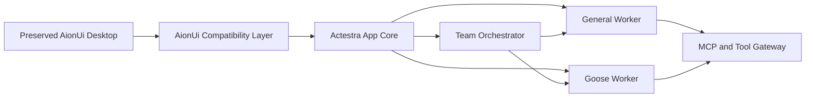

# Actestra

> Work, orchestrated.

Actestra is an independent, cross-platform desktop workspace for general AI work,
coding tasks, and coordinated multi-agent execution.

The product direction is intentionally modular:

- AionUi `v2.1.41` is the preserved functional UI and general-work product
  foundation. Actestra replaces providers and authority beneath compatible
  boundaries instead of redrawing or removing its workflows.
- Goose is integrated later as a specialized coding and terminal worker through
  AionUi's existing agent/ACP and conversation experience.
- Eigent-style orchestration is mapped into AionUi's existing Team experience;
  the Eigent repository is not merged wholesale into Actestra.

Actestra is a new product. It does not share code, identity, data, configuration,
release infrastructure, or product boundaries with Aera.

## Current state

P2 is accepted on `main`.
[Pull request 2](https://github.com/bignormal/actestra-desktop/pull/2) squash
merged the independent product shell at
`76d6a58b20c3e010ee759358f2c86be80bc6a6c1`, and
[main CI](https://github.com/bignormal/actestra-desktop/actions/runs/30329620829)
passes on that exact commit.

Actestra has accepted **P3 — Platform Core and Contracts** on `main`. P3.1
domain records and lifecycle rules plus the P3.2 version 1 event contract are
implemented at
`31dd6e4178eb7641b45be0ee2bccb862a96dac99` and pass
[PR CI run 30331681309](https://github.com/bignormal/actestra-desktop/actions/runs/30331681309).
P3.3 adds a storage-neutral persistence port, accepted SQLite/migration
decision, forward-only schema registry, and main-owned adapter at
`4de756984269624a02fbfdf77e558c958a03c2e0`; exact-head
[PR CI run 30335076556](https://github.com/bignormal/actestra-desktop/actions/runs/30335076556)
passes. P3.4 adds the protocol-versioned worker boundary, main-owned lifecycle
supervisor, and deterministic fake at
`2b1ad9200ff44f2b6be219a8a4b58b0083ebd45b`; exact implementation
[PR CI run 30339662937](https://github.com/bignormal/actestra-desktop/actions/runs/30339662937)
passes. P3.5 adds privileged-service contracts and deterministic main-owned
services governed by
[ADR-0007](docs/architecture/decisions/0007-privileged-service-authorization.md)
at `cec0cdc554656c021cdff7f2341ddd3f9b5d83dd`; exact implementation
[PR CI run 30345370507](https://github.com/bignormal/actestra-desktop/actions/runs/30345370507)
passes. P3.6 adds the main-only composition root, SQLite schema version 3
evidence, terminal-attempt release barrier, closed IPC, and bounded renderer
projection governed by
[ADR-0008](docs/architecture/decisions/0008-main-owned-projection-and-ipc.md).
It is implemented at `950fe0efa2fdc5adc69d013acc9f417d201cb28e`; exact
[PR CI run 30350732223](https://github.com/bignormal/actestra-desktop/actions/runs/30350732223)
passes. Review remediation is implemented at
`4fa0fb120a6ceb2c71effd2a552e8d9bbf05d151`; exact
[PR CI run 30374144474](https://github.com/bignormal/actestra-desktop/actions/runs/30374144474)
passes. The full 67-file independent review and zero-issue review of all
remediation files are complete.
[Pull request 3](https://github.com/bignormal/actestra-desktop/pull/3) reached
final head `71bf3e3fb1d7661fee053ee811279d44f1fdf45f`, passed
[PR CI run 30376696055](https://github.com/bignormal/actestra-desktop/actions/runs/30376696055),
and squash merged as `f6833c50eaf5a426948bac7999f93a08b19a425e`.
[Main CI run 30378191752](https://github.com/bignormal/actestra-desktop/actions/runs/30378191752)
passes on that exact squash commit, closing the P3 exit gate. P4.0/F0 and the
P4.1/F1 identity-and-isolation implementation are CI-backed on
`feat/aionui-first-foundation`. P4.2/F2 shadow projection implementation
`632573fa03c34fdb789c85d8efc1ce1e0f8e8177` plus packaged-boundary
remediation `1478726d62302fa885525024eb4839af5e98b4dd` pass
[macOS arm64 CI run 30421351204](https://github.com/bignormal/actestra-desktop/actions/runs/30421351204);
pull request 6 remains Draft.

- The repository now contains the exact, unmodified 1,766-file AionUi
  `v2.1.41` runnable desktop source foundation at commit
  `2d8925fc67a97a20996fadcd2a0862b778b572ba`. A SHA-256 manifest plus a
  machine check protect every file, all 27 routes, and all 41 bridge domains.
- Frozen install, native production build, and isolated native Electron launch
  pass locally. The actual AionUi Guide UI is recorded in
  [native foundation evidence](docs/product/AIONUI_NATIVE_FOUNDATION.md).
- The original P2 Electron 37.10.3 and React 19.2.4 shell remains a P3
  contract/package regression harness. It is not the target product interface.
- Product name, bundle identifier, executable, icon, deep-link scheme, and
  versioned data layout are Actestra-owned.
- The renderer is sandboxed and receives only three fixed, non-privileged
  metadata intents. External HTTP, HTTPS, WebSocket, permissions, navigation,
  new windows, telemetry, updates, and accounts are inactive.
- Twenty-seven test files with 141 tests, an exact Electron-runtime SQLite
  probe, a three-scenario process-failure harness, formatting, lint, strict
  types, product-boundary checks, renderer build, packaged identity/CSP checks,
  and a fresh-profile three-stage startup smoke pass locally. P3.1-P3.6 and
  review remediation also have exact implementation CI. Unsigned arm64
  app/DMG/ZIP packaging passes locally.
- The pure TypeScript core contract has no Electron, filesystem, shell, network,
  credential, or renderer authority. SQLite, worker supervision, policy,
  approval, opaque credential leases, the metadata-only audit trail, and the
  deterministic tool gateway remain behind main-owned ports. P3.6 registers the
  inert privileged composition and SQLite evidence only in main; preload exposes
  three fixed metadata intents and no generic IPC or protected operation. The
  shell still has no real worker process, credential backend, tool execution,
  input-reference store, transport, or orchestration.
- There is no CI-backed candidate, signed release, deployment, distribution, or
  user acceptance.
- A reviewable downstream overlay now applies Actestra identity, icons,
  versioned private profiles, and a fail-closed external-effect policy without
  editing the frozen AionUi source or removing its routes and feature entries.
- F1 implementation commit
  `836a9f1f81687f091e1c5b92ce30bff167e9da4f` plus resource-only CI
  remediation `462a1b0d920279d42f124fdd28673d77dc55b765` pass
  [macOS arm64 CI run 30417692550](https://github.com/bignormal/actestra-desktop/actions/runs/30417692550),
  including the materialized native build, unsigned bundle, packaged identity,
  and clean-profile smoke.
- F2 recognizes conversation, task, provider, workspace, approval, artifact,
  and runtime metadata through a fixed, fail-isolated observation operation.
  Main hashes native identity, validates P3 graphs and task events, and appends
  inert SQLite schema version 4 evidence without writing authoritative P3
  tables.
- Focused root and downstream F2 tests, the 141-test root check, all 2,590
  passing native tests, native production build, restart and duplicate proof,
  rejection containment, and one real native conversation read pass locally.
  The preserved Guide and its original functional entries remain visible.
- Exact-head CI repeats root boundaries, downstream materialization, strict
  types, 14 focused tests, native production build, unsigned bundle, packaged
  identity and product boundary, and clean-profile smoke.
- The native AionUi foundation is not yet fused to P3 authoritative data; F2 is
  compatibility evidence only. Goose and Eigent-style integration have not
  started.

See [Project Status](docs/PROJECT_STATUS.md) for the evidence-backed state.
The local P2 proof is recorded in
[P2 Product Shell](docs/product/P2_PRODUCT_SHELL.md).
The current execution order is recorded in
[P3 Platform Core](docs/product/P3_PLATFORM_CORE.md).
The preserve-first product contract is recorded in the
[AionUi Retention Matrix](docs/upstream/AIONUI_RETENTION_MATRIX.md), and the
ordered fusion is in
[AionUi–Actestra Fusion](docs/architecture/AIONUI_ACTESTRA_FUSION.md).

## Start here

1. [Documentation Index](docs/README.md)
2. [MVP Definition](docs/product/MVP.md)
3. [Development Sequence](docs/roadmap/DEVELOPMENT_SEQUENCE.md)
4. [System Overview](docs/architecture/SYSTEM_OVERVIEW.md)
5. [Git Workflow](docs/governance/GIT_WORKFLOW.md)
6. [Upstream Policy](docs/governance/UPSTREAM_POLICY.md)
7. [AionUi Baseline Evidence](docs/upstream/AIONUI_V2.1.41_BASELINE.md)
8. [AionUi Retention Matrix](docs/upstream/AIONUI_RETENTION_MATRIX.md)
9. [AionUi–Actestra Fusion](docs/architecture/AIONUI_ACTESTRA_FUSION.md)
10. [AionUi F1 Identity and Isolation](docs/product/AIONUI_F1_IDENTITY_ISOLATION.md)
11. [AionUi F2 Shadow Projection](docs/product/AIONUI_F2_SHADOW_PROJECTION.md)

Repository-wide instructions are in [AGENTS.md](AGENTS.md). Contribution rules
are in [CONTRIBUTING.md](CONTRIBUTING.md).

## Architecture stance

Actestra owns the user-facing product state: workspaces, tasks, permissions,
credentials, events, artifacts, and audit history. External agent runtimes are
workers behind a stable adapter and event boundary; they do not become competing
sources of truth.



The accepted decisions are recorded in
[Architecture Decisions](docs/architecture/decisions/README.md).

## Native foundation commands

```sh
bun run foundation:aionui:check
bun run foundation:aionui:install
bun run foundation:aionui:test
bun run foundation:aionui:package
bun run foundation:aionui:dev
```

## Actestra downstream commands

```sh
bun run downstream:aionui:check
bun run downstream:aionui:install
bun run downstream:aionui:test
bun run downstream:aionui:package
bun run downstream:aionui:dev
```

## Licensing

The license for original Actestra code has not yet been selected. Referencing an
upstream project does not mean its code has been imported. When third-party code
is introduced, its exact version, commit, license, notices, and local
modifications must be recorded according to the
[Upstream Policy](docs/governance/UPSTREAM_POLICY.md).

See [THIRD_PARTY_NOTICES.md](THIRD_PARTY_NOTICES.md) for the current inventory.
