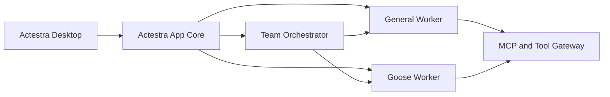

# Actestra

> Work, orchestrated.

Actestra is an independent, cross-platform desktop workspace for general AI work,
coding tasks, and coordinated multi-agent execution.

The product direction is intentionally modular:

- AionUi is the initial desktop product foundation.
- Goose is integrated later as a specialized coding and terminal worker.
- Eigent informs the multi-agent orchestration experience; its repository is not
  merged wholesale into Actestra.

Actestra is a new product. It does not share code, identity, data, configuration,
release infrastructure, or product boundaries with Aera.

## Current state

Actestra is in **P1 — Reproducible Upstream Baseline**, with the technical
evidence ready for review on `upstream/aionui-v2-1-41`.

- AionUi `v2.1.41` and AionCore `v0.1.52` are pinned to exact commits.
- Two independent clean checkouts repeated frozen installation, development
  launch, upstream Vitest, compilation, and full macOS DMG/ZIP generation.
- License, asset, runtime, telemetry, update, storage, entitlement, and module
  disposition inventories are recorded.
- No upstream product source code has been imported.
- The local unsigned AionUi packages are evaluation evidence only: their
  signatures are invalid and Gatekeeper rejects them.
- No Actestra application package, CI validation, candidate, release,
  deployment, or user acceptance exists.
- P2 may begin only after the P1 evidence branch is reviewed and merged.

See [Project Status](docs/PROJECT_STATUS.md) for the evidence-backed state.

## Start here

1. [Documentation Index](docs/README.md)
2. [MVP Definition](docs/product/MVP.md)
3. [Development Sequence](docs/roadmap/DEVELOPMENT_SEQUENCE.md)
4. [System Overview](docs/architecture/SYSTEM_OVERVIEW.md)
5. [Git Workflow](docs/governance/GIT_WORKFLOW.md)
6. [Upstream Policy](docs/governance/UPSTREAM_POLICY.md)
7. [AionUi Baseline Evidence](docs/upstream/AIONUI_V2.1.41_BASELINE.md)

Repository-wide instructions are in [AGENTS.md](AGENTS.md). Contribution rules
are in [CONTRIBUTING.md](CONTRIBUTING.md).

## Architecture stance

Actestra owns the user-facing product state: workspaces, tasks, permissions,
credentials, events, artifacts, and audit history. External agent runtimes are
workers behind a stable adapter and event boundary; they do not become competing
sources of truth.

The accepted decisions are recorded in
[Architecture Decisions](docs/architecture/decisions/README.md).

## Licensing

The license for original Actestra code has not yet been selected. Referencing an
upstream project does not mean its code has been imported. When third-party code
is introduced, its exact version, commit, license, notices, and local
modifications must be recorded according to the
[Upstream Policy](docs/governance/UPSTREAM_POLICY.md).

See [THIRD_PARTY_NOTICES.md](THIRD_PARTY_NOTICES.md) for the current inventory.
