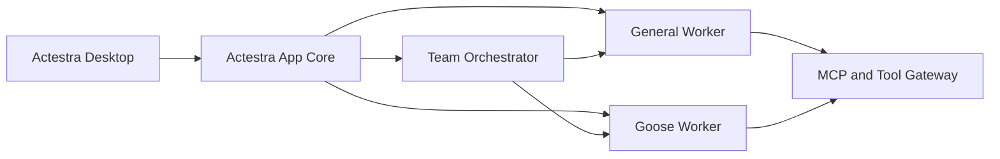

# Actestra

> Work, orchestrated.

Actestra is an independent, cross-platform desktop workspace for general AI work,
coding tasks, and coordinated multi-agent execution.

The product direction is intentionally modular:

- AionUi is an evaluated desktop and general-work reference; useful modules may
  enter later as selective, attributed ports.
- Goose is integrated later as a specialized coding and terminal worker.
- Eigent informs the multi-agent orchestration experience; its repository is not
  merged wholesale into Actestra.

Actestra is a new product. It does not share code, identity, data, configuration,
release infrastructure, or product boundaries with Aera.

## Current state

P2 is accepted on `main`.
[Pull request 2](https://github.com/bignormal/actestra-desktop/pull/2) squash
merged the independent product shell at
`76d6a58b20c3e010ee759358f2c86be80bc6a6c1`, and
[main CI](https://github.com/bignormal/actestra-desktop/actions/runs/30329620829)
passes on that exact commit.

Actestra is now entering **P3 — Platform Core and Contracts** on
`feat/platform-core-contracts`. The branch currently establishes only the P3
execution index; no P3 model, database, worker, approval, policy, credential,
tool, or audit implementation exists yet.

- The Electron 37.10.3 and React 19.2.4 shell is original Actestra source; no
  AionUi, AionCore, Goose, Eigent, Aera, or AgentEra application source or asset
  has been copied.
- Product name, bundle identifier, executable, icon, deep-link scheme, and
  versioned data layout are Actestra-owned.
- The renderer is sandboxed and receives only two typed, non-privileged bridge
  operations. External HTTP, HTTPS, WebSocket, permissions, navigation, new
  windows, telemetry, updates, and accounts are inactive.
- Five test files with 22 tests, a three-scenario process-failure harness,
  formatting, lint, strict types, product-boundary checks, renderer build,
  unsigned arm64 app/DMG/ZIP packaging, packaged identity/CSP checks, and a
  fresh-profile three-stage startup smoke pass locally.
- The shell has no task persistence, worker runtime, tool execution, or
  orchestration yet; P3 defines and proves those boundaries with a deterministic
  fake before any real worker is integrated.
- There is no CI-backed candidate, signed release, deployment, distribution, or
  user acceptance.

See [Project Status](docs/PROJECT_STATUS.md) for the evidence-backed state.
The local P2 proof is recorded in
[P2 Product Shell](docs/product/P2_PRODUCT_SHELL.md).
The current execution order is recorded in
[P3 Platform Core](docs/product/P3_PLATFORM_CORE.md).

## Start here

1. [Documentation Index](docs/README.md)
2. [MVP Definition](docs/product/MVP.md)
3. [Development Sequence](docs/roadmap/DEVELOPMENT_SEQUENCE.md)
4. [System Overview](docs/architecture/SYSTEM_OVERVIEW.md)
5. [Git Workflow](docs/governance/GIT_WORKFLOW.md)
6. [Upstream Policy](docs/governance/UPSTREAM_POLICY.md)
7. [AionUi Baseline Evidence](docs/upstream/AIONUI_V2.1.41_BASELINE.md)

Repository-wide instructions are in [AGENTS.md](AGENTS.md). Contribution rules
are in [CONTRIBUTING.md](CONTRIBUTING.md).

## Architecture stance

Actestra owns the user-facing product state: workspaces, tasks, permissions,
credentials, events, artifacts, and audit history. External agent runtimes are
workers behind a stable adapter and event boundary; they do not become competing
sources of truth.

The accepted decisions are recorded in
[Architecture Decisions](docs/architecture/decisions/README.md).

## Licensing

The license for original Actestra code has not yet been selected. Referencing an
upstream project does not mean its code has been imported. When third-party code
is introduced, its exact version, commit, license, notices, and local
modifications must be recorded according to the
[Upstream Policy](docs/governance/UPSTREAM_POLICY.md).

See [THIRD_PARTY_NOTICES.md](THIRD_PARTY_NOTICES.md) for the current inventory.
