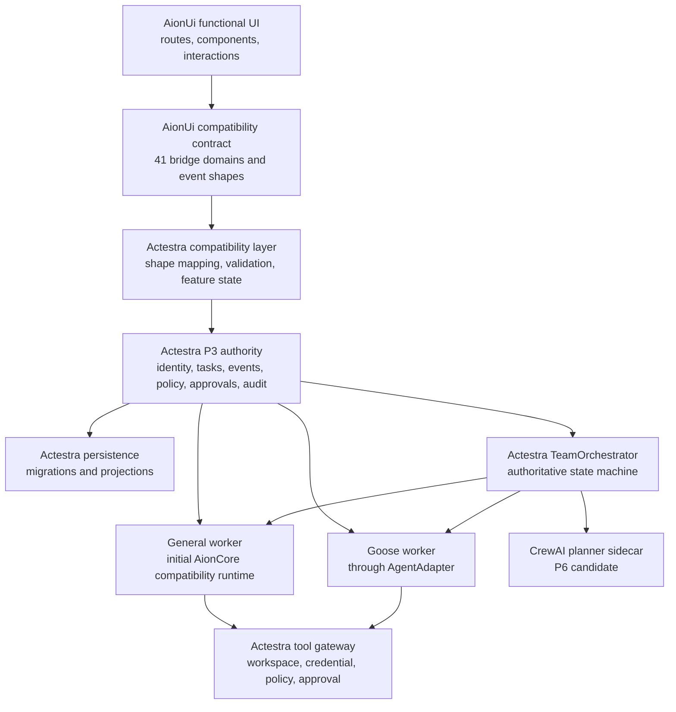

# AionUi–Actestra Fusion Architecture

Status: Accepted implementation topology under ADR-0010

## Outcome

AionUi remains the actual desktop application, functional UI, and
general-work experience. The accepted Actestra P3 core is fused beneath it as
the authority for product identity, task state, persistence, permissions,
approvals, audit, artifacts, worker supervision, packaging, and release.

This is an inverted migration from the earlier shell direction. Actestra does
not redraw AionUi and then reimplement its functions. It starts from the exact
native AionUi application and replaces providers behind compatibility seams,
one functional domain at a time.

## Target topology

The user sees one application and one coherent history. Goose does not add a
second coding UI; it appears through the preserved AionUi agent/ACP and
conversation surfaces. CrewAI does not add a second team application or state
authority; its bounded planning candidates enter an Actestra-owned
TeamOrchestrator and appear through the preserved AionUi Team surfaces. Eigent
remains the Team interaction and acceptance reference.

## Stable seams

### Renderer compatibility seam

The primary renderer-facing seam is the existing AionUi bridge and its event
shapes:

- `packages/desktop/src/common/platform/bridge`;
- `packages/desktop/src/common/adapter/ipcBridge.ts`;
- renderer hooks and contexts consuming those domains;
- router and settings contribution contracts.

The compatibility layer keeps those shapes stable. It must not turn the
renderer into a direct filesystem, credential, shell, updater, database, or
worker client.

### Configuration seam

AionUi configuration stores and UI schemas remain readable while providers are
migrated. Actestra supplies:

- product and profile identity;
- secure credential references;
- model/provider projections;
- feature availability and isolation reasons;
- versioned migrations from native AionUi state where user data exists.

### Runtime seam

The native baseline may use the exact AionCore `v0.1.52` runtime to prove
feature parity. During fusion it is treated as a supervised general worker and
compatibility service, not as the long-term owner of Actestra task, approval,
audit, or release state.

Distribution of AionCore remains blocked until its observed root-license and
Cargo-license inconsistency is resolved and its binary provenance is accepted.

## Authority transition rule

There must never be two implicit systems of record for the same domain.

For each bridge domain, one of these modes is declared:

1. **Native baseline** — native AionUi/AionCore owns test-only state inside an
   isolated profile. This proves upstream behavior only.
2. **Shadow projection** — native writes remain authoritative while an
   Actestra adapter validates and projects metadata into P3 contracts. Shadow
   state must not drive user-visible decisions.
3. **Actestra authoritative** — the bridge writes through the Actestra core;
   native AionUi storage is read-only compatibility or migration input.
4. **Isolated effect** — the UI and intent remain, but an unsafe or unowned
   external effect is blocked with an explicit user-visible reason.

A bridge domain cannot be declared fused until its write authority, migration,
rollback, restart behavior, and error mapping are tested.

## Ordered fusion phases

### F0 — Native preservation baseline

- Store the exact AionUi `v2.1.41` source snapshot and license.
- Verify every source file by SHA-256.
- Require all 27 router paths and 41 bridge domains.
- Install with the exact lock, run upstream tests, build, launch in an isolated
  profile, and capture golden UI evidence.
- Record the full retention matrix before changing native UI.

Exit: exact source and native launch are reproducible; this is not yet an
Actestra application candidate.

### F1 — Downstream identity and profile boundary

- Apply Actestra product name, bundle ID, executable, icon, protocol, and
  versioned data paths as a documented downstream patch.
- Preserve window, Guide, navigation, onboarding, and all feature routes.
- Make desktop startup guest/local-first.
- Disable AionUi telemetry, update, feedback, publisher, and official-service
  effects while retaining their UI states.

Exit: a fresh profile launches as Actestra with AionUi UI parity and no
unapproved upstream account, endpoint, update, or telemetry effect.

### F2 — Compatibility bridge and P3 shadow projection

- Introduce typed adapters for AionUi conversation, task, provider, workspace,
  approval, artifact, and runtime shapes.
- Start with read-only or metadata-only shadow projection into the accepted P3
  event and persistence contracts.
- Prove identity mapping, event ordering, redaction, restart behavior, and
  projection failure without changing UI behavior.

Exit: representative native journeys create valid P3 shadow evidence, but no
domain is falsely described as Actestra-authoritative.

Current implementation: the seven-domain contract, fixed observation bridge,
main-owned projection, SQLite schema version 4 evidence, restart behavior,
redaction, and failure isolation are exact-head CI-backed. Full native
regression and the real native conversation read are locally validated. See
[AionUi F2 Shadow Projection](../product/AIONUI_F2_SHADOW_PROJECTION.md) and
[ADR-0011](decisions/0011-aionui-shadow-projection.md). F2 does not write
authoritative P3 domain or event tables.

### F3 — Actestra authority by functional domain

- Move conversation/task/session persistence, workspace grants, protected
  operations, approval evidence, artifacts, and audit writes behind the P3
  core one domain at a time.
- Retain AionUi bridge responses, streaming events, loading states, failures,
  and interaction semantics.
- Migrate existing native data with forward-only, resumable, rollback-aware
  procedures.

Exit: the general-work journey survives restart with Actestra as the declared
system of record and with denial, cancellation, crash, and artifact-conflict
proof.

Current first slice: F3.1 keeps the existing renderer permission cards, ACP
options, pet confirmation window, and native confirmation response semantics.
Desktop main persists the immutable response and schema version 5 delivery
outbox before sending it to loopback AionCore, then reconciles ambiguous
delivery on retry and restart. Native AionCore still owns pending request
creation, provider semantics, and protected-operation execution; remote WebUI
remains on its isolated native compatibility path. See
[AionUi F3.1 Approval Decision Authority](../product/AIONUI_F3_APPROVAL_AUTHORITY.md)
and
[ADR-0012](decisions/0012-aionui-approval-decision-authority.md).

Current second slice: F3.2 keeps those response and reconciliation semantics,
but routes only delivery of the already persisted response through one exact P3
`network.request` capability. The fixed manifest, exact policy rule, durable
policy/start/outcome audit, bounded in-memory input reference, structured native
error preservation, uncertain-outcome reconciliation, and explicit F3.1
rollback are defined in
[AionUi F3.2 Approval Delivery Policy Gate](../product/AIONUI_F3_APPROVAL_POLICY_GATE.md)
and
[ADR-0013](decisions/0013-aionui-approval-delivery-policy-gate.md). F3.2 does
not infer the native tool action, create a second approval, or move pending
request and protected-operation authority out of AionCore.

Current third slice: F3.3 routes only the bounded pending-state read used by
F3.1 retry and restart reconciliation through its own exact P3 capability,
policy rule, and durable audit sequence. The loopback transport reduces the
native list to an in-memory boolean; list content, request creation, provider
semantics, and the underlying protected operation remain native-owned. F3.3
wraps F3.2 without changing delivery semantics or the preserved AionUi UI. See
[AionUi F3.3 Approval Reconciliation Policy Gate](../product/AIONUI_F3_APPROVAL_RECONCILIATION_GATE.md)
and
[ADR-0014](decisions/0014-aionui-approval-reconciliation-policy-gate.md).

Current General Work fusion slice: GW-P4.6 keeps the original SendBox,
conversation message, cancellation, and Preview surfaces while one strict
text intent is handled by Actestra Core. Main resolves the native workspace,
schema version 8 atomically registers the authoritative journey, a supervised
General Worker requests the accepted scoped output tool, and only redacted
status or exact-owner bounded Preview content returns to the renderer. See
[ADR-0020](decisions/0020-preserved-aionui-general-work-journey.md).

### F4 — Goose inside the preserved agent experience

- Pin and supervise Goose behind `AgentAdapter`.
- Register it through AionUi's existing agent/ACP settings, selectors, repair,
  permissions, conversation, tool-call, terminal, diff, and test surfaces.
- Use isolated Git worktrees and the Actestra tool gateway.

Exit: coding work is usable without opening or reproducing Goose's separate
application UI.

### F5 — CrewAI-assisted Eigent-style orchestration inside Team

- Map Actestra leaders, workers, dependencies, slots, child turns, approvals,
  pause, retry, replacement, handoff, and aggregation into the existing AionUi
  Team types and views.
- Keep the Actestra TeamOrchestrator authoritative and evaluate CrewAI only as
  a supervised planner, replanner, and aggregation sidecar under ADR-0015.
- Validate every plan and replan for schema, cycles, bounds, budget, policy,
  and available worker capabilities before persistence or scheduling.
- Preserve native Team creation, navigation, chat, status, rename/pin/delete,
  messaging, and recovery behaviors.

Exit: a mixed general-and-code fixture completes through the preserved Team UI
with deterministic failure and restart proof, and a CrewAI crash or version
mismatch cannot corrupt authoritative state.

### F6 — Remote and ecosystem providers

- Replace Hub, extensions, WebUI, channels, remote agents, feedback,
  diagnostics, and update providers with signed and policy-scoped Actestra
  services.
- Retain the corresponding settings and workflows throughout isolation and
  activation.

Exit: every enabled network effect has identity, credential, policy, audit,
integrity, rollback, and offline behavior.

### F7 — Candidate and cross-platform acceptance

- Produce Actestra-owned macOS, Windows, and Linux packaging.
- Verify signatures, notarization, updates, rollback, SBOM, provenance,
  third-party notices, clean-machine install, upgrade, uninstall, and fresh
  profiles.
- Run the retention matrix against exact candidate artifacts.

Exit: source, CI, candidate, release, distribution, and user acceptance are
recorded as separate evidence.

## Patch organization

The frozen F0 snapshot is immutable. Downstream changes use a reviewable patch
series or overlay with:

- one functional domain per patch group;
- upstream file and symbol references;
- R0/R1/R2 classification;
- Actestra authority owner;
- migration and rollback notes;
- native and compatibility tests;
- golden screenshots for affected UI.

Updating AionUi to a newer version is a separate upstream branch. It must first
replay the preservation checks, then rebase the Actestra patch series and
explain every retention-matrix difference.

The first executable compatibility artifact is
[`foundation/aionui-v2.1.41.compatibility.json`](../../foundation/aionui-v2.1.41.compatibility.json).
It classifies all 27 routes as R0 and every one of the 41 bridge domains exactly
once as R1 or R2. At F0 it explicitly permits no user-interface change and
claims no Actestra-authoritative bridge domain.

## Non-claims of the native snapshot alone

The native snapshot and its running application prove that the chosen AionUi
UI and original functions are present and reproducible. They do not yet prove:

- Actestra product identity or profile migration;
- Actestra-authoritative task or conversation writes;
- policy-complete filesystem, shell, network, or credential access;
- Goose or Eigent-style integration;
- distribution permission for the evaluated AionCore binary;
- signed packages, deployment, release, or user acceptance.
