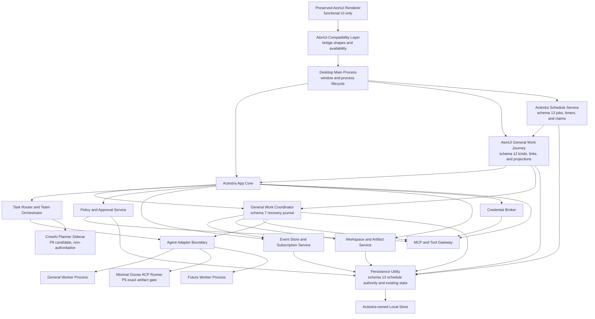

# System Overview

Status: P3 and P4 are accepted on `main`; the exact phase implementation head is
`80e84a28cb6e4e08eb73ec83193908ab3aa69cbe`, and the phase acceptance record is
`adc9a99d7806f5627041368b4ff932c1fe9a42f0`. Its merged-main CI
run 30689608454 attempt 2 passes. P4 includes F0 through F3.3, GW-P4.2 through
GW-P4.6, the representative workspace-file, bounded local-research, writing,
Office-document, schema-13 schedule, tool-failure, and Worker-crash/recovery
journeys. P5.0 is accepted through PR 26 and merged-main CI 30691300690.
ADR-0024 selects the exact Goose source and minimal stdio ACP boundary;
ADR-0025 admits only the exact uncompiled RSA metadata finding. P5.1 builds and
validates the runner and is accepted through its reviewed hotfix, exact-head CI,
squash merge, and merged-main CI recorded in project status. P5 is accepted on
`main`. P6 plan admission is also accepted on `main`; the larger Team
orchestration and AionUI-native Team journey are implemented in the local
delivery batch recorded in project status. A generic supervised planner
boundary exists locally, but CrewAI itself is not imported, admitted, or
packaged.

The P7.1 development integration gate is accepted on `main` through pull
request 56, squash merge `d7db878ce0385a14dae579bea3fe299e17e856b7`, and
passing exact-head and merged-main CI. Its 28-case abuse catalog and seven-case
packaged macOS smoke remain the accepted security baseline.

P7.2 Worker resource/process reliability is accepted on `main` for the General
Worker and Goose Worker only through pull request 58, exact head
`69dde6adfd44188eec475a55ae02cbab893103b4`, squash merge
`dc904b7b9cf7d0c64c563bcc732547f0ff27ce13`, and passing pull-request and
merged-main CI runs 31900510574 and 31901651415. Main owns their fixed profiles
and the closed terminal vocabulary: `worker-resource-cpu-exceeded`,
`worker-resource-memory-exceeded`, `worker-resource-output-exceeded`,
`worker-resource-timeout`, `worker-resource-storage-exceeded`,
`worker-process-tree-violated`, and
`worker-resource-enforcement-unavailable`. The implementation preserves the
existing Electron utility process, Goose runner, supervisor, Tool Gateway,
macOS sandbox, and downstream overlay boundaries. The accepted macOS job
includes package trust plus General CPU/memory and Goose output/storage/fork
hostile smoke.

P7.3 database backup, migration rollback, and crash recovery is accepted on
`main` for the SQLite persistence utility only through pull request 60, exact
head `e4f548f3d5ba3d5fd1e02882b0beaa928241e9e0`, squash merge
`7418d4d6bb348f9c80961343ec49807fbfdab4ad`, and passing pull-request and
merged-main CI runs 31906809232 and 31907989900. The persistence utility owns
private pre-migration backups, SHA-256-bound recovery manifests,
migration-failure restore, and pending-manifest startup recovery without giving
renderer or preload code any database, SQL, backup-path, or filesystem
authority. P7.4 diagnostic export and audit retention, Windows/Linux
enforcement, formal signing, release, deployment, and final user acceptance
remain outside the verified system state.

## Context

Actestra presents one desktop product while using multiple specialized execution
engines. The primary design problem is not launching several agents; it is
maintaining one coherent task, permission, data, and audit model across them.

## Component view



## Current implementation boundary

The accepted P2 renderer, minimal context-isolated preload bridge, and Electron
main process remain on `main` as a P3 platform-contract and package-regression
harness. That shell is not the target product UI.

P4.0 adds a separate exact, frozen AionUi `v2.1.41` native source foundation.
It preserves 1,766 runnable desktop files, 27 routes, 41 bridge domains, and
the complete native functional UI. P4.1 applies Actestra identity, a versioned
private profile, and isolated external-effect providers as a reviewable
downstream overlay. It does not edit the frozen source or remove original
functional entries.

P3.1 and P3.2 add a runtime-neutral core domain, lifecycle validation, and
version 1 event stream contract. P3.3 adds a storage-neutral port plus a SQLite
adapter with schema versions 1 and 2. P3.4 historically added the version 1
`AgentAdapter` contract, a main-owned lifecycle supervisor, and a deterministic
in-memory fake adapter. GW-P4.3 advances that boundary to Adapter v2 and a real
deterministic process while retaining the accepted lifecycle rules. P3.5 adds
versioned privileged-operation and tool-manifest contracts plus main-owned
deterministic policy, approval, opaque credential-lease, metadata-audit, and
tool-gateway services.

P3.6 adds SQLite schema version 3 for durable metadata-only privileged audit
and immutable terminal-attempt evidence. Electron main registers an inert
deny-by-default composition root, a disabled executor, trusted-main-frame IPC,
and a bounded renderer projection. Preload exposes only application metadata,
platform snapshot, and renderer-ready intents. F3.2 adds one separate, exact
loopback response-delivery manifest, policy rule, in-memory bounded input
reference, and executor beneath the existing F3.1 service. F3.3 separately
gates the bounded boolean reconciliation read. At that merged baseline there
is no credential backend, general content-reference store, general MCP or
native-tool transport, process transport, or real worker adapter. GW-P4.2 adds
the content-reference store and persistence process; GW-P4.3 adds the first
real deterministic worker process; accepted GW-P4.4 admits exactly two
main-owned native text capabilities without granting filesystem authority to
that process. Accepted GW-P4.5 adds the durable coordination and
restart-recovery sequence around those capabilities. Accepted GW-P4.6 maps
that sequence into the preserved AionUI SendBox, message, cancel, and Preview
surfaces. The representative-file, bounded local-research, writing, and
Office-document paths accepted through pull requests 16 through 19 compose the
scoped capabilities inside that same journey. ADR-0023's main-owned
schedule-provider boundary, schema 13, timers, claims, and native cron routing
are accepted through pull requests 20 and 21 with exact merged-main CI.
Representative tool failure reuses the existing file journey and scoped-read
policy path and is accepted through pull request 22, exact final head
`077f30bcfa3929959c971d08081092bbf976e2ee`, PR CI 30673687603, squash merge
`c7c414c0c5a126b276fb02b372e02fff437e5f23`, and merged-main CI 30673919260.
Its local package remains distinct from commit, CI, merge, notarization,
candidate, release, distribution, or user-acceptance evidence.

The accepted Worker-crash/recovery reliability fixture keeps the generic coordinator's
retryable crash state while selecting a terminal no-replacement disposition
only for the preserved AionUI General Work composition. A canonical
`worker.failed` event is required before main appends `task.failed`; the Task
and Session become failed while the Worker and Attempt remain crashed with the
same incident. Local contracts cover stable restart projection and fail-closed
missing-event behavior. Complete root/native gates, a fresh signed unnotarized
arm64 package, strict package checks, and real target-app crash/restart smoke
pass, followed by complete 14-file manual review and exact scope audits in
implementation commit `47ed445eab204c0998e44167455c062600158dd3`.
Ready pull request 24 reached exact final head
`3593fac8db48a0cb149bb6c736374eeaccebe332`, passed PR CI 30687199671, squash
merged as `80e84a28cb6e4e08eb73ec83193908ab3aa69cbe`, and passed merged-main CI 30687433298. Its rate-limited CodeRabbit status is not formal review evidence.

P4.2 adds the separate compatibility boundary accepted in
[ADR-0011](decisions/0011-aionui-shadow-projection.md). Successful native HTTP
responses and declared WebSocket events may publish seven strict metadata
observation shapes through one fixed preload operation. Main hashes native
identity, validates a P3 graph and optional task event stream, and appends
SQLite schema version 4 shadow evidence. It does not insert shadow records into
the authoritative P3 domain or core-event tables. Native AionUi continues to
own user-visible state, and projection failure cannot alter the native result.

P4.3/F3.1 adds the first narrowly authoritative write accepted in
[ADR-0012](decisions/0012-aionui-approval-decision-authority.md). The preserved
desktop confirmation surfaces submit one fixed response intent to main. Main
persists an immutable schema version 5 response and delivery outbox before
calling the loopback native confirmation endpoint. Exact duplicates are
idempotent, changed responses conflict, and a prior or failed attempt must be
reconciled against the native pending list before redelivery.

P4.3/F3.2, governed by
[ADR-0013](decisions/0013-aionui-approval-delivery-policy-gate.md), routes only
that persisted response-delivery effect through the P3 gateway as one fixed
`network.request` to an `external-service`. Policy and tool-start audit must
persist before the loopback POST, and completion or failure audit must persist
before the result is final. Compatibility-scoped hashes correlate the audit
without storing native identifiers or creating authoritative P3 domain rows.
This slice does not infer, approve, or execute the underlying native tool.

GW-P4.2 general work, governed by
[ADR-0016](decisions/0016-p4-general-work-process-and-content-boundaries.md),
moves schemas 1 through 5 and every P3/F2/F3 persistence operation together
behind a dedicated utility process. Schema version 6 adds durable workspace
grants and immutable, 1 MiB-bounded UTF-8 content references with exact owner,
kind, lifecycle, length, and SHA-256 validation. Pull request 10 merged this
slice as `8e32882108b10272c1489c1a46a77cede1cc4fb7`, and exact main CI run
30476091907 passes.

The persistence utility exclusively owns `state/actestra.sqlite3` beneath
Actestra user data, uses one DELETE/FULL connection, and rejects foreign
ownership, future schemas, inconsistent migration history, invalid domain
graphs, corrupt event projections, and corrupt content. Electron main and the
AionUi compatibility bridge use one asynchronous, versioned port with no
synchronous fallback. Source and packaged-graph checks reject `node:sqlite`
and `DatabaseSync` from the main entry and require them in the utility entry.
This process separation is not an operating-system sandbox.

GW-P4.3, governed by
[ADR-0017](decisions/0017-general-worker-process-and-agent-adapter-v2.md),
advances AgentAdapter to exact version 2 with typed tool-result resolution and
explicit protocol-error signals. A separate native worker protocol at exact
version 1 runs one deterministic attempt per Electron utility process. Main
owns attempt tokens, product IDs, ToolRequest IDs, timestamps, normalized Core
events, cancellation, and cleanup. The worker receives only a bounded prompt,
entry state, control messages, and typed tool results with optional opaque
output references.

The root harness and preserved AionUI downstream both build a distinct General
Worker entry. A real packaged-harness smoke and a real materialized-AionUI
launch complete a three-event no-tool process probe. The latter also starts
the exact local AionCore 0.1.52 and reaches renderer-ready with no
installation-incomplete fault injection. Pull request 11 merged the exact
GW-P4.3 head `b3a3bc7e27d7dab44dadeff6dcedc92cec1b3ee5` as
`671587813bea18411b6cdc2ee388d94cd18d6c50`; pull-request CI run 30481670123
and exact merged-main CI run 30481890911 pass. The probe is not yet wired to a
user-submitted task, and no filesystem, shell, network, credential, MCP,
persistence, policy, or approval authority is granted to the worker itself.

GW-P4.4, governed by
[ADR-0018](decisions/0018-scoped-native-text-tools-and-policy.md), registers
only `actestra.workspace.read-text` and
`actestra.task-output.write-text`. A main-owned coordinator accepts only the
current pending request of a still-blocked supervised attempt, derives
identity from the attempt and normalized event, and derives action, resource
kind, credential prohibition, and timeout from a closed registry. It then
uses the existing deny-by-default gateway and durable audit path.

The production executor reloads the exact active workspace grant and content
owner. Reads require a portable normalized relative path, canonical
containment, no symbolic-link component, a regular file, valid UTF-8, and at
most 1 MiB. Writes are limited to a validated task-owned
`.actestra/task-output/<task-id>` subtree and publish create-only through an
exclusive same-filesystem operation. Content returns only as an exact-owner
opaque reference. Stable cancellation, timeout, scope, validation, conflict,
and post-effect failure evidence reaches the gateway without exposing raw
content or paths to the worker or renderer. Root and native regression, build,
unsigned harness package, and isolated native desktop smoke pass locally.
The complete 30-file full-diff review was remediated. Pull request 12 merged
the exact head `34f2d2201581c19b3dc67c5a7936f8a411bff9e1` as
`7ec009c6384a93c17f24e4276469e98cb5f2b71d`; pull-request CI run
30486392525 and exact merged-main CI run 30486544268 pass.

GW-P4.5, governed by
[ADR-0019](decisions/0019-general-work-durable-coordination-and-recovery.md),
adds a revisioned schema version 7 journal for immutable attempt identity,
append-only Core events, a verified bounded-event resume baseline, explicit
tool execution ambiguity, a pre-execution workspace-grant identity, file
artifact intent, exact-owner output binding, terminal cleanup, and
finalization. Before that event window advances, its evicted prefix is
committed idempotently to the normalized event store. The main-owned
coordinator persists an in-flight tool before execution and its terminal
result before Adapter acknowledgement. A failed barrier retains the exact
terminal result and cannot execute the create-only tool again.

After Adapter cleanup, terminal-pending state precedes authoritative-history
and resume-baseline verification, artifact verification, serialized
Task/Session/Worker/Artifact reconciliation, idempotent event append, terminal
evidence, finalized state, and Supervisor release. Admission and startup
recovery cap non-finalized checkpoints at 100. Startup recovers them before
the preserved AionUI window opens. Active attempts become explicit restart
failure or cancellation evidence and require fresh worker identity. No
renderer or route changes, and no Goose, CrewAI, or Eigent runtime enters this
slice.

GW-P4.6, governed by
[ADR-0020](decisions/0020-preserved-aionui-general-work-journey.md), adds one
strict `/actestra` intent to the preserved SendBox while ordinary native sends
remain unchanged. Main resolves the selected native conversation through one
bounded loopback read, validates and canonicalizes its workspace, and
atomically registers the Actestra Workspace, grant, Task, Session, Worker,
prompt, output input, and schema-version-8 journey link. Only a SHA-256 hash of
the raw native conversation identity is durable.

One real supervised General Worker utility process requests the existing
create-only task-output capability with an exact main-owned ToolRequest ID.
The representative-file extension adds schema version 9's closed journey kind.
Its `/actestra file` intent cannot select a path: main supplies only
`actestra-input.txt` with a 64 KiB per-invocation read maximum aligned to Worker
transport, invokes the bounded workspace read, resolves its exact owned output,
and sends that content to the same Worker. Oversized source fails as
`content-too-large` before transport. The Worker returns a strict private
`result.md` write input to its adapter; main persists it under a second request
owner before invoking the create-only tool. Source text and the private write
input do not enter Core events or renderer projections.

Status, incident, cancellation, and Artifact projections are rebuilt from
Actestra state. Preview requires the linked Task, finalized checkpoint
binding, exact Artifact, and exact-owner content reference; only bounded UTF-8
content crosses the preload bridge and the native Preview marks it
non-persistable. Prepared linked Tasks with no attempt resume from their
already persisted prompt, journey kind, grant, and initial tool input after
native backend/window readiness, without re-reading or rebinding native
workspace state. This slice adds no route, second UI, Goose, CrewAI, or Eigent
runtime.

The local-research extension adds schema version 10's exact
`local-research-artifact` kind and `/actestra research` command. Main reads
only `actestra-research.txt` under the same 64 KiB Worker transport bound. The
same isolated Worker converts at most 32 non-empty local evidence lines into a
private create-only `research.md` input; main persists that input under the
exact write request before the accepted task-output tool creates a file
Artifact labeled `Actestra local research brief`. Source content stays out of
normalized Core events and renderer projections. This is a deterministic
offline local-corpus fixture, not general or network research authority.

The writing extension adds schema version 11's exact `writing-artifact` kind
and `/actestra write` command. Its ordered Title, Audience, Purpose, and one to
eight Point fields are validated before prompt-only atomic registration. It
performs no workspace read. The isolated Worker derives a private `draft.md`
create-only input; main persists that exact-owner input before the existing
text tool creates a `document` Artifact labeled `Actestra writing draft`.
Prepared recovery regenerates from the durable brief without replaying native
workspace context. Private draft input and its content reference stay out of
normalized Core events, metadata audit, and renderer projections; only the
owned non-persisted Preview returns bounded content.

The Office extension adds schema version 12's exact
`office-document-artifact` kind and `/actestra office` command. Its ordered
Document, Owner, Summary, and one through six Section fields are validated
before prompt-only atomic registration. The isolated Worker derives a private
bounded document model without reading the workspace. Main persists the
versioned model inside the exact-owner tool input before the third closed
scoped capability, `actestra.task-output.write-office-document`, generates and
atomically publishes the fixed `brief.docx` package. After publication, the
executor persists the same validated model as the canonical exact-owner tool
output bound to the `document` Artifact. The retained Word Preview resolves
that finalized binding and receives only a detached, bounded renderer
projection through safe React text nodes. `persist: false` prevents AionUI from
caching that projection; it does not make the canonical Actestra model
non-durable. DOCX bytes, output paths, roots, and content references do not
cross into the renderer or metadata-only evidence.

ADR-0023 implements a schema-13 schedule authority beneath the retained
`/scheduled` routes and `ipcBridge.cron` DTOs. One main-owned service holds
bounded existing-conversation jobs, canonical schedule grants, next-run
calculation, timers, atomic run claims, missed/interrupted state, and native
event projection. A claimed run may enter the existing General Work journey
only from that stored grant and never gives the scheduler direct Worker or tool
authority. Contract, migration, persistence, main-service, bridge, and native
compatibility are accepted on `main` through pull request 20, exact final head
`c06ca5b4bd842fbad098ffc3b9e7bcef1aadbceb`, PR CI 30659567604, squash merge
`5b0748af674165f9e9475be61dc1e02a1b08c8bc`, and merged-main CI 30660078199.
Pull request 21 records that acceptance on current `main`; its merged-main CI
30661178474 passes.

## Foundation integration boundary

ADR-0010 and the
[fusion architecture](AIONUI_ACTESTRA_FUSION.md) invert the earlier shell
migration:

- AionUi routes, components, interaction design, and functional entries remain
  the user-facing foundation. Preservation protects design and functional
  continuity, but does not freeze every page or information architecture;
  Actestra-native UI additions and adaptations require recorded R1/R2
  downstream patches, retained compatibility, and rollback evidence;
- its 41 bridge domains form the renderer compatibility contract;
- Actestra adapters replace provider and authority behavior beneath that
  contract;
- domains transition from isolated native baseline, through shadow projection,
  to one declared Actestra system of record;
- unready external effects are isolated with visible reasons instead of having
  their UI deleted;
- Goose enters through the preserved agent/ACP experience;
- Eigent-style orchestration enters through the preserved Team experience.

The detailed non-regression scope is the
[AionUi Retention Matrix](../upstream/AIONUI_RETENTION_MATRIX.md).

The F2 shadow state is deliberately not shown as a second authority in the
component view. It is compatibility evidence only, has no renderer read path,
and cannot drive policy, approval, tool, worker, migration, or UI decisions.
Its implementation and live proof are recorded in
[AionUi F2 Shadow Projection](../product/AIONUI_F2_SHADOW_PROJECTION.md).

F3.1 introduces a separate authority only for the desktop confirmation response
and its outbox state. AionCore still owns pending confirmation creation,
provider-specific option validity, and protected-operation execution. The
preserved AionUi UI remains the presentation layer, and headless WebUI stays on
its isolated native compatibility path. The exact split is recorded in
[AionUi F3.1 Approval Decision Authority](../product/AIONUI_F3_APPROVAL_AUTHORITY.md).

F3.2 introduces no second user confirmation. The exact allow rule applies only
to transport of the response already selected in the preserved UI and persisted
by F3.1. A structured native rejection is returned only after failure audit
persists; an outcome-audit failure is uncertain and re-enters F3.1
reconciliation. The exact split is recorded in
[AionUi F3.2 Approval Delivery Policy Gate](../product/AIONUI_F3_APPROVAL_POLICY_GATE.md).

F3.3 introduces no pending-list authority. It routes only the main-owned,
boolean reconciliation read through its own exact capability, policy, and
durable audit sequence. AionCore still owns request creation and list content.
The exact split is recorded in
[AionUi F3.3 Approval Reconciliation Policy Gate](../product/AIONUI_F3_APPROVAL_RECONCILIATION_GATE.md).

## Authority boundaries

### Desktop renderer

The renderer displays state and sends typed user intents. It does not hold raw
credentials or direct shell, filesystem, process, network publishing, or
installation authority.

### Desktop main process

The main process owns windows, IPC validation, privileged service lifecycle, and
worker process supervision. It does not embed an agent runtime in renderer
memory.

### Actestra app core

The app core owns:

- workspace and task identity;
- task routing and orchestration;
- worker registrations and capabilities;
- policy and approval decisions;
- versioned events;
- artifact metadata;
- audit history;
- credential references;
- migrations and crash recovery.

### Team orchestrator and supervised planner providers

The Actestra TeamOrchestrator owns the authoritative dependency graph, worker
admission, attempt identity, budgets, approvals, artifacts, cancellation,
replanning versions, and recovery state.

The first P6 implementation slice establishes the non-authoritative planner
boundary before any sidecar runtime is added. Actestra Core accepts only a
versioned, bounded request and candidate shape; validates unique declared
capabilities and classified context references, node/dependency integrity,
depth, concurrency, attempt budgets, required General/coding/human-feedback
nodes, and a parallel branch; then creates deterministic Actestra-owned plan,
node, and Task identities. A desktop-main service sends only the normalized,
deeply frozen request through a cancellable planner port and sanitizes planner
failures. Pull request 45 reached exact head
`a3d08a934160c1a5d61ff987ade29212bd3c0b05`, passed exact-head CI
30906689796, squash merged as
`30742934adde1e0944c4e8ced1f005452a1f3568`, and passed exact merged-main CI 30907869824.

The current local P6 batch adds durable admission authority before scheduling.
Core revalidates exact fields, bounded text, identities, limits, canonical
topology,
and the required mixed-team envelope for every persisted or reloaded plan.
Schema 14 adds one strict `team_plans` table with unique plan and
correlation/version identities plus a SHA-256 digest over the canonical JSON.
The supervised persistence utility exposes only closed persist and lookup
operations; identical retries are idempotent, conflicting identities fail
closed, reloaded plans are deeply frozen, and the client rejects substituted
responses before closing the utility connection. Desktop main awaits the
durability barrier before returning an admitted plan. Schema 15 separately owns
Team definitions, current run heads, and append-only run revisions; it does not
rewrite schema 14 or make a planner authoritative. The main-owned scheduler
then persists each Core transition before observation or effect and owns
dependency readiness, controls, protected-approval blocking, workflow
feedback, cancellation, cleanup, deterministic recovery, and reference-only
aggregation. General and Goose nodes route through their already accepted
journey boundaries. The current local development product admits the fixed
`actestra-native-team-planner@1.0.0` sidecar and a Main-owned persisted
provider/model binding, so an ordinary orchestrated Team can execute both
workers without giving the planner, renderer, or Goose direct credential
authority. Deterministic fixtures remain boundary evidence; the 2026-08-12
isolated Electron acceptance additionally proves the packaged development path
against a real provider.

The current Task 14 correction adds forward-only schema 16 without changing the
accepted schema-15 migration bytes. Its immutable
`team_experience_bindings` table binds each Team identity exactly once to
`standard` or `orchestrated`. Main binds existing AionCore Teams as standard on
first list/get projection and schema-15 Actestra Team definitions as
orchestrated; a cross-store identity or type conflict fails closed and the
binding survives restart.

Forward-only schema 17 separately owns metadata-only standard-Team message
delivery authority. Main persists `pending-effect` before the AionCore message
effect, records `effect-observed` only with a bounded provider message/run
acknowledgement whose run postcondition was observed, and records
`effect-uncertain` for an ambiguous provider outcome or interrupted startup.
The Main-owned delivery ID, bounded client nonce, and request SHA-256 make an
observed retry replay only its durable acknowledgement; a changed request,
pending delivery, or uncertain delivery fails closed before another effect.
Each Team/target can have at most one unresolved delivery. Neither message
content nor attachment paths are persisted, and startup converts inherited
pending deliveries to uncertain before Team bridge registration rather than
resending them. Renderer storage contains only the nonce and request
fingerprint, never delivery authority or message content.

The current Actestra-owned persistence utility is schema 22. Forward
migrations after schema 17 add immutable Team experience binding,
artifact-delivery authority (including distinct patch-owner and destination
grants), and persisted General v1 capability requirements. Schema 17 remains
the historical standard-Team message-delivery migration; it is not the current
Actestra database version used by packaged smoke.

Coding delivery remains split by authority: an isolated Goose worktree produces
a patch Artifact, while only a separately approved Main operation can apply it
to the original workspace. General v1 remains text-only and validates a
structured output envelope before Artifact creation.

The 2026-08-06 amendment to
[ADR-0015](decisions/0015-crewai-supervised-orchestration-sidecar.md) makes an
Actestra Main-owned local-Agent compatibility provider a possible production
candidate boundary, not an admitted runtime. The current product graph does not
ship that provider: ordinary desktop startup does not import, construct,
catalogue, version-probe, help-probe, or invoke Claude or Codex, and it forwards
no credential or user environment to either CLI. Downstream manifest and
native-wiring guards reject the provider/runtime source copies and any startup
injection that would assemble Team or coding runtime state from them.

A non-shipped local evaluation prototype projects zero capabilities for Claude
and Codex and rejects structured invocation before model-process spawn. That
prototype is boundary research only. Codex still lacks an enforceable
all-tools-off mode; Claude Code `2.1.168` can disable hooks, plugins, memory,
Skills, MCP, and tools with `--bare`, but that mode does not reuse OAuth or
Keychain credentials. Read-only or ephemeral execution and post-hoc tool-event
inspection are not admission evidence. Actestra does not enable user settings,
invoke `apiKeyHelper`, forward a raw token/API key, or use Gemini in this batch.
That local-Agent candidate remains disabled. It no longer determines ordinary
Team readiness: ADR-0026 supplies the admitted Actestra-native planner, and
Main constructs `ActestraTeamComposition` only when the persisted provider/model
selection and both Worker journeys pass their independent admission checks.
Without those prerequisites the visible journey remains explicitly
`team-planner-unavailable` or `team-worker-runtime-unavailable`. Main projects
that live submission availability, bounded reason, next action, and
`actestra-main-runtime` authority source before the renderer can submit a task.
The AionUI page disables an impossible intent while the POST boundary remains
independently fail closed; renderer code does not infer readiness.

Planner candidates and aggregations would still require Core/closed-protocol
normalization, Goose may receive only the existing message-or-tool-call result,
and Team workspace paths resolve only from an active persisted Main grant.
Neither prototype evidence nor fixture execution is production acceptance.
Neither a local CLI nor a later CrewAI provider may create product processes,
worktrees, credentials, approvals, tools, authoritative identifiers, or durable
product state. Private provider memory, persistence, events, traces, and retries
remain disposable compatibility state. CrewAI remains separately gated and is
not imported or admitted by this amendment.

Eigent remains the reference for the user-visible Team experience and
acceptance behavior; its separate application and complete runtime are not
part of the Actestra process topology.

Local Tasks 6 through 8 add a closed AionUI Team request/event contract,
trusted-current-main-frame IPC, and downstream patch 0014. Main owns Team
identity and two-to-five-member CAS updates, active-run mutation exclusion,
soft removal, plan admission, orchestrator controls, and the projection of
schema-15 run authority into native Team DTOs. The fixed preload provider
routes only `/api/teams` and declared Team events. While that provider is
active, renderer list/get use its single schema-16-typed Main/Core projection;
the preserved native AionUI provider is used only when the Actestra provider is
absent, never as a second renderer-side authority.

The same AionUI-first surface now provides a local explicit standard-versus-
orchestrated creation choice, Team list, `/team/:id`, members/roles and
General+Goose configuration, owned
workspace/task input, group-chat messages, plan/node/Worker and dependency
state, protected approvals, pause/cancel/retry/replace/handoff,
Artifact/result aggregation, and restart recovery. It presents Actestra
identity, authority source, current executor, blocked reason, and next valid
action in the AionUI design language. User messages recover from the canonical
schema-14 goal, while bounded Worker activity and Artifact references recover
from schema-15 revisions. Raw Worker summaries, private paths, audit
identifiers, process details, plan internals, and persistence authority do not
cross into the renderer. No Goose or Eigent application UI enters the product.

This provider and visible journey are integrated on `main` through P6 pull
request 51. Their focused native, Core, TypeScript, downstream-contract, DOM,
complete root, packaged smoke, real provider-backed Electron, exact-head CI,
and merged-main CI evidence is recorded in project status. The P6
development-delivery exit gate is accepted. Formal signing, release,
deployment, cross-platform and final user acceptance, and real CrewAI admission
remain open.

### Agent workers

Workers perform specialized reasoning and execution behind `AgentAdapter`.
Workers may retain private transient state, but Actestra does not rely on an
opaque worker session as the only record of task progress or user consent.

### Tool gateway

MCP servers and native tools are reached through a gateway that applies
workspace scope, credential brokering, policy, approval, logging, timeout, and
redaction.

The P3.5 language-level boundary is accepted in
[ADR-0007](decisions/0007-privileged-service-authorization.md). The gateway
validates a frozen protected-operation snapshot against an Actestra-owned tool
capability manifest, evaluates an immutable policy snapshot, appends
metadata-only policy evidence, obtains direct or one-shot approval evidence,
issues opaque credential-lease references, appends tool-start evidence, and
only then calls an injected executor. An operation with no matching rule is
denied, and conflicting rules resolve in `deny`, then `require-approval`, then
`allow` precedence.

The accepted P3 baseline executor is test-only. Accepted GW-P4.4 adds a
production executor for the two exact ADR-0018 text capabilities; ADR-0022
adds one exact create-only Office-document capability under the same
main-owned gateway. Each still receives an opaque input reference rather than
raw renderer arguments. The current
credential broker has no secret store. Approval permits one attempt but does
not prove execution or success. Executor failures carry stable codes and
explicit `mayHaveExecuted` evidence; an ambiguous post-effect failure must not
be retried automatically.

The P3.6 startup, durable evidence, supervisor release, IPC, and projection
boundary is accepted in
[ADR-0008](decisions/0008-main-owned-projection-and-ipc.md). Durable audit
continues its gapless sequence across restart. Terminal worker events and
metadata-only incident codes must persist before supervisor memory is released.
Renderer projection excludes event content, incident messages, input
references, credential references, paths, and raw persistence access.

## Adapter lifecycle

The lifecycle rules originate in
[ADR-0006](decisions/0006-agent-adapter-lifecycle-and-supervision.md).
[ADR-0017](decisions/0017-general-worker-process-and-agent-adapter-v2.md)
supersedes its version-1 interface with exact Adapter version 2:

```ts
interface AgentAdapter {
  capabilities(): Promise<AgentCapabilities>;
  start(request: AgentStartRequest): Promise<void>;
  appendAuthoritativeArtifactEvent(
    sessionId: SessionId,
    event: CoreEvent<"artifact.created" | "artifact.updated">,
  ): Promise<void>;
  send(sessionId: SessionId, input: AgentInput): Promise<void>;
  approve(requestId: ToolRequestId, decision: AgentApprovalDecision): Promise<void>;
  resolveTool(requestId: ToolRequestId, result: AgentToolResult): Promise<void>;
  cancel(sessionId: SessionId, reason?: string): Promise<void>;
  subscribe(sessionId: SessionId, handler: AgentSignalHandler): Unsubscribe;
  dispose(sessionId: SessionId): Promise<void>;
}
```

Capabilities and the protocol version are checked exactly before start.
Control signals and nested core events have independent gapless sequences.
Session, worker, and event-stream identity is immutable for one attempt; crash
or timeout recovery starts a bounded replacement with fresh attempt identities.
The supervisor uses observed local time for startup, heartbeat, and cancellation
acknowledgement bounds instead of trusting worker timestamps.
Terminal attempts remain readable after adapter cleanup until the main-owned
evidence coordinator persists their core events and metadata-only terminal
record. Only then does it cross the supervisor release barrier and clear
in-memory events. Failed writes retain the snapshot for an idempotent retry.

Adapters translate external formats. The UI and app core must not branch on a
General Worker, Goose, or future-worker private event format. The deterministic
fake performs no I/O. The GW-P4.3 process worker performs only protocol and
lifecycle computation; it has no filesystem, network, shell, model,
credential, persistence, Electron, or tool-execution authority.

## Goose P5 boundary

[ADR-0024](decisions/0024-minimal-goose-acp-runner.md) selects Goose `v1.45.0`
at exact commit `4dc0420f5704a92806c6628c8f0a3497d7a88759` as the source
and ACP compatibility target. It does not admit the upstream release CLI.
Actestra builds a small runner against Goose core with default features
disabled, an initially empty Goose feature set, and calls the public stdio entry
with no builtins and no scheduler.
The exact source, feature, lock, patch, target, executable, ACP, license, SBOM,
audit, and provenance manifest must pass before a real session starts.

P5.1 pins Rust 1.96.1, `cargo-auditable 0.7.4`, and `cargo-audit 0.22.2`.
The builder emits an immutable per-target executable, committed lock copy,
CycloneDX 1.6 active-graph SBOM, normalized audit evidence, exact Goose
Apache-2.0 payload, executed build-tool archive and executable digests, and
manifest. The runtime admission path rejects symlinks,
unexpected files or keys, size or digest changes, widened features, incompatible
ACP metadata, incomplete audits, or substituted binaries. It also requires the
caller to supply a trusted manifest SHA-256 and expected target triple from
outside the artifact, so a self-consistent or wrong-architecture replacement
cannot authorize itself. ADR-0025 allows only
the exact `RUSTSEC-2023-0071` / `rsa 0.9.10`
`metadata-only-not-compiled` record while all-target dependency queries and
compiled artifacts independently prove no selected RSA or SQLx MySQL path.

The adapter stages rehashed executable bytes into an attempt-private root,
launches only stdio ACP under a macOS deny-network sandbox and a closed
environment, and sends only numeric ACP protocol version 1 `initialize`. It
checks `agentInfo.name`, exact version, protocol, capabilities, authentication
method advertisement, and runner digest before session creation. The first
handshake has no provider, credential, tool, workspace, model, or user
configuration. Unsupported versions or capabilities, spawn errors, digest
failures, successful close, and forced termination all remove the private root;
the process receives no original checkout path.

For a coding task, Actestra creates and owns the isolated Git worktree. Goose
receives no builtin tool and does not receive the original checkout. The ACP
session may declare only an Actestra-owned MCP/capability proxy. That proxy
turns file, terminal, Git, diff, test, and publish requests into the existing
Tool Gateway's canonical scope, policy, one-shot approval, audit, result, and
Artifact flow. Later model traffic may reach only an Actestra loopback proxy
with an opaque attempt lease; arbitrary Worker network and raw provider secrets
remain denied.

ACP messages and identifiers are compatibility input. Actestra Task, Session,
Worker, Attempt, event, approval, Artifact, audit, terminal, cancellation, and
cleanup state remain authoritative. Goose configuration, SQLite, session, and
cache state are disposable. Cancellation and crashes cross the existing
persist-before-release barrier before the process group, private root, or
worktree is removed.

P5.1 adds the minimal executable and admission/supervision machinery but stops
after `initialize`; it creates no ACP session and exposes no coding capability.
P5.1 is accepted through the reviewed hotfix, exact-head CI, merge, and
merged-main CI recorded in project status. Its ignored local and short-lived CI
artifacts are evidence, not signed release bytes.

P5.2 now has an implemented lower boundary: one detached
Actestra-managed worktree and six exact file, terminal, Git, diff, and test
capabilities use the existing Tool Gateway, active grant, persistent content
references, one-shot approval, audit, timeout, and cancellation contracts.
Main-owned Git holds local configuration locks through inspection and checkout,
disables hooks and fsmonitor, rejects executable repository filters and include
indirection, captures the exact Git directory/common-directory binding, and
uses no optional locks for read-only inspection. Every invocation rechecks that
binding before consuming input. A post-create validation failure removes Git
worktree metadata before attempt bytes. Registered processes run with a rebuilt
environment under the macOS deny-network and host-user-data-read sandbox; they
cannot rewrite the worktree `.git` pointer. Leader success or failure,
cancellation, timeout, and output overflow all clean the process group.
Lifecycle close uses the executor's exact persistence authority, waits through
durable output persistence while retaining completed-side-effect evidence,
reuses one exact revocation record across ambiguous persistence-response
retries, requires an exact grant-revocation receipt, and removes the worktree
with retryable Git-metadata-first cleanup.

The lower boundary is now locally composed into desktop main by one
Actestra-owned lifecycle service. It creates the worktree, persists the exact
active grant before exposing its Tool Gateway, composes the managed platform,
tracks openings and live sessions, retains failed cleanup for retry, and closes
coding sessions before the persistence utility. A pre-existing managed root is
repaired to POSIX `0700`; shutdown attempts all retained cleanups and active
sessions, and a remaining coding-cleanup error keeps the service and persistence
available for retry after schedule/general cleanup. Production identifiers are
main-generated; deterministic sources remain explicit test input. Downstream
patch 0012 creates the service under the private profile's
`coding-worktrees` root and provides only a main-process getter. The current
manifest copies four containment sources, seven Goose session sources, and the
exact runner source pin into the materialized native application; no preload,
renderer bridge, route, state projection, or second UI is added.

The admitted Goose connection now has a separate, bounded `session/new`
lifecycle contract. One process accepts one request with an absolute coding
workspace, one exact loopback HTTP MCP declaration, and one opaque Bearer
attempt lease. The reader correlates the response by fixed JSON-RPC ID while
admitting at most one usage and one available-commands setup notification for
the same ACP session. Unknown envelopes, result fields, update kinds or fields,
oversized frames, rejection, timeout, transport failure, process exit, or a
second session fail closed. The runner wrapper removes its attempt-private root
on session failure. ACP modes, configuration options, command details, and
Goose metadata are compatibility input and are not promoted into Actestra
authority.

That bounded ACP lifecycle is delivered on `main` through pull request 33 at
exact final head `5d873f2feb94679341627aab0472a66630cf16cd`, squash merge
`c5f498e926adac484694dab6d2f05b9822cc0b12`, and exact merged-main CI 30825221070. Delivery does not expand its fixture-backed authority boundary.

Pull request 34 changed only the four P5 source-of-truth documents, passed
exact-head CI 30827073008, squash merged as
`776d1e1c10d13f036a3318f7d3c193a7819443a2`, and passed exact merged-main CI 30828549443. It introduced no additional runtime authority.

The authenticated, stateless MCP transport is delivered through pull request
35 at exact head `93a8e9633f2be7b5f8c8b1eead3f2a21b0770073`, squash merge
`8a31bafc1cd322744189fc4ed1e68f769225c999`, and exact merged-main CI 30834217310. One Actestra-owned server listens on a random `127.0.0.1` port,
accepts only exact `POST /mcp` requests with the attempt-private Bearer lease,
and validates Host, absence of Origin, pinned Goose User-Agent, content and
accept headers, body length, and the negotiated MCP protocol header. It admits
only the ordered `initialize`, `notifications/initialized`, and `tools/list`
exchange. The list exposes the same six closed coding schemas with snapshotted
command/test identifiers and the exact pinned Goose session/progress metadata
shape. All additional metadata and methods are rejected; in particular, that
delivered transport boundary returns method-not-found for `tools/call` and
cannot enter the Tool Gateway. Shutdown destroys partial and retained sockets.

The current main-process composition helper creates separate 256-bit MCP and
model leases; the Worker cannot supply either. It starts the MCP server and an
authenticated model proxy on separate random `127.0.0.1` ports before Goose.
The model-related additions to the Worker's rebuilt environment are the pinned
provider, caller-selected model, exact proxy base URL, opaque local API lease,
loopback proxy bypass, and `GOOSE_DISABLE_SESSION_NAMING=true`. Actestra Core,
not Goose's private model call, remains authoritative for session naming. The
macOS sandbox still denies all other network traffic and admits outbound access
only to those exact two ports.

After `session/new`, Actestra sends the pinned
`_goose/unstable/tools/list` ACP request filtered to the admitted MCP extension.
The helper waits for both the server's accepted authenticated `tools/list` and
Goose's strict response, then requires the exact six coding tool identifiers
before returning. Opening failure and normal close release Worker before MCP
and the model proxy; every cleanup is attempted, idempotent, and reported as an
aggregate. The helper has no renderer, preload, raw provider credential, shell,
or filesystem authority of its own.

Pull request 36 old head `9e277e1593b2715ed3721e1febb886985a942824`
passed its macOS arm64 job but failed Goose runner admission in CI 30837296114
at `session/new`. The exact SHA was not rerun. The corrected runtime uses the
model-readiness catalog because pinned Goose resolves provider/model state at
session creation, explicit loopback `NO_PROXY` because the host proxy otherwise
intercepts the request, exact two-port sandbox admission, and the explicit ACP
method because `session/new` initializes MCP but does not itself issue
`tools/list`. An admitted-artifact local integration passes the corrected path
and exact-six discovery. Corrected final head
`5fe78bfaf2982556af975d23bc904d10b77a1f29` passed exact-head CI 30843561874,
squash merged as `08e6fefcd87721fbe4f21eee73f9ba6c52a638c0`, and passed exact
merged-main CI 30845006202.

The authenticated tool-call slice extends only that MCP boundary. After
the accepted list, it requires the exact ACP session, isolated worktree, bounded
unique Worker correlation identifier, closed tool identifier, and versioned
input. Replay and post-close calls fail before authority; synchronous and
asynchronous failures are sanitized; listener cleanup stops admission, aborts
and awaits in-flight invocations, and destroys retained sockets. Closure is
rechecked after request-body intake and immediately before the deferred invoker,
so shutdown that wins either race cannot enter main authority. The
caller-supplied main invoker generates fresh Actestra request/input identifiers,
persists the exact Task/Session/Worker/grant owner, invokes the existing Tool
Gateway, and resolves only the matching durable output. An approval-required
operation is not executed. Goose correlation identifiers remain compatibility
metadata and never replace Actestra identity or authority.

Pull request 37 delivered that bridge at exact head
`84b0550495717343b75ca2540cb7c191ab65b12a`, exact-head CI 30851778390,
squash merge `d933546454e63a2d836e728f1b93980cb4a7c0ac`, and exact
merged-main CI 30853499159. Both CI layers passed macOS arm64 foundation and
Goose runner admission. CodeRabbit stopped at its review limit; GitHub has no
submitted review or inline review thread, so the successful status is not
line-level review evidence.

The exact final production/test/script fingerprint passes the single required
root gate: formatting, zero-warning lint, strict TypeScript, Electron SQLite,
68 passing and 1 skipped test files with 589 passing and 1 skipped tests,
deterministic smoke, the 89-source boundary, frozen/downstream contracts, and
the 58-main/3-preload/28-renderer-module production build.

The 12-file committed CodeRabbit review raised six findings. The close race and
fixed `/tmp` fixture were confirmed and remediated with a deterministic
no-main-authority regression and an operating-system-derived temporary path.
Four suggestions were rejected after verification: the Gateway result union has
no third state, the closed parser already rejects invalid tool identifiers, the
recorded CST date is correct, and the 128-call ceiling is the deliberate
containment limit.

The current inference/prompt slice extends the model proxy only after Actestra
binds the exact ACP session. Authenticated `POST /v1/chat/completions` requires
the opaque model lease, exact Host and session header, bounded non-chunked JSON,
the selected model, streaming mode, and a bounded messages array. A caller-owned
model invoker receives that bounded request plus an abort signal and may return
only assistant text or one MCP tool call with usage; Actestra serializes the
closed SSE form. After exact tool discovery, ACP admits one bounded text prompt,
strictly correlates the response and session updates, and normalizes only
session-info, tool-call, completed update, assistant-text, and usage evidence.

The affected local gate passes 4 files and 55 tests. An admitted pinned-Goose
artifact passes one real integration: two model requests, one authenticated MCP
file-read call, the tool result in the second request, a final assistant message
and usage, complete Worker/model/MCP cleanup, and no remaining private root or
Runner process. The single final-byte root gate passes formatting, zero-warning
lint, strict TypeScript, Electron SQLite, 68 passing and 1 skipped test files
with 593 passing and 1 skipped tests, deterministic smoke, the 89-source
boundary, frozen/downstream contracts, and the 58-main/3-preload/28-renderer-
module production build.

Pull request 38 delivered that prompt loop at exact head
`cc773081ba448266951a3b2ac3654831022118fc`, exact-head CI 30859115162, and
squash merge `a6280dd38eacdbada9db159c4784110ec8e42770`. Its merged-main CI
30860137257 passed the macOS job but failed the Goose job only when one real-Git
test crossed Vitest's implicit five-second deadline; that SHA was not rerun.
Pull request 39 delivered the bounded deadline at exact head
`38cbbaaedbb8e5955b96a6d7148841180e751e35`, exact-head CI 30861770178,
squash merge `7e8732e264febff42fb3d451011b3b8e48caaff5`, and passing merged-main
CI 30862710547.

The current desktop-main service composes the delivered helper only after it
creates the isolated worktree, persists the active grant, and creates the
main-owned Tool Gateway invoker bound to Actestra Task, Session, and Worker
identity. Goose receives that worktree plus snapshotted command/test identifiers;
it does not receive the original checkout or another authority path. The service
tracks Goose openings and sessions separately from lower-level coding sessions.
Shutdown waits for openings, closes Goose before grant revocation and worktree
removal, aggregates failures in that order, and retains unfinished authority for
retry. An opening that loses the close race closes both layers before returning
`closed`.

Downstream patch 0012 now materializes seven Goose TypeScript sources and the
exact runner source pin in addition to the four containment sources. The
192-file contract contains 71 reviewed source copies and four R0 invariants;
materialized native TypeScript and its generated main-only composition test pass.
There is still no preload, renderer, route, schema, or frozen-foundation change.
The final root gate passes 68 test files and 597 tests with one file and one test
skipped, the 89-source boundary, both foundation contracts, and the production
build. Pull request 40 delivered that lifecycle at exact head
`c35f8c37c14dedaa980dfbb539f16fc21379be8a`, exact-head CI 30865837496,
squash merge `1909033977576d94f6983f9c911b8e0a866a59de`, and passing
merged-main CI 30866691199.

The current approval-outcome slice keeps the default invoker fail closed at
`approval-required` unless desktop main supplies one explicit decision handler.
The handler receives only an immutable Actestra approval snapshot, Goose
correlation identifiers, and the abort signal. An approved or denied outcome is
persisted through the Actestra approval service first. Approved execution then
re-enters the Tool Gateway with the original protected operation and same
one-shot approval ID; denial returns bounded `approval-denied` evidence without
calling the executor. The returned resolution must match the pending approval's
ID, operation, policy revision, request time, expiry, decision state, and actor.
Abort or malformed evidence fails closed. The focused file passes 18 tests with
2 admitted-artifact real-Goose approval tests skipped locally; the existing
Goose CI script selects them when its exact artifact environment is present.
The single root gate on the final production/test bytes passes 68 test files and
601 tests with 1 file and 3 tests skipped, the 89-source product boundary, the
1,766-file frozen foundation, the 192-file downstream contract, strict types,
smoke, and the 58-main/3-preload/28-renderer-module production build. The
installed materialized-native tree passes TypeScript and its generated
composition test.

Pull request 41 delivered those approval outcomes at exact head
`917a95260d84f09aacf5038d92a5230d1781676d`, exact-head CI 30870425378,
squash merge `7dfc4973021d68d5df0ded12fa218ecd42da9691`, and passing
merged-main CI 30871703449.

The delivered durable-evidence slice keeps Actestra Core authoritative across the
real Goose prompt/tool loop. Electron main derives one stable SHA-256 stream and
correlation identity from the exact Actestra Workspace, Task, Session, and
Worker, writes `task.started` before Goose opening, and normalizes only bounded
assistant text, tool intent/outcome, approval, failure, cancellation, and review
state. Goose message, session, and tool-call identifiers remain disposable
correlation input. Tool input and output content do not enter metadata-only
events. Tool request, approval-required/resolved, start, completion, denial, and
failure evidence is durable before the corresponding bounded result returns.

Successful prompt completion moves Task and Session to `blocked` and Worker to
`ready`, retaining the isolated worktree for the later publish/Artifact slice.
Close first persists Task/Session cancellation and Worker stopping, cancels any
pending approval through the same ApprovalService, then closes Goose, revokes
the grant, removes the worktree, and records Worker stopped. Cancelled prompts
and approval-handler failures settle pending approvals before terminal Task
events. Goose opening and prompt failures use stable sanitized codes and failed
Task/Session plus crashed Worker projections. Event and projection retries reuse
the same normalized result after a committed response is lost; they do not call
Goose or the Tool Gateway again. General Work terminal reconciliation and coding
projection now share one main-owned persistence mutation barrier, preventing
lost DomainGraph updates between the two coordinators.

The downstream overlay adds the evidence coordinator and shared mutation
barrier as source copies, producing a passing 194-file contract with 4 R0
invariants and 73 reviewed source copies and no new patch, preload, renderer,
route, schema, or frozen-foundation change. The affected local gate passes 2
files with 44 tests passed and 2 admitted-artifact tests skipped, strict
TypeScript, and affected zero-warning lint. The installed materialized-native
tree passes strict TypeScript and its generated composition test 1 file/1 test.
The final-byte root gate passes formatting over 206 files, zero-warning lint
over 198 files, strict TypeScript, the Electron SQLite probe, 68 passing and 1
skipped test files with 613 passing and 3 skipped tests, deterministic smoke,
the 91-source product boundary, the exact 1,766-file foundation, the downstream
contract, and the 59-main/3-preload/28-renderer-module production build. Pull
request 42 delivered those bytes at exact head
`a20882abeb6caac3b4f230fde42a7e06965a0730`, exact-head CI 30876755457,
squash merge `e064dc88e717cef093c866cdbc2692d23ed7dd03`, and merged-main CI 30877711241.

The accepted main-only publish boundary starts only from the blocked review
projection. It captures a maximum 1 MiB base-to-worktree binary patch across
tracked, staged, unstaged, and bounded untracked paths. A private temporary Git
index admits untracked content without modifying the real index. Common and
worktree configuration locks cover executable filter/include denial, exact Git
binding, inventory, and capture. The source checkout remains outside the target.

`actestra.coding.artifact.publish` is registered only in Electron main's
existing Tool Gateway executor. The Goose MCP list and ACP discovery remain the
same six file, terminal, Git, diff, and test tools. Main stores the patch under
an exact Actestra content reference; the approval handler receives only base
commit, byte length, SHA-256, approval metadata, and an abort signal. Approved
execution re-captures and byte-verifies the worktree before consuming the
one-shot approval.

Output content, `tool.started`, `tool.completed`, `artifact.created`, one
available file `Artifact`, and completed Task/Session plus stopping Worker state
are durable before Goose, grant, and worktree cleanup. Denial or post-approval
drift records bounded failure evidence, restores blocked/blocked/ready, and
retains the worktree. Stable derived references make one in-process completed
publish replay-safe without another approval or duplicate event.

Its final production fingerprint passes 5 focused files with 123 tests
passed and 2 admitted-artifact tests skipped, plus one complete root gate: 68
passing and 1 skipped test files with 618 passing and 3 skipped tests, the
93-source product boundary, exact frozen foundation, the 196-file downstream
contract with 4 R0 invariants and 75 source copies, strict types, smoke, and the
59-main/3-preload/28-renderer-module build.

Pull request 43 delivered the boundary at exact head
`305a29d9b2b514865983ae9d8a23f877566bb7a5`, exact-head CI 30883055147,
squash merge `9048fe2cc23819f596d8721adb8c544dcd0b786f`, and merged-main CI 30884138218. P5.2 is accepted on that exact composition.

P5.3 adds one R1 downstream provider patch over the retained AionUI surface.
Electron main owns the fixed Goose managed-agent identity and readiness state,
runner admission, canonical native Git-root resolution, Task/Session/Worker
registration, five closed journey operations, tool and publish decisions,
cancellation, and projection from durable DomainGraph plus Core events. IPC is
accepted only from the current main frame. A separate context-isolated preload
object exposes the five fixed operations and no generic Electron or Node
capability.

The retained Agent Settings and Repair surfaces receive only bounded
ready/unavailable metadata. The existing non-Team ACP SendBox receives one
fixed native/Goose selector; native send and stop, Team behavior, routes, and
layout remain intact. Goose accepts text-only submissions, so attachments fail
explicitly. The existing permission component recognizes only closed Actestra
metadata before routing a tool or publish decision; all ordinary native
confirmations retain their original provider. Bounded assistant messages, tool
state, terminal/test summaries, diffs, review state, cancellation, and Artifact
labels render through the existing ACP message surfaces. There is no Goose
window, route, updater, settings authority, private history, or second UI.

The affected root set passes 7 files and 26 tests. Its artifact-gated
integration runs real admitted Goose through this journey and proves separate
main-owned approvals for an isolated file write and a registered focused test,
final assistant projection, exact patch metadata at publish approval, available
Artifact registration, and ordered Worker/grant/worktree cleanup while the
source checkout stays byte- and Git-clean. A second real prompt remains in
flight until the retained stop action cancels it and proves the same cleanup
without publication. The downstream 217/4/80 contract, materialized native
TypeScript, and 3 files/8 native focused tests also pass. On the unchanged final
production/test fingerprint, one complete root `bun run check` passes 74
passing and 2 skipped test files with 642 passing and 5 skipped tests, the
98-source product boundary, the exact 1,766-file foundation with 27 routes and
41 bridge domains, the 217/4/80 downstream contract, and the
61-main/3-preload/28-renderer-module build. Pull request 44 reached exact head
`15a8e29b44a6684313f29a694f0d0615de95cf36`, passed exact-head CI
30899489690, squash merged as `ee8425e39e201078cd64fe3af38355279ecf56de`,
and passed exact merged-main CI 30900884248. P5.3 is accepted on `main`; this is
not candidate, release, deployment, or user-acceptance evidence.

## Event contract

Every event uses the version 1 envelope accepted in
[ADR-0004](decisions/0004-core-domain-event-stream.md), with:

- event identifier;
- schema version;
- task, session, and worker identifiers;
- monotonic sequence or equivalent ordering field;
- timestamp;
- event type;
- payload;
- causation and correlation identifiers;
- redaction classification.

Ordering is scoped to one immutable worker execution attempt. Sequence numbers
start at one and are gapless; timestamps cannot move backwards but do not
determine order. Exact duplicate event identifiers are idempotent, conflicting
reuse fails closed, verified cursors support replay, and no event can follow a
terminal task event.

Initial event types:

- `task.started`
- `task.updated`
- `agent.message`
- `tool.requested`
- `tool.started`
- `tool.completed`
- `tool.failed`
- `approval.required`
- `approval.resolved`
- `artifact.created`
- `artifact.updated`
- `worker.blocked`
- `worker.failed`
- `task.completed`
- `task.failed`
- `task.cancelled`

## Data ownership

| Data                                                                                                           | System of record                                    |
| -------------------------------------------------------------------------------------------------------------- | --------------------------------------------------- |
| Product settings and migrations                                                                                | Actestra                                            |
| Native conversation, task, provider, workspace, artifact, runtime, and pending-confirmation state through F3.2 | Native AionUi                                       |
| F2 compatibility shadow evidence                                                                               | Actestra SQLite, inert and non-authoritative        |
| F3.1 desktop confirmation response and delivery state                                                          | Actestra SQLite schema 5                            |
| F3.2 response-delivery policy and audit evidence                                                               | Actestra fixed policy plus SQLite schema 3 audit    |
| Workspace grants                                                                                               | Actestra persistence utility, schema 6              |
| Bounded content references                                                                                     | Actestra persistence utility, schema 6              |
| General Work attempt, tool, artifact-binding, and recovery checkpoints                                         | Actestra persistence utility, schema 7              |
| Preserved-AionUI journey links, kinds, and authoritative registration including prompt-only writing and Office | Actestra persistence utility, schema 12             |
| Scheduled General Work jobs, grants, timers, and run claims                                                    | Actestra persistence utility, schema 13             |
| Tasks and dependency graph                                                                                     | Actestra                                            |
| P3 protected-operation approval evidence for the underlying native tool                                        | Actestra target contract; not activated by F3.2     |
| Event and audit history                                                                                        | Actestra                                            |
| Artifact metadata                                                                                              | Actestra                                            |
| Secret values                                                                                                  | Operating-system secure storage via Actestra broker |
| Worker transient state                                                                                         | Worker, treated as recoverable or disposable        |
| Git task changes                                                                                               | Isolated task worktree                              |
| Upstream runtime configuration                                                                                 | Adapter-managed and versioned                       |

## Isolation model

- Each worker is a separate supervised process.
- Each coding task uses a dedicated Git worktree.
- General tasks write to a task output area before replacing user files.
- Tool access is scoped to an approved workspace and task.
- High-risk native operations require explicit policy and approval evidence.
- Cancellation terminates downstream tools and reconciles task state.
- No worker receives every credential or unrestricted home-directory access by
  default.

## Failure model

The core must distinguish:

- worker unavailable;
- incompatible worker version;
- user denied approval;
- tool timeout or failure;
- worker crash;
- core restart;
- partial team failure;
- artifact conflict;
- cancellation;
- policy rejection.

These states must not be collapsed into a generic success, generic chat message,
or silent retry. P3.4 implements startup and heartbeat timeout,
idempotent cancellation, cancellation acknowledgement timeout, protocol
failure, crash, terminal reconciliation, and bounded fresh-attempt restart
semantics. P3.6 persists terminal incident codes and projects bounded,
metadata-only attempt state through trusted main-frame IPC. GW-P4.5 persists
the pre-execution, pre-acknowledgement, terminal-pending, and finalized
barriers, retains ambiguous effects, and deterministically converts
application-interrupted attempts into recoverable terminal evidence. GW-P4.6
adds atomic pre-attempt registration and separately restarts prepared linked
Tasks only from that already durable authority. Its no-replacement crash
composition now terminalizes a canonical Worker process exit as failed
Task/Session plus crashed Worker/Attempt evidence; finalized restart reads that
authority without relaunching work.

## Deferred choices

P2 pins Node.js 24.13.0, Bun 1.3.9, Electron 37.10.3, React 19.2.4, and data
layout version 1 for the legacy harness. The native AionUi foundation retains
its exact locked dependency graph until a reviewed downstream update.
ADR-0005 selects Electron's embedded `node:sqlite` and an Actestra-owned
forward migration registry for durable storage. ADR-0011 selects the bounded
F2 observation transport and inert shadow storage. ADR-0012 selects the first
F3 authority slice and persist-before-deliver reconciliation. ADR-0015 fixes
the authority and process boundary for the first P6 orchestration candidate,
but does not select a production CrewAI dependency. ADR-0016 selects the
general-work persistence utility, schema 6 grants, and bounded content
references. ADR-0017 selects Adapter v2 and the real General Worker protocol.
ADR-0018 selects the two scoped native text tools and their production policy.
ADR-0019 selects the durable general-work coordination, tool-result retention,
artifact binding, and startup-recovery sequence. ADR-0020 selects the
preserved-AionUI General Work intents, atomic schema-8 journey authority,
schema-9 file journey, schema-10 bounded local-research journey, redacted
projection, non-persisted native Preview, and prepared-task recovery sequence.
ADR-0021 adds schema-11 prompt-derived writing, private Worker-authored draft
input, document Artifact, and prepared recovery without workspace reread.
ADR-0022 adds schema-12 Office registration, a private Worker-authored document
model, one main-owned create-only DOCX tool, and the bounded retained Word
Preview provider. ADR-0023 accepts schema-13 schedule ownership, main-owned
timers and claims, retained cron DTOs/events, skipped missed occurrences, and
existing-conversation General Work execution. Four complete 50-file review
passes have explicit fixes or accepted-decision dispositions; two follow-up
confirmations were rate-limited before analysis and are not zero-issue
evidence. Final local gates, exact PR-head CI, squash merge, and merged-main CI
are recorded above. The representative tool-failure slice adds no new renderer
or tool capability: it forces the existing 64 KiB file-read boundary, retains
matching tool/Task/Attempt incident evidence, creates no Artifact, and proves
stable restart projection. Pull request 22 and its exact remote gates are
recorded above. The separate Worker-crash/recovery implementation is accepted
through the exact PR and merged-main gates recorded above, completing P4.
General or network research, credential storage, and OS sandbox mechanisms
remain later work. Local Apple Development-signed packages remain unnotarized
and are not candidates, releases, distributions, or user-acceptance artifacts.
Signing, notarization, update delivery, and cross-platform candidate packaging
remain P8 work.

This document fixes authority and lifecycle boundaries; a pinned shell
dependency does not pre-decide worker or persistence architecture.
