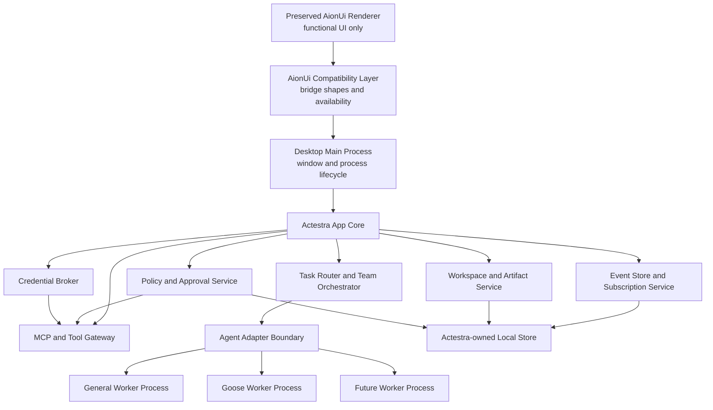

# System Overview

Status: P3 and P4.0/F0 through P4.3/F3.1 accepted on `main`;
P4.3/F3.2 approval-delivery policy and audit is under local validation on
`feat/aionui-f3-policy-audit`

## Context

Actestra presents one desktop product while using multiple specialized execution
engines. The primary design problem is not launching several agents; it is
maintaining one coherent task, permission, data, and audit model across them.

## Component view



## Current implementation boundary

The accepted P2 renderer, minimal context-isolated preload bridge, and Electron
main process remain on `main` as a P3 platform-contract and package-regression
harness. That shell is not the target product UI.

P4.0 adds a separate exact, frozen AionUi `v2.1.41` native source foundation.
It preserves 1,766 runnable desktop files, 27 routes, 41 bridge domains, and
the complete native functional UI. P4.1 applies Actestra identity, a versioned
private profile, and isolated external-effect providers as a reviewable
downstream overlay. It does not edit the frozen source or remove original
functional entries.

P3.1 and P3.2 add a runtime-neutral core domain, lifecycle validation, and
version 1 event stream contract. P3.3 adds a storage-neutral port plus a
main-owned SQLite adapter with schema versions 1 and 2. P3.4 adds the version 1
`AgentAdapter` contract, a main-owned lifecycle supervisor, and a deterministic
in-memory fake adapter. P3.5 adds versioned privileged-operation and
tool-manifest contracts plus main-owned deterministic policy, approval, opaque
credential-lease, metadata-audit, and tool-gateway services.

P3.6 adds SQLite schema version 3 for durable metadata-only privileged audit
and immutable terminal-attempt evidence. Electron main registers an inert
deny-by-default composition root, a disabled executor, trusted-main-frame IPC,
and a bounded renderer projection. Preload exposes only application metadata,
platform snapshot, and renderer-ready intents. F3.2 locally adds one separate,
exact loopback response-delivery manifest, policy rule, in-memory bounded input
reference, and executor beneath the existing F3.1 service. There is no
credential backend, general input-reference store, general MCP or native-tool
transport, process transport, or real worker adapter.

P4.2 adds the separate compatibility boundary accepted in
[ADR-0011](decisions/0011-aionui-shadow-projection.md). Successful native HTTP
responses and declared WebSocket events may publish seven strict metadata
observation shapes through one fixed preload operation. Main hashes native
identity, validates a P3 graph and optional task event stream, and appends
SQLite schema version 4 shadow evidence. It does not insert shadow records into
the authoritative P3 domain or core-event tables. Native AionUi continues to
own user-visible state, and projection failure cannot alter the native result.

P4.3/F3.1 adds the first narrowly authoritative write accepted in
[ADR-0012](decisions/0012-aionui-approval-decision-authority.md). The preserved
desktop confirmation surfaces submit one fixed response intent to main. Main
persists an immutable schema version 5 response and delivery outbox before
calling the loopback native confirmation endpoint. Exact duplicates are
idempotent, changed responses conflict, and a prior or failed attempt must be
reconciled against the native pending list before redelivery.

P4.3/F3.2, governed by
[ADR-0013](decisions/0013-aionui-approval-delivery-policy-gate.md), routes only
that persisted response-delivery effect through the P3 gateway as one fixed
`network.request` to an `external-service`. Policy and tool-start audit must
persist before the loopback POST, and completion or failure audit must persist
before the result is final. Compatibility-scoped hashes correlate the audit
without storing native identifiers or creating authoritative P3 domain rows.
This slice does not infer, approve, or execute the underlying native tool.

The SQLite adapter owns `state/actestra.sqlite3` beneath Actestra user data,
uses one DELETE/FULL connection, and rejects foreign ownership, future schemas,
inconsistent migration history, invalid domain graphs, and corrupt event
projections. Its asynchronous port prevents storage technology from entering
core consumers, but its current synchronous implementation must move to a
supervised persistence utility before user-workload writes are activated.

## Foundation integration boundary

ADR-0010 and the
[fusion architecture](AIONUI_ACTESTRA_FUSION.md) invert the earlier shell
migration:

- AionUi routes, components, interaction design, and functional entries remain
  the user-facing application;
- its 41 bridge domains form the renderer compatibility contract;
- Actestra adapters replace provider and authority behavior beneath that
  contract;
- domains transition from isolated native baseline, through shadow projection,
  to one declared Actestra system of record;
- unready external effects are isolated with visible reasons instead of having
  their UI deleted;
- Goose enters through the preserved agent/ACP experience;
- Eigent-style orchestration enters through the preserved Team experience.

The detailed non-regression scope is the
[AionUi Retention Matrix](../upstream/AIONUI_RETENTION_MATRIX.md).

The F2 shadow state is deliberately not shown as a second authority in the
component view. It is compatibility evidence only, has no renderer read path,
and cannot drive policy, approval, tool, worker, migration, or UI decisions.
Its implementation and live proof are recorded in
[AionUi F2 Shadow Projection](../product/AIONUI_F2_SHADOW_PROJECTION.md).

F3.1 introduces a separate authority only for the desktop confirmation response
and its outbox state. AionCore still owns pending confirmation creation,
provider-specific option validity, and protected-operation execution. The
preserved AionUi UI remains the presentation layer, and headless WebUI stays on
its isolated native compatibility path. The exact split is recorded in
[AionUi F3.1 Approval Decision Authority](../product/AIONUI_F3_APPROVAL_AUTHORITY.md).

F3.2 introduces no second user confirmation. The exact allow rule applies only
to transport of the response already selected in the preserved UI and persisted
by F3.1. A structured native rejection is returned only after failure audit
persists; an outcome-audit failure is uncertain and re-enters F3.1
reconciliation. The exact split is recorded in
[AionUi F3.2 Approval Delivery Policy Gate](../product/AIONUI_F3_APPROVAL_POLICY_GATE.md).

## Authority boundaries

### Desktop renderer

The renderer displays state and sends typed user intents. It does not hold raw
credentials or direct shell, filesystem, process, network publishing, or
installation authority.

### Desktop main process

The main process owns windows, IPC validation, privileged service lifecycle, and
worker process supervision. It does not embed an agent runtime in renderer
memory.

### Actestra app core

The app core owns:

- workspace and task identity;
- task routing and orchestration;
- worker registrations and capabilities;
- policy and approval decisions;
- versioned events;
- artifact metadata;
- audit history;
- credential references;
- migrations and crash recovery.

### Agent workers

Workers perform specialized reasoning and execution behind `AgentAdapter`.
Workers may retain private transient state, but Actestra does not rely on an
opaque worker session as the only record of task progress or user consent.

### Tool gateway

MCP servers and native tools are reached through a gateway that applies
workspace scope, credential brokering, policy, approval, logging, timeout, and
redaction.

The P3.5 language-level boundary is accepted in
[ADR-0007](decisions/0007-privileged-service-authorization.md). The gateway
validates a frozen protected-operation snapshot against an Actestra-owned tool
capability manifest, evaluates an immutable policy snapshot, appends
metadata-only policy evidence, obtains direct or one-shot approval evidence,
issues opaque credential-lease references, appends tool-start evidence, and
only then calls an injected executor. An operation with no matching rule is
denied, and conflicting rules resolve in `deny`, then `require-approval`, then
`allow` precedence.

The current executor is test-only and receives an opaque input reference rather
than raw arguments. The current credential broker has no secret store. Approval
permits one attempt but does not prove execution or success. Failure after an
executor call is reported as possibly executed and must not be retried
automatically.

The P3.6 startup, durable evidence, supervisor release, IPC, and projection
boundary is accepted in
[ADR-0008](decisions/0008-main-owned-projection-and-ipc.md). Durable audit
continues its gapless sequence across restart. Terminal worker events and
metadata-only incident codes must persist before supervisor memory is released.
Renderer projection excludes event content, incident messages, input
references, credential references, paths, and raw persistence access.

## Adapter lifecycle

Protocol version 1 is accepted in
[ADR-0006](decisions/0006-agent-adapter-lifecycle-and-supervision.md) and owns
this language-level boundary:

```ts
interface AgentAdapter {
  capabilities(): Promise<AgentCapabilities>
  start(request: AgentStartRequest): Promise<void>
  send(sessionId: SessionId, input: AgentInput): Promise<void>
  approve(
    requestId: ToolRequestId,
    decision: AgentApprovalDecision,
  ): Promise<void>
  cancel(sessionId: SessionId, reason?: string): Promise<void>
  subscribe(sessionId: SessionId, handler: AgentSignalHandler): Unsubscribe
  dispose(sessionId: SessionId): Promise<void>
}
```

Capabilities and the protocol version are checked exactly before start.
Control signals and nested core events have independent gapless sequences.
Session, worker, and event-stream identity is immutable for one attempt; crash
or timeout recovery starts a bounded replacement with fresh attempt identities.
The supervisor uses observed local time for startup, heartbeat, and cancellation
acknowledgement bounds instead of trusting worker timestamps.
Terminal attempts remain readable after adapter cleanup until the main-owned
evidence coordinator persists their core events and metadata-only terminal
record. Only then does it cross the supervisor release barrier and clear
in-memory events. Failed writes retain the snapshot for an idempotent retry.

Adapters translate external formats. The UI and app core must not branch on a
Goose-specific or future-worker-specific event format. The deterministic fake
performs no filesystem, network, process, shell, model, credential, or tool
operation.

## Event contract

Every event uses the version 1 envelope accepted in
[ADR-0004](decisions/0004-core-domain-event-stream.md), with:

- event identifier;
- schema version;
- task, session, and worker identifiers;
- monotonic sequence or equivalent ordering field;
- timestamp;
- event type;
- payload;
- causation and correlation identifiers;
- redaction classification.

Ordering is scoped to one immutable worker execution attempt. Sequence numbers
start at one and are gapless; timestamps cannot move backwards but do not
determine order. Exact duplicate event identifiers are idempotent, conflicting
reuse fails closed, verified cursors support replay, and no event can follow a
terminal task event.

Initial event types:

- `task.started`
- `task.updated`
- `agent.message`
- `tool.requested`
- `tool.started`
- `tool.completed`
- `tool.failed`
- `approval.required`
- `approval.resolved`
- `artifact.created`
- `artifact.updated`
- `worker.blocked`
- `worker.failed`
- `task.completed`
- `task.failed`
- `task.cancelled`

## Data ownership

| Data | System of record |
| --- | --- |
| Product settings and migrations | Actestra |
| Native conversation, task, provider, workspace, artifact, runtime, and pending-confirmation state through F3.2 | Native AionUi |
| F2 compatibility shadow evidence | Actestra SQLite, inert and non-authoritative |
| F3.1 desktop confirmation response and delivery state | Actestra SQLite schema 5 |
| F3.2 response-delivery policy and audit evidence | Actestra fixed policy plus SQLite schema 3 audit |
| Workspace grants | Actestra |
| Tasks and dependency graph | Actestra |
| P3 protected-operation approval evidence for the underlying native tool | Actestra target contract; not activated by F3.2 |
| Event and audit history | Actestra |
| Artifact metadata | Actestra |
| Secret values | Operating-system secure storage via Actestra broker |
| Worker transient state | Worker, treated as recoverable or disposable |
| Git task changes | Isolated task worktree |
| Upstream runtime configuration | Adapter-managed and versioned |

## Isolation model

- Each worker is a separate supervised process.
- Each coding task uses a dedicated Git worktree.
- General tasks write to a task output area before replacing user files.
- Tool access is scoped to an approved workspace and task.
- High-risk native operations require explicit policy and approval evidence.
- Cancellation terminates downstream tools and reconciles task state.
- No worker receives every credential or unrestricted home-directory access by
  default.

## Failure model

The core must distinguish:

- worker unavailable;
- incompatible worker version;
- user denied approval;
- tool timeout or failure;
- worker crash;
- core restart;
- partial team failure;
- artifact conflict;
- cancellation;
- policy rejection.

These states must not be collapsed into a generic success, generic chat message,
or silent retry. P3.4 implements startup and heartbeat timeout,
idempotent cancellation, cancellation acknowledgement timeout, protocol
failure, crash, terminal reconciliation, and bounded fresh-attempt restart
semantics. P3.6 persists terminal incident codes and projects bounded,
metadata-only attempt state through trusted main-frame IPC.

## Deferred choices

P2 pins Node.js 24.13.0, Bun 1.3.9, Electron 37.10.3, React 19.2.4, and data
layout version 1 for the legacy harness. The native AionUi foundation retains
its exact locked dependency graph until a reviewed downstream update.
ADR-0005 selects Electron's embedded `node:sqlite` and an Actestra-owned
forward migration registry for durable storage. ADR-0011 selects the bounded
F2 observation transport and inert shadow storage. ADR-0012 selects the first
F3 authority slice and persist-before-deliver reconciliation. Later P4 work
still must order the remaining domain migrations and decide worker sandbox
mechanisms, real credential storage, input-reference storage, production
policy, and utility-process hosting. Signing, notarization, update delivery,
and cross-platform candidate packaging remain P8 work.

This document fixes authority and lifecycle boundaries; a pinned shell
dependency does not pre-decide worker or persistence architecture.
