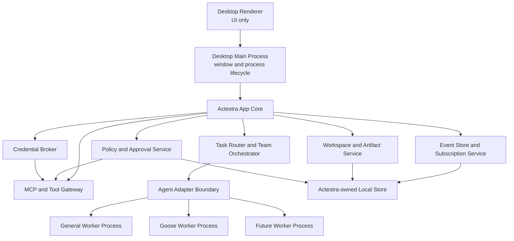

# System Overview

Status: P2 shell implemented; P3 platform core planned

## Context

Actestra presents one desktop product while using multiple specialized execution
engines. The primary design problem is not launching several agents; it is
maintaining one coherent task, permission, data, and audit model across them.

## Component view



## Current implementation boundary

P2 implements the renderer, a minimal context-isolated preload bridge, and the
Electron main process. The renderer can request application metadata and report
that it rendered; neither operation grants filesystem, shell, process,
credential, installation, or publishing authority.

The app core, persistence beyond the versioned data-layout manifest, policy and
approval service, tool gateway, worker adapters, and workers shown below are P3
or later components. They are architectural boundaries, not hidden
implementations in the P2 package.

## Authority boundaries

### Desktop renderer

The renderer displays state and sends typed user intents. It does not hold raw
credentials or direct shell, filesystem, process, network publishing, or
installation authority.

### Desktop main process

The main process owns windows, IPC validation, privileged service lifecycle, and
worker process supervision. It does not embed an agent runtime in renderer
memory.

### Actestra app core

The app core owns:

- workspace and task identity;
- task routing and orchestration;
- worker registrations and capabilities;
- policy and approval decisions;
- versioned events;
- artifact metadata;
- audit history;
- credential references;
- migrations and crash recovery.

### Agent workers

Workers perform specialized reasoning and execution behind `AgentAdapter`.
Workers may retain private transient state, but Actestra does not rely on an
opaque worker session as the only record of task progress or user consent.

### Tool gateway

MCP servers and native tools are reached through a gateway that applies
workspace scope, credential brokering, policy, approval, logging, timeout, and
redaction.

## Adapter lifecycle

The language-level interface may change during P3, but it must preserve these
capabilities:

```ts
interface AgentAdapter {
  capabilities(): Promise<AgentCapabilities>
  start(task: AgentTask): Promise<AgentSession>
  send(sessionId: string, message: AgentInput): Promise<void>
  approve(requestId: string, decision: ApprovalDecision): Promise<void>
  cancel(sessionId: string, reason?: string): Promise<void>
  subscribe(sessionId: string, handler: AgentEventHandler): Unsubscribe
  dispose(sessionId: string): Promise<void>
}
```

Adapters translate external formats. The UI and app core must not branch on a
Goose-specific or future-worker-specific event format.

## Event contract

Every event uses a versioned envelope with at least:

- event identifier;
- schema version;
- task, session, and worker identifiers;
- monotonic sequence or equivalent ordering field;
- timestamp;
- event type;
- payload;
- causation and correlation identifiers;
- redaction classification.

Initial event types:

- `task.started`
- `task.updated`
- `agent.message`
- `tool.requested`
- `tool.started`
- `tool.completed`
- `tool.failed`
- `approval.required`
- `approval.resolved`
- `artifact.created`
- `artifact.updated`
- `worker.blocked`
- `worker.failed`
- `task.completed`
- `task.failed`
- `task.cancelled`

## Data ownership

| Data | System of record |
| --- | --- |
| Product settings and migrations | Actestra |
| Workspace grants | Actestra |
| Tasks and dependency graph | Actestra |
| User approval evidence | Actestra |
| Event and audit history | Actestra |
| Artifact metadata | Actestra |
| Secret values | Operating-system secure storage via Actestra broker |
| Worker transient state | Worker, treated as recoverable or disposable |
| Git task changes | Isolated task worktree |
| Upstream runtime configuration | Adapter-managed and versioned |

## Isolation model

- Each worker is a separate supervised process.
- Each coding task uses a dedicated Git worktree.
- General tasks write to a task output area before replacing user files.
- Tool access is scoped to an approved workspace and task.
- High-risk native operations require explicit policy and approval evidence.
- Cancellation terminates downstream tools and reconciles task state.
- No worker receives every credential or unrestricted home-directory access by
  default.

## Failure model

The core must distinguish:

- worker unavailable;
- incompatible worker version;
- user denied approval;
- tool timeout or failure;
- worker crash;
- core restart;
- partial team failure;
- artifact conflict;
- cancellation;
- policy rejection.

These states must not be collapsed into a generic success, generic chat message,
or silent retry.

## Deferred choices

P2 pins Node.js 24.13.0, Bun 1.3.9, Electron 37.10.3, React 19.2.4, and data
layout version 1 for the current shell. P3 will decide durable storage
technology, process transport, schema tooling, worker sandbox mechanisms, and
the concrete migration registry. Signing, notarization, update delivery, and
cross-platform candidate packaging remain P8 work.

This document fixes authority and lifecycle boundaries; a pinned shell
dependency does not pre-decide worker or persistence architecture.
