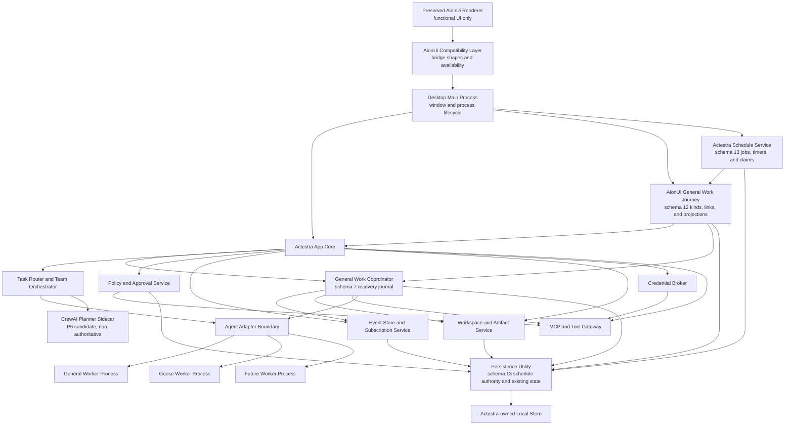

# System Overview

Status: P3, F0 through F3.3, GW-P4.2 through GW-P4.6, the representative
workspace-file, bounded local-research, writing, Office-document, and
schema-13 schedule journeys are accepted on `main` through exact current head
`3d8d697a6416176d90183f671da28347bb194553` and merged-main CI run
30661178474; representative tool failure has final-local root, native, package,
package-audit, and target-app evidence but no Git or remote acceptance yet;
Worker-crash/recovery remains before the P4 exit gate; CrewAI is accepted as
the first P6 planner-sidecar candidate but is not implemented or packaged

## Context

Actestra presents one desktop product while using multiple specialized execution
engines. The primary design problem is not launching several agents; it is
maintaining one coherent task, permission, data, and audit model across them.

## Component view



## Current implementation boundary

The accepted P2 renderer, minimal context-isolated preload bridge, and Electron
main process remain on `main` as a P3 platform-contract and package-regression
harness. That shell is not the target product UI.

P4.0 adds a separate exact, frozen AionUi `v2.1.41` native source foundation.
It preserves 1,766 runnable desktop files, 27 routes, 41 bridge domains, and
the complete native functional UI. P4.1 applies Actestra identity, a versioned
private profile, and isolated external-effect providers as a reviewable
downstream overlay. It does not edit the frozen source or remove original
functional entries.

P3.1 and P3.2 add a runtime-neutral core domain, lifecycle validation, and
version 1 event stream contract. P3.3 adds a storage-neutral port plus a SQLite
adapter with schema versions 1 and 2. P3.4 historically added the version 1
`AgentAdapter` contract, a main-owned lifecycle supervisor, and a deterministic
in-memory fake adapter. GW-P4.3 advances that boundary to Adapter v2 and a real
deterministic process while retaining the accepted lifecycle rules. P3.5 adds
versioned privileged-operation and tool-manifest contracts plus main-owned
deterministic policy, approval, opaque credential-lease, metadata-audit, and
tool-gateway services.

P3.6 adds SQLite schema version 3 for durable metadata-only privileged audit
and immutable terminal-attempt evidence. Electron main registers an inert
deny-by-default composition root, a disabled executor, trusted-main-frame IPC,
and a bounded renderer projection. Preload exposes only application metadata,
platform snapshot, and renderer-ready intents. F3.2 adds one separate, exact
loopback response-delivery manifest, policy rule, in-memory bounded input
reference, and executor beneath the existing F3.1 service. F3.3 separately
gates the bounded boolean reconciliation read. At that merged baseline there
is no credential backend, general content-reference store, general MCP or
native-tool transport, process transport, or real worker adapter. GW-P4.2 adds
the content-reference store and persistence process; GW-P4.3 adds the first
real deterministic worker process; accepted GW-P4.4 admits exactly two
main-owned native text capabilities without granting filesystem authority to
that process. Accepted GW-P4.5 adds the durable coordination and
restart-recovery sequence around those capabilities. Accepted GW-P4.6 maps
that sequence into the preserved AionUI SendBox, message, cancel, and Preview
surfaces. The representative-file, bounded local-research, writing, and
Office-document paths accepted through pull requests 16 through 19 compose the
scoped capabilities inside that same journey. ADR-0023's main-owned
schedule-provider boundary, schema 13, timers, claims, and native cron routing
are accepted through pull requests 20 and 21 with exact merged-main CI.
Representative tool failure reuses the existing file journey and scoped-read
policy path; its local evidence remains distinct from commit, PR, merge, or
release evidence.

P4.2 adds the separate compatibility boundary accepted in
[ADR-0011](decisions/0011-aionui-shadow-projection.md). Successful native HTTP
responses and declared WebSocket events may publish seven strict metadata
observation shapes through one fixed preload operation. Main hashes native
identity, validates a P3 graph and optional task event stream, and appends
SQLite schema version 4 shadow evidence. It does not insert shadow records into
the authoritative P3 domain or core-event tables. Native AionUi continues to
own user-visible state, and projection failure cannot alter the native result.

P4.3/F3.1 adds the first narrowly authoritative write accepted in
[ADR-0012](decisions/0012-aionui-approval-decision-authority.md). The preserved
desktop confirmation surfaces submit one fixed response intent to main. Main
persists an immutable schema version 5 response and delivery outbox before
calling the loopback native confirmation endpoint. Exact duplicates are
idempotent, changed responses conflict, and a prior or failed attempt must be
reconciled against the native pending list before redelivery.

P4.3/F3.2, governed by
[ADR-0013](decisions/0013-aionui-approval-delivery-policy-gate.md), routes only
that persisted response-delivery effect through the P3 gateway as one fixed
`network.request` to an `external-service`. Policy and tool-start audit must
persist before the loopback POST, and completion or failure audit must persist
before the result is final. Compatibility-scoped hashes correlate the audit
without storing native identifiers or creating authoritative P3 domain rows.
This slice does not infer, approve, or execute the underlying native tool.

GW-P4.2 general work, governed by
[ADR-0016](decisions/0016-p4-general-work-process-and-content-boundaries.md),
moves schemas 1 through 5 and every P3/F2/F3 persistence operation together
behind a dedicated utility process. Schema version 6 adds durable workspace
grants and immutable, 1 MiB-bounded UTF-8 content references with exact owner,
kind, lifecycle, length, and SHA-256 validation. Pull request 10 merged this
slice as `8e32882108b10272c1489c1a46a77cede1cc4fb7`, and exact main CI run
30476091907 passes.

The persistence utility exclusively owns `state/actestra.sqlite3` beneath
Actestra user data, uses one DELETE/FULL connection, and rejects foreign
ownership, future schemas, inconsistent migration history, invalid domain
graphs, corrupt event projections, and corrupt content. Electron main and the
AionUi compatibility bridge use one asynchronous, versioned port with no
synchronous fallback. Source and packaged-graph checks reject `node:sqlite`
and `DatabaseSync` from the main entry and require them in the utility entry.
This process separation is not an operating-system sandbox.

GW-P4.3, governed by
[ADR-0017](decisions/0017-general-worker-process-and-agent-adapter-v2.md),
advances AgentAdapter to exact version 2 with typed tool-result resolution and
explicit protocol-error signals. A separate native worker protocol at exact
version 1 runs one deterministic attempt per Electron utility process. Main
owns attempt tokens, product IDs, ToolRequest IDs, timestamps, normalized Core
events, cancellation, and cleanup. The worker receives only a bounded prompt,
entry state, control messages, and typed tool results with optional opaque
output references.

The root harness and preserved AionUI downstream both build a distinct General
Worker entry. A real packaged-harness smoke and a real materialized-AionUI
launch complete a three-event no-tool process probe. The latter also starts
the exact local AionCore 0.1.52 and reaches renderer-ready with no
installation-incomplete fault injection. Pull request 11 merged the exact
GW-P4.3 head `b3a3bc7e27d7dab44dadeff6dcedc92cec1b3ee5` as
`671587813bea18411b6cdc2ee388d94cd18d6c50`; pull-request CI run 30481670123
and exact merged-main CI run 30481890911 pass. The probe is not yet wired to a
user-submitted task, and no filesystem, shell, network, credential, MCP,
persistence, policy, or approval authority is granted to the worker itself.

GW-P4.4, governed by
[ADR-0018](decisions/0018-scoped-native-text-tools-and-policy.md), registers
only `actestra.workspace.read-text` and
`actestra.task-output.write-text`. A main-owned coordinator accepts only the
current pending request of a still-blocked supervised attempt, derives
identity from the attempt and normalized event, and derives action, resource
kind, credential prohibition, and timeout from a closed registry. It then
uses the existing deny-by-default gateway and durable audit path.

The production executor reloads the exact active workspace grant and content
owner. Reads require a portable normalized relative path, canonical
containment, no symbolic-link component, a regular file, valid UTF-8, and at
most 1 MiB. Writes are limited to a validated task-owned
`.actestra/task-output/<task-id>` subtree and publish create-only through an
exclusive same-filesystem operation. Content returns only as an exact-owner
opaque reference. Stable cancellation, timeout, scope, validation, conflict,
and post-effect failure evidence reaches the gateway without exposing raw
content or paths to the worker or renderer. Root and native regression, build,
unsigned harness package, and isolated native desktop smoke pass locally.
The complete 30-file full-diff review was remediated. Pull request 12 merged
the exact head `34f2d2201581c19b3dc67c5a7936f8a411bff9e1` as
`7ec009c6384a93c17f24e4276469e98cb5f2b71d`; pull-request CI run
30486392525 and exact merged-main CI run 30486544268 pass.

GW-P4.5, governed by
[ADR-0019](decisions/0019-general-work-durable-coordination-and-recovery.md),
adds a revisioned schema version 7 journal for immutable attempt identity,
append-only Core events, a verified bounded-event resume baseline, explicit
tool execution ambiguity, a pre-execution workspace-grant identity, file
artifact intent, exact-owner output binding, terminal cleanup, and
finalization. Before that event window advances, its evicted prefix is
committed idempotently to the normalized event store. The main-owned
coordinator persists an in-flight tool before execution and its terminal
result before Adapter acknowledgement. A failed barrier retains the exact
terminal result and cannot execute the create-only tool again.

After Adapter cleanup, terminal-pending state precedes authoritative-history
and resume-baseline verification, artifact verification, serialized
Task/Session/Worker/Artifact reconciliation, idempotent event append, terminal
evidence, finalized state, and Supervisor release. Admission and startup
recovery cap non-finalized checkpoints at 100. Startup recovers them before
the preserved AionUI window opens. Active attempts become explicit restart
failure or cancellation evidence and require fresh worker identity. No
renderer or route changes, and no Goose, CrewAI, or Eigent runtime enters this
slice.

GW-P4.6, governed by
[ADR-0020](decisions/0020-preserved-aionui-general-work-journey.md), adds one
strict `/actestra` intent to the preserved SendBox while ordinary native sends
remain unchanged. Main resolves the selected native conversation through one
bounded loopback read, validates and canonicalizes its workspace, and
atomically registers the Actestra Workspace, grant, Task, Session, Worker,
prompt, output input, and schema-version-8 journey link. Only a SHA-256 hash of
the raw native conversation identity is durable.

One real supervised General Worker utility process requests the existing
create-only task-output capability with an exact main-owned ToolRequest ID.
The representative-file extension adds schema version 9's closed journey kind.
Its `/actestra file` intent cannot select a path: main supplies only
`actestra-input.txt` with a 64 KiB per-invocation read maximum aligned to Worker
transport, invokes the bounded workspace read, resolves its exact owned output,
and sends that content to the same Worker. Oversized source fails as
`content-too-large` before transport. The Worker returns a strict private
`result.md` write input to its adapter; main persists it under a second request
owner before invoking the create-only tool. Source text and the private write
input do not enter Core events or renderer projections.

Status, incident, cancellation, and Artifact projections are rebuilt from
Actestra state. Preview requires the linked Task, finalized checkpoint
binding, exact Artifact, and exact-owner content reference; only bounded UTF-8
content crosses the preload bridge and the native Preview marks it
non-persistable. Prepared linked Tasks with no attempt resume from their
already persisted prompt, journey kind, grant, and initial tool input after
native backend/window readiness, without re-reading or rebinding native
workspace state. This slice adds no route, second UI, Goose, CrewAI, or Eigent
runtime.

The local-research extension adds schema version 10's exact
`local-research-artifact` kind and `/actestra research` command. Main reads
only `actestra-research.txt` under the same 64 KiB Worker transport bound. The
same isolated Worker converts at most 32 non-empty local evidence lines into a
private create-only `research.md` input; main persists that input under the
exact write request before the accepted task-output tool creates a file
Artifact labeled `Actestra local research brief`. Source content stays out of
normalized Core events and renderer projections. This is a deterministic
offline local-corpus fixture, not general or network research authority.

The writing extension adds schema version 11's exact `writing-artifact` kind
and `/actestra write` command. Its ordered Title, Audience, Purpose, and one to
eight Point fields are validated before prompt-only atomic registration. It
performs no workspace read. The isolated Worker derives a private `draft.md`
create-only input; main persists that exact-owner input before the existing
text tool creates a `document` Artifact labeled `Actestra writing draft`.
Prepared recovery regenerates from the durable brief without replaying native
workspace context. Private draft input and its content reference stay out of
normalized Core events, metadata audit, and renderer projections; only the
owned non-persisted Preview returns bounded content.

The Office extension adds schema version 12's exact
`office-document-artifact` kind and `/actestra office` command. Its ordered
Document, Owner, Summary, and one through six Section fields are validated
before prompt-only atomic registration. The isolated Worker derives a private
bounded document model without reading the workspace. Main persists the
versioned model inside the exact-owner tool input before the third closed
scoped capability, `actestra.task-output.write-office-document`, generates and
atomically publishes the fixed `brief.docx` package. After publication, the
executor persists the same validated model as the canonical exact-owner tool
output bound to the `document` Artifact. The retained Word Preview resolves
that finalized binding and receives only a detached, bounded renderer
projection through safe React text nodes. `persist: false` prevents AionUI from
caching that projection; it does not make the canonical Actestra model
non-durable. DOCX bytes, output paths, roots, and content references do not
cross into the renderer or metadata-only evidence.

ADR-0023 implements a schema-13 schedule authority beneath the retained
`/scheduled` routes and `ipcBridge.cron` DTOs. One main-owned service holds
bounded existing-conversation jobs, canonical schedule grants, next-run
calculation, timers, atomic run claims, missed/interrupted state, and native
event projection. A claimed run may enter the existing General Work journey
only from that stored grant and never gives the scheduler direct Worker or tool
authority. Contract, migration, persistence, main-service, bridge, and native
compatibility are accepted on `main` through pull request 20, exact final head
`c06ca5b4bd842fbad098ffc3b9e7bcef1aadbceb`, PR CI 30659567604, squash merge
`5b0748af674165f9e9475be61dc1e02a1b08c8bc`, and merged-main CI 30660078199.
Pull request 21 records that acceptance on current `main`; its merged-main CI
30661178474 passes.

## Foundation integration boundary

ADR-0010 and the
[fusion architecture](AIONUI_ACTESTRA_FUSION.md) invert the earlier shell
migration:

- AionUi routes, components, interaction design, and functional entries remain
  the user-facing application;
- its 41 bridge domains form the renderer compatibility contract;
- Actestra adapters replace provider and authority behavior beneath that
  contract;
- domains transition from isolated native baseline, through shadow projection,
  to one declared Actestra system of record;
- unready external effects are isolated with visible reasons instead of having
  their UI deleted;
- Goose enters through the preserved agent/ACP experience;
- Eigent-style orchestration enters through the preserved Team experience.

The detailed non-regression scope is the
[AionUi Retention Matrix](../upstream/AIONUI_RETENTION_MATRIX.md).

The F2 shadow state is deliberately not shown as a second authority in the
component view. It is compatibility evidence only, has no renderer read path,
and cannot drive policy, approval, tool, worker, migration, or UI decisions.
Its implementation and live proof are recorded in
[AionUi F2 Shadow Projection](../product/AIONUI_F2_SHADOW_PROJECTION.md).

F3.1 introduces a separate authority only for the desktop confirmation response
and its outbox state. AionCore still owns pending confirmation creation,
provider-specific option validity, and protected-operation execution. The
preserved AionUi UI remains the presentation layer, and headless WebUI stays on
its isolated native compatibility path. The exact split is recorded in
[AionUi F3.1 Approval Decision Authority](../product/AIONUI_F3_APPROVAL_AUTHORITY.md).

F3.2 introduces no second user confirmation. The exact allow rule applies only
to transport of the response already selected in the preserved UI and persisted
by F3.1. A structured native rejection is returned only after failure audit
persists; an outcome-audit failure is uncertain and re-enters F3.1
reconciliation. The exact split is recorded in
[AionUi F3.2 Approval Delivery Policy Gate](../product/AIONUI_F3_APPROVAL_POLICY_GATE.md).

F3.3 introduces no pending-list authority. It routes only the main-owned,
boolean reconciliation read through its own exact capability, policy, and
durable audit sequence. AionCore still owns request creation and list content.
The exact split is recorded in
[AionUi F3.3 Approval Reconciliation Policy Gate](../product/AIONUI_F3_APPROVAL_RECONCILIATION_GATE.md).

## Authority boundaries

### Desktop renderer

The renderer displays state and sends typed user intents. It does not hold raw
credentials or direct shell, filesystem, process, network publishing, or
installation authority.

### Desktop main process

The main process owns windows, IPC validation, privileged service lifecycle, and
worker process supervision. It does not embed an agent runtime in renderer
memory.

### Actestra app core

The app core owns:

- workspace and task identity;
- task routing and orchestration;
- worker registrations and capabilities;
- policy and approval decisions;
- versioned events;
- artifact metadata;
- audit history;
- credential references;
- migrations and crash recovery.

### Team orchestrator and CrewAI sidecar

The Actestra TeamOrchestrator owns the authoritative dependency graph, worker
admission, attempt identity, budgets, approvals, artifacts, cancellation,
replanning versions, and recovery state.

CrewAI is the first P6 planner-sidecar candidate under
[ADR-0015](decisions/0015-crewai-supervised-orchestration-sidecar.md). It runs
in a separately supervised Python process and may propose bounded plans,
replans, worker-capability assignments, and result aggregations. It cannot
create processes, worktrees, credentials, approvals, tools, authoritative
identifiers, or durable product state. Its private memory, persistence,
events, traces, and retries are disposable compatibility state.

Eigent remains the reference for the user-visible Team experience and
acceptance behavior; its separate application and complete runtime are not
part of the Actestra process topology.

### Agent workers

Workers perform specialized reasoning and execution behind `AgentAdapter`.
Workers may retain private transient state, but Actestra does not rely on an
opaque worker session as the only record of task progress or user consent.

### Tool gateway

MCP servers and native tools are reached through a gateway that applies
workspace scope, credential brokering, policy, approval, logging, timeout, and
redaction.

The P3.5 language-level boundary is accepted in
[ADR-0007](decisions/0007-privileged-service-authorization.md). The gateway
validates a frozen protected-operation snapshot against an Actestra-owned tool
capability manifest, evaluates an immutable policy snapshot, appends
metadata-only policy evidence, obtains direct or one-shot approval evidence,
issues opaque credential-lease references, appends tool-start evidence, and
only then calls an injected executor. An operation with no matching rule is
denied, and conflicting rules resolve in `deny`, then `require-approval`, then
`allow` precedence.

The accepted P3 baseline executor is test-only. Accepted GW-P4.4 adds a
production executor for the two exact ADR-0018 text capabilities; ADR-0022
adds one exact create-only Office-document capability under the same
main-owned gateway. Each still receives an opaque input reference rather than
raw renderer arguments. The current
credential broker has no secret store. Approval permits one attempt but does
not prove execution or success. Executor failures carry stable codes and
explicit `mayHaveExecuted` evidence; an ambiguous post-effect failure must not
be retried automatically.

The P3.6 startup, durable evidence, supervisor release, IPC, and projection
boundary is accepted in
[ADR-0008](decisions/0008-main-owned-projection-and-ipc.md). Durable audit
continues its gapless sequence across restart. Terminal worker events and
metadata-only incident codes must persist before supervisor memory is released.
Renderer projection excludes event content, incident messages, input
references, credential references, paths, and raw persistence access.

## Adapter lifecycle

The lifecycle rules originate in
[ADR-0006](decisions/0006-agent-adapter-lifecycle-and-supervision.md).
[ADR-0017](decisions/0017-general-worker-process-and-agent-adapter-v2.md)
supersedes its version-1 interface with exact Adapter version 2:

```ts
interface AgentAdapter {
  capabilities(): Promise<AgentCapabilities>;
  start(request: AgentStartRequest): Promise<void>;
  appendAuthoritativeArtifactEvent(
    sessionId: SessionId,
    event: CoreEvent<"artifact.created" | "artifact.updated">,
  ): Promise<void>;
  send(sessionId: SessionId, input: AgentInput): Promise<void>;
  approve(requestId: ToolRequestId, decision: AgentApprovalDecision): Promise<void>;
  resolveTool(requestId: ToolRequestId, result: AgentToolResult): Promise<void>;
  cancel(sessionId: SessionId, reason?: string): Promise<void>;
  subscribe(sessionId: SessionId, handler: AgentSignalHandler): Unsubscribe;
  dispose(sessionId: SessionId): Promise<void>;
}
```

Capabilities and the protocol version are checked exactly before start.
Control signals and nested core events have independent gapless sequences.
Session, worker, and event-stream identity is immutable for one attempt; crash
or timeout recovery starts a bounded replacement with fresh attempt identities.
The supervisor uses observed local time for startup, heartbeat, and cancellation
acknowledgement bounds instead of trusting worker timestamps.
Terminal attempts remain readable after adapter cleanup until the main-owned
evidence coordinator persists their core events and metadata-only terminal
record. Only then does it cross the supervisor release barrier and clear
in-memory events. Failed writes retain the snapshot for an idempotent retry.

Adapters translate external formats. The UI and app core must not branch on a
General Worker, Goose, or future-worker private event format. The deterministic
fake performs no I/O. The GW-P4.3 process worker performs only protocol and
lifecycle computation; it has no filesystem, network, shell, model,
credential, persistence, Electron, or tool-execution authority.

## Event contract

Every event uses the version 1 envelope accepted in
[ADR-0004](decisions/0004-core-domain-event-stream.md), with:

- event identifier;
- schema version;
- task, session, and worker identifiers;
- monotonic sequence or equivalent ordering field;
- timestamp;
- event type;
- payload;
- causation and correlation identifiers;
- redaction classification.

Ordering is scoped to one immutable worker execution attempt. Sequence numbers
start at one and are gapless; timestamps cannot move backwards but do not
determine order. Exact duplicate event identifiers are idempotent, conflicting
reuse fails closed, verified cursors support replay, and no event can follow a
terminal task event.

Initial event types:

- `task.started`
- `task.updated`
- `agent.message`
- `tool.requested`
- `tool.started`
- `tool.completed`
- `tool.failed`
- `approval.required`
- `approval.resolved`
- `artifact.created`
- `artifact.updated`
- `worker.blocked`
- `worker.failed`
- `task.completed`
- `task.failed`
- `task.cancelled`

## Data ownership

| Data                                                                                                           | System of record                                    |
| -------------------------------------------------------------------------------------------------------------- | --------------------------------------------------- |
| Product settings and migrations                                                                                | Actestra                                            |
| Native conversation, task, provider, workspace, artifact, runtime, and pending-confirmation state through F3.2 | Native AionUi                                       |
| F2 compatibility shadow evidence                                                                               | Actestra SQLite, inert and non-authoritative        |
| F3.1 desktop confirmation response and delivery state                                                          | Actestra SQLite schema 5                            |
| F3.2 response-delivery policy and audit evidence                                                               | Actestra fixed policy plus SQLite schema 3 audit    |
| Workspace grants                                                                                               | Actestra persistence utility, schema 6              |
| Bounded content references                                                                                     | Actestra persistence utility, schema 6              |
| General Work attempt, tool, artifact-binding, and recovery checkpoints                                         | Actestra persistence utility, schema 7              |
| Preserved-AionUI journey links, kinds, and authoritative registration including prompt-only writing and Office | Actestra persistence utility, schema 12             |
| Scheduled General Work jobs, grants, timers, and run claims                                                    | Actestra persistence utility, schema 13             |
| Tasks and dependency graph                                                                                     | Actestra                                            |
| P3 protected-operation approval evidence for the underlying native tool                                        | Actestra target contract; not activated by F3.2     |
| Event and audit history                                                                                        | Actestra                                            |
| Artifact metadata                                                                                              | Actestra                                            |
| Secret values                                                                                                  | Operating-system secure storage via Actestra broker |
| Worker transient state                                                                                         | Worker, treated as recoverable or disposable        |
| Git task changes                                                                                               | Isolated task worktree                              |
| Upstream runtime configuration                                                                                 | Adapter-managed and versioned                       |

## Isolation model

- Each worker is a separate supervised process.
- Each coding task uses a dedicated Git worktree.
- General tasks write to a task output area before replacing user files.
- Tool access is scoped to an approved workspace and task.
- High-risk native operations require explicit policy and approval evidence.
- Cancellation terminates downstream tools and reconciles task state.
- No worker receives every credential or unrestricted home-directory access by
  default.

## Failure model

The core must distinguish:

- worker unavailable;
- incompatible worker version;
- user denied approval;
- tool timeout or failure;
- worker crash;
- core restart;
- partial team failure;
- artifact conflict;
- cancellation;
- policy rejection.

These states must not be collapsed into a generic success, generic chat message,
or silent retry. P3.4 implements startup and heartbeat timeout,
idempotent cancellation, cancellation acknowledgement timeout, protocol
failure, crash, terminal reconciliation, and bounded fresh-attempt restart
semantics. P3.6 persists terminal incident codes and projects bounded,
metadata-only attempt state through trusted main-frame IPC. GW-P4.5 persists
the pre-execution, pre-acknowledgement, terminal-pending, and finalized
barriers, retains ambiguous effects, and deterministically converts
application-interrupted attempts into recoverable terminal evidence. GW-P4.6
adds atomic pre-attempt registration and separately restarts prepared linked
Tasks only from that already durable authority.

## Deferred choices

P2 pins Node.js 24.13.0, Bun 1.3.9, Electron 37.10.3, React 19.2.4, and data
layout version 1 for the legacy harness. The native AionUi foundation retains
its exact locked dependency graph until a reviewed downstream update.
ADR-0005 selects Electron's embedded `node:sqlite` and an Actestra-owned
forward migration registry for durable storage. ADR-0011 selects the bounded
F2 observation transport and inert shadow storage. ADR-0012 selects the first
F3 authority slice and persist-before-deliver reconciliation. ADR-0015 fixes
the authority and process boundary for the first P6 orchestration candidate,
but does not select a production CrewAI dependency. ADR-0016 selects the
general-work persistence utility, schema 6 grants, and bounded content
references. ADR-0017 selects Adapter v2 and the real General Worker protocol.
ADR-0018 selects the two scoped native text tools and their production policy.
ADR-0019 selects the durable general-work coordination, tool-result retention,
artifact binding, and startup-recovery sequence. ADR-0020 selects the
preserved-AionUI General Work intents, atomic schema-8 journey authority,
schema-9 file journey, schema-10 bounded local-research journey, redacted
projection, non-persisted native Preview, and prepared-task recovery sequence.
ADR-0021 adds schema-11 prompt-derived writing, private Worker-authored draft
input, document Artifact, and prepared recovery without workspace reread.
ADR-0022 adds schema-12 Office registration, a private Worker-authored document
model, one main-owned create-only DOCX tool, and the bounded retained Word
Preview provider. ADR-0023 accepts schema-13 schedule ownership, main-owned
timers and claims, retained cron DTOs/events, skipped missed occurrences, and
existing-conversation General Work execution. Four complete 50-file review
passes have explicit fixes or accepted-decision dispositions; two follow-up
confirmations were rate-limited before analysis and are not zero-issue
evidence. Final local gates, exact PR-head CI, squash merge, and merged-main CI
are recorded above. The representative tool-failure slice adds no new renderer
or tool capability: it forces the existing 64 KiB file-read boundary, retains
matching tool/Task/Attempt incident evidence, creates no Artifact, and proves
stable restart projection locally. Its Git delivery remains pending. General
or network research, Worker crash, credential storage, and OS sandbox
mechanisms remain later work. Local Apple Development-signed packages remain
unnotarized and are not candidates, releases, distributions, or user-acceptance
artifacts.
Signing, notarization, update delivery, and cross-platform candidate packaging
remain P8 work.

This document fixes authority and lifecycle boundaries; a pinned shell
dependency does not pre-decide worker or persistence architecture.
