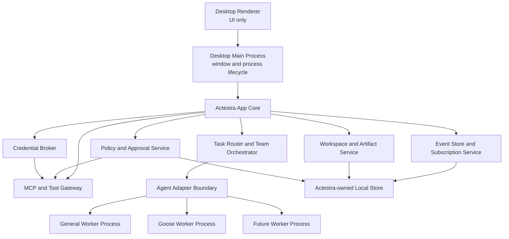

# System Overview

Status: P2 shell implemented; P3.1-P3.4 contracts are CI-backed

## Context

Actestra presents one desktop product while using multiple specialized execution
engines. The primary design problem is not launching several agents; it is
maintaining one coherent task, permission, data, and audit model across them.

## Component view



## Current implementation boundary

P2 implements the renderer, a minimal context-isolated preload bridge, and the
Electron main process. The renderer can request application metadata and report
that it rendered; neither operation grants filesystem, shell, process,
credential, installation, or publishing authority.

P3.1 and P3.2 add a runtime-neutral core domain, lifecycle validation, and
version 1 event stream contract. P3.3 adds a storage-neutral port plus a
main-owned SQLite adapter with schema versions 1 and 2. P3.4 adds the
version 1 `AgentAdapter` contract, a main-owned lifecycle supervisor, and a
deterministic in-memory fake adapter. None are registered with application
startup or exposed to the renderer yet. Policy and approval services, tool
gateway, process transports, real worker adapters, and workers shown below
remain P3 or later components. They are architectural boundaries, not hidden
implementations in the package.

The SQLite adapter owns `state/actestra.sqlite3` beneath Actestra user data,
uses one DELETE/FULL connection, and rejects foreign ownership, future schemas,
inconsistent migration history, invalid domain graphs, and corrupt event
projections. Its asynchronous port prevents storage technology from entering
core consumers, but its current synchronous implementation must move to a
supervised persistence utility before user-workload writes are activated.

## Authority boundaries

### Desktop renderer

The renderer displays state and sends typed user intents. It does not hold raw
credentials or direct shell, filesystem, process, network publishing, or
installation authority.

### Desktop main process

The main process owns windows, IPC validation, privileged service lifecycle, and
worker process supervision. It does not embed an agent runtime in renderer
memory.

### Actestra app core

The app core owns:

- workspace and task identity;
- task routing and orchestration;
- worker registrations and capabilities;
- policy and approval decisions;
- versioned events;
- artifact metadata;
- audit history;
- credential references;
- migrations and crash recovery.

### Agent workers

Workers perform specialized reasoning and execution behind `AgentAdapter`.
Workers may retain private transient state, but Actestra does not rely on an
opaque worker session as the only record of task progress or user consent.

### Tool gateway

MCP servers and native tools are reached through a gateway that applies
workspace scope, credential brokering, policy, approval, logging, timeout, and
redaction.

## Adapter lifecycle

Protocol version 1 is accepted in
[ADR-0006](decisions/0006-agent-adapter-lifecycle-and-supervision.md) and owns
this language-level boundary:

```ts
interface AgentAdapter {
  capabilities(): Promise<AgentCapabilities>
  start(request: AgentStartRequest): Promise<void>
  send(sessionId: SessionId, input: AgentInput): Promise<void>
  approve(
    requestId: ToolRequestId,
    decision: AgentApprovalDecision,
  ): Promise<void>
  cancel(sessionId: SessionId, reason?: string): Promise<void>
  subscribe(sessionId: SessionId, handler: AgentSignalHandler): Unsubscribe
  dispose(sessionId: SessionId): Promise<void>
}
```

Capabilities and the protocol version are checked exactly before start.
Control signals and nested core events have independent gapless sequences.
Session, worker, and event-stream identity is immutable for one attempt; crash
or timeout recovery starts a bounded replacement with fresh attempt identities.
The supervisor uses observed local time for startup, heartbeat, and cancellation
acknowledgement bounds instead of trusting worker timestamps.
Terminal attempts remain readable after adapter cleanup until the caller
explicitly disposes the supervisor record; that release clears its in-memory
events. P3.6 must persist required outcome and incident evidence first.

Adapters translate external formats. The UI and app core must not branch on a
Goose-specific or future-worker-specific event format. The deterministic fake
performs no filesystem, network, process, shell, model, credential, or tool
operation.

## Event contract

Every event uses the version 1 envelope accepted in
[ADR-0004](decisions/0004-core-domain-event-stream.md), with:

- event identifier;
- schema version;
- task, session, and worker identifiers;
- monotonic sequence or equivalent ordering field;
- timestamp;
- event type;
- payload;
- causation and correlation identifiers;
- redaction classification.

Ordering is scoped to one immutable worker execution attempt. Sequence numbers
start at one and are gapless; timestamps cannot move backwards but do not
determine order. Exact duplicate event identifiers are idempotent, conflicting
reuse fails closed, verified cursors support replay, and no event can follow a
terminal task event.

Initial event types:

- `task.started`
- `task.updated`
- `agent.message`
- `tool.requested`
- `tool.started`
- `tool.completed`
- `tool.failed`
- `approval.required`
- `approval.resolved`
- `artifact.created`
- `artifact.updated`
- `worker.blocked`
- `worker.failed`
- `task.completed`
- `task.failed`
- `task.cancelled`

## Data ownership

| Data | System of record |
| --- | --- |
| Product settings and migrations | Actestra |
| Workspace grants | Actestra |
| Tasks and dependency graph | Actestra |
| User approval evidence | Actestra |
| Event and audit history | Actestra |
| Artifact metadata | Actestra |
| Secret values | Operating-system secure storage via Actestra broker |
| Worker transient state | Worker, treated as recoverable or disposable |
| Git task changes | Isolated task worktree |
| Upstream runtime configuration | Adapter-managed and versioned |

## Isolation model

- Each worker is a separate supervised process.
- Each coding task uses a dedicated Git worktree.
- General tasks write to a task output area before replacing user files.
- Tool access is scoped to an approved workspace and task.
- High-risk native operations require explicit policy and approval evidence.
- Cancellation terminates downstream tools and reconciles task state.
- No worker receives every credential or unrestricted home-directory access by
  default.

## Failure model

The core must distinguish:

- worker unavailable;
- incompatible worker version;
- user denied approval;
- tool timeout or failure;
- worker crash;
- core restart;
- partial team failure;
- artifact conflict;
- cancellation;
- policy rejection.

These states must not be collapsed into a generic success, generic chat message,
or silent retry. P3.4 implements startup and heartbeat timeout,
idempotent cancellation, cancellation acknowledgement timeout, protocol
failure, crash, terminal reconciliation, and bounded fresh-attempt restart
semantics. Durable incident storage and renderer projection remain P3.6 work.

## Deferred choices

P2 pins Node.js 24.13.0, Bun 1.3.9, Electron 37.10.3, React 19.2.4, and data
layout version 1 for the current shell. ADR-0005 selects Electron's embedded
`node:sqlite` and an Actestra-owned forward migration registry for durable
storage. P3 still must decide process transport, worker sandbox mechanisms,
credential/policy services, and utility-process hosting. Signing, notarization,
update delivery, and cross-platform candidate packaging remain P8 work.

This document fixes authority and lifecycle boundaries; a pinned shell
dependency does not pre-decide worker or persistence architecture.
