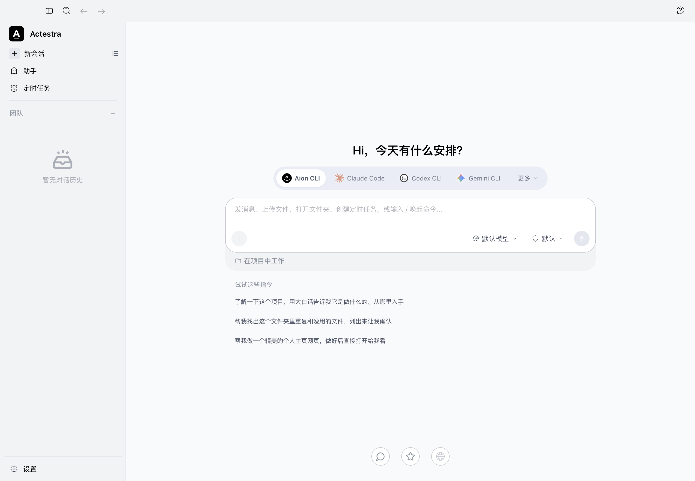

# AionUi F1 Identity and Isolation Evidence

Date: 2026-07-29

Host: macOS arm64

Branch: `feat/aionui-first-foundation`

Draft PR: [6](https://github.com/bignormal/actestra-desktop/pull/6)

## Result

F1 applies Actestra product identity, a versioned private profile, and a
fail-closed external-effect policy to the real AionUi `v2.1.41` desktop
application. It does not replace the AionUi interface with the legacy Actestra
shell.

The original AionUi layout and feature entries remain the product surface. The
Guide, conversation entry, Assistants, Scheduled Tasks, Team, Settings,
agent/model selector, composer, workspace selector, suggestions, feedback,
repository, and WebUI entries are still present. Identity tokens now show
Actestra, while unowned network effects return an explicit unavailable state
instead of silently executing or disappearing.

## Downstream boundary

The frozen 1,766-file source at
[`foundation/aionui-v2.1.41`](../../foundation/aionui-v2.1.41) remains
byte-identical to its recorded manifest. Actestra changes live in the
reviewable overlay under
[`downstream/aionui-v2.1.41`](../../downstream/aionui-v2.1.41). Commands
materialize a disposable, ignored working tree at
`.actestra/aionui-v2.1.41`.

The overlay declares every changed path and protects representative R0 files:

- the native router;
- the sidebar composition;
- the Guide page composition;
- the complete renderer IPC bridge surface.

The machine check fails if the frozen source drifts, an undeclared file changes,
an expected file does not change, an R0 invariant changes, or the identity and
effect policy is incomplete.

## Product identity and profile

| Boundary | F1 value |
| --- | --- |
| Product name | `Actestra` |
| Application ID | `com.bignormal.actestra` |
| Executable | `Actestra` |
| Deep-link protocol | `actestra` |
| Repository and release links | `bignormal/actestra-desktop` |
| Profile schema | `v1` |
| Development profile | `Actestra Dev/profiles/v1/default` |
| Local runtime data | `.actestra-v1-dev` |

The profile is created before Electron session startup. Its root, session,
logs, and crash-dump directories use owner-only `0700` permissions, and
`actestra-profile.json` uses `0600`. An existing manifest with an unknown
product or layout version fails closed. F1 does not read, mutate, or implicitly
migrate a native AionUi profile.

## External-effect policy

The implementation source remains available for later Actestra-owned provider
work, but these effects are disabled by default:

| Effect | F1 behavior |
| --- | --- |
| Telemetry and Sentry | Initialization, preload reporting, source-map upload, and installer reporting are disabled |
| Auto-update | UI and implementation remain; startup and update bridges return an Actestra-owned unavailable state |
| Feedback upload | Entry and form remain; submission stops before collecting or uploading diagnostics |
| AionUi and OfficeCLI official services | Known official hosts, repositories, CDN paths, and Hub bridge requests are blocked |
| Public WebUI listener | Remote/public start and automatic restoration are blocked; an explicit local-only start remains available |
| External links | User-selected third-party providers remain possible, but known upstream official product links are isolated |

First-run managed Node download is a documented third-party runtime dependency,
not an AionUi account, telemetry, catalog, update, or feedback dependency. F1
allows it so the retained local runtime can keep working.

## Local evidence

| Check | Result |
| --- | --- |
| Frozen foundation | Pass; the existing 1,766-file manifest remains unchanged |
| Overlay contract | Pass; 64 declared changed files and 4 R0 invariant files |
| Strict TypeScript | Pass in the materialized native tree |
| Focused F1 and retained-provider tests | Pass; 12 files and 120 tests |
| Complete native test command | Pass; 323 files passed, 1 skipped; 2,585 tests passed, 5 skipped |
| Native production build | Pass for main, preload, and renderer |
| Native development launch | Pass; Electron title and wordmark are `Actestra` |
| Profile permissions | Pass; directories `0700`, manifest `0600` |
| Listener snapshot | Pass; Vite, explicit test CDP, and AionCore bind loopback only |
| Connection snapshot | Pass; no non-loopback established socket remained after startup |
| Official-service log scan | Pass; no AionUi/OfficeCLI/Sentry/update/feedback endpoint match |

The CDP port in the launch evidence was enabled explicitly for screenshot
capture. It is off by default and listens on `127.0.0.1` when enabled.

One concurrent full run while the development watcher was reloading the
materialized 1,766-file tree hit the existing Office preview test's 10-second
dynamic-import timeout. That file then passed 14/14 in isolation, and the clean
full rerun produced the complete passing result above. Vitest also emits the
existing non-failing process-listener warning near suite completion.

## Remote CI evidence

F1 product implementation commit
`836a9f1f81687f091e1c5b92ce30bff167e9da4f` and resource-only CI
remediation commit `462a1b0d920279d42f124fdd28673d77dc55b765` pass
[macOS arm64 run 30417692550](https://github.com/bignormal/actestra-desktop/actions/runs/30417692550).
That run verifies the root repository and documentation, materializes and
installs the downstream application, passes strict TypeScript and all 120
focused retained-provider and isolation tests, builds the 10,160-module native
renderer, creates an unsigned app bundle, checks packaged identity and product
boundaries, and launches the packaged shell from a clean profile.

The first run on the product implementation,
[run 30417468041](https://github.com/bignormal/actestra-desktop/actions/runs/30417468041),
passed the checks through the focused native tests but exhausted the runner's
approximately 2 GB default Node.js heap during the native renderer build. The
remediation raises only that build step to a 4 GB heap; the same command passes
locally and in the succeeding CI run. This was CI resource remediation, not a
change to product behavior.

## Visual preservation evidence



The screenshot is from the running downstream Electron application. It proves
the original AionUi desktop structure remains visible with Actestra identity;
it is not a claim that every retained provider has already moved to Actestra
authority.

## Reproduction

```sh
bun run downstream:aionui:check
bun run downstream:aionui:install
bun run downstream:aionui:test
bun run downstream:aionui:package
bun run downstream:aionui:dev
```

Local development can reuse the exact frozen dependency installation:

```sh
bun run downstream:aionui:materialize
```

## Non-claims and remaining gates

- The full runtime and visual proof is macOS arm64 evidence. Windows and Linux
  identity resources and source policy are present but are not physical-platform
  packaging or launch evidence.
- Internal AionUi names that are part of compatibility APIs, asset identifiers,
  backend logs, and storage formats are intentionally retained. They are not
  user-facing product identity and must not be mechanically renamed.
- A single listener/socket snapshot is not a packet capture. Automated policy
  tests and source checks provide the fail-closed contract; later release
  evidence still requires clean-machine and platform network verification.
- The downstream application is unsigned development software. This is not a
  merged candidate, signed package, release, distribution, or user acceptance.
  Passing implementation CI does not change those states.
- P3 has not yet become authoritative behind the preserved native bridge.
  Compatibility projection is the next development slice.
