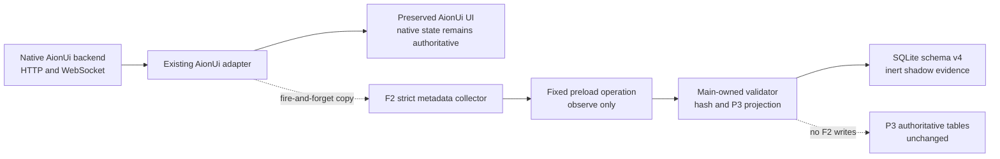

# AionUi F2 Shadow Projection Evidence

Date: 2026-07-29

Branch: `feat/aionui-first-foundation`

Pull request:
[draft PR 6](https://github.com/bignormal/actestra-desktop/pull/6)

## Result

P4.2/F2 is implemented, pushed, and exact-head CI-backed. The preserved
AionUi `v2.1.41` HTTP and WebSocket paths can emit seven strict metadata
observation shapes into a main-owned P3 shadow projection. SQLite schema
version 4 stores that evidence separately from authoritative P3 state. The
complete native suite and real desktop projection remain local evidence.

Native AionUi remains authoritative. The observer is fire-and-forget, has no
renderer read path, and cannot change a response, event payload, route,
component, user-visible state, policy result, approval, worker, or tool action.
The governing boundary is
[ADR-0011](../architecture/decisions/0011-aionui-shadow-projection.md).

## Data flow and authority

The native response is parsed once and returned unchanged. Recognized metadata
is published separately through `actestra:shadow-observe-v1`. Main accepts one
argument from the trusted current main frame and contains every rejection as a
bounded result.

## Observed domains

| Domain | Recognized native source | P3 shadow shape |
| --- | --- | --- |
| Conversation | Conversation list and detail responses | Workspace, task, session, and worker metadata |
| Task | `turn.completed` event | Validated task graph and ordered core event stream |
| Provider | Provider list response | Generic worker availability metadata |
| Workspace | Conversation workspace response | Entry count and hashed workspace identity |
| Approval | Confirmation responses and events | Generic approval state metadata |
| Artifact | Artifact responses and events | Generic artifact state metadata |
| Runtime | Runtime responses and status events | Session, worker, and task state metadata |

The contract caps one response at 50 observations. It rejects undeclared fields
and malformed or oversized values.

## Retained and excluded data

Durable evidence retains:

- observation contract and AionUi source versions;
- one of the seven declared domains;
- capture time;
- deterministic native identity and revision hashes;
- a validated P3 domain graph;
- a validated P3 event stream where the task shape supports it;
- a gapless SQLite sequence and canonical evidence projection.

Durable evidence excludes:

- raw native conversation, turn, provider, approval, artifact, and runtime
  identifiers;
- conversation names and descriptions;
- prompts, messages, model output, filenames, and workspace paths;
- artifact content and payloads;
- approval action descriptions;
- API keys, credentials, tokens, raw tool input, and arbitrary exception text.

Native identifiers and workspace keys exist only transiently while main hashes
the bounded observation. They do not enter the durable evidence JSON or its
indexed projection.

## Persistence and restart behavior

SQLite schema version 4 adds only `aionui_shadow_evidence` and its index. Each
write:

1. validates the strict native observation;
2. derives deterministic P3 identifiers;
3. validates the P3 graph and event stream;
4. appends canonical evidence and indexed metadata in one transaction;
5. returns the existing sequence for an exact duplicate.

Restart continues the gapless sequence. Read-time validation detects a mismatch
between canonical evidence and indexed columns. Loading the authoritative P3
domain graph after shadow writes still returns no shadow workspaces, tasks,
sessions, workers, approvals, or artifacts.

## UI and failure preservation

The F2 patch does not edit the four R0 invariant files:

- the renderer router;
- the sidebar;
- the Guide page;
- the native IPC bridge.

All remain byte-identical to the frozen source. Projection absence, invalid
metadata, database startup failure, append failure, or IPC failure is contained
outside the native request. The publisher logs only a stable rejection code or
a generic channel-unavailable message.

## Local automated evidence

| Check | Result |
| --- | --- |
| Root focused F2 tests | Pass; 4 files and 18 tests |
| Root full check | Pass; formatting, lint, strict types, Electron SQLite probe, 27 files and 141 tests, process smoke, 38-source product boundary, frozen-source check, F2 overlay check, and build |
| Downstream strict TypeScript | Pass |
| Downstream focused F2 and retained-policy tests | Pass; 5 files and 14 tests |
| Complete native AionUi suite | Pass; 326 files passed, 1 skipped; 2,590 tests passed, 5 skipped |
| Native production build | Pass; 558 main, 6 preload, and 10,162 renderer modules |
| Downstream overlay declaration | Pass; 83 changed files, 4 R0 invariant files, and 13 reviewed source copies |

The complete native suite emits its existing non-failing process-listener
warning. The native build emits existing upstream circular-dependency,
large-chunk, and mixed static/dynamic import warnings; it completes
successfully.

## Real desktop evidence

An isolated Actestra profile exercised the actual downstream Electron
application:

1. the preserved Guide opened at `#/guid` with the original navigation,
   assistants, schedules, Team, Settings, provider selector, workspace,
   suggestions, feedback, repository, and WebUI entries;
2. `window.actestraShadow.observe` crossed preload, IPC, main projection, and
   SQLite, appending sequence 1;
3. the same observation after restart returned the same sequence as a
   duplicate;
4. a completed task observation appended sequence 2 with two ordered P3 events;
5. an observation containing an undeclared `apiKey` was rejected while the
   title, route, and Guide remained unchanged;
6. a real native conversation was created in an isolated temporary workspace;
7. the existing Guide conversation read used the original
   `GET /api/conversations` path and automatically appended shadow sequence 3;
8. the native conversation remained visible in the Guide, while durable shadow
   evidence contained none of its raw identifier, title, or workspace path;
9. authoritative P3 workspace, task, session, and core-event tables remained
   empty.

The native fixture conversation was deleted after the proof. The isolated
profile and temporary workspace were moved to the macOS Trash and remain
recoverable.

## Rollback

Regenerate the downstream tree without
`0002-actestra-p3-shadow-projection.mjs`. This removes the collector,
publisher, fixed preload operation, main bridge registration, and new
projections without modifying the frozen AionUi tree or native records.

Schema migrations remain forward-only. Existing version 4 shadow rows can stay
inert because no native or Actestra-authoritative read path consumes them.

## Remote evidence

F2 implementation commit
`632573fa03c34fdb789c85d8efc1ce1e0f8e8177` is pushed to Draft PR 6.
[CI run 30421071039](https://github.com/bignormal/actestra-desktop/actions/runs/30421071039)
passed source, documentation, dependency install, strict types, 14 focused
tests, native production build, and unsigned bundle creation, then failed the
legacy harness packaged-boundary check. The old check treated declared F2
compatibility text in main as user-facing AionUi identity, so clean-profile
smoke did not run. That failed run is diagnostic evidence, not a pass.

Remediation commit
`1478726d62302fa885525024eb4839af5e98b4dd` keeps Aera, upstream endpoints,
Sentry, and undeclared AionUi text forbidden throughout the package. It permits
AionUi text only in `out/main/index.js` when the fixed F2 compatibility markers
are also present; renderer, preload, metadata, and every other textual ASAR
file remain forbidden.

[Exact-head CI run 30421351204](https://github.com/bignormal/actestra-desktop/actions/runs/30421351204)
passes the complete macOS arm64 job: root checks and boundaries, documentation,
downstream materialization and install, strict types, all 14 focused tests,
native production build, unsigned app bundle, packaged identity and product
boundary, and clean-profile smoke.

Draft PR status, merge, candidate, release, distribution, and user acceptance
remain separate states.

## Non-claims and next gate

F2 does not claim:

- any native AionUi domain has moved to Actestra write authority;
- shadow evidence is trusted audit or product state;
- native data migration or rollback of user records;
- real policy, credential, tool, MCP, or worker execution;
- Goose or Eigent-style orchestration;
- a signed candidate, deployment, release, distribution, or user acceptance.

The next development slice is P4.3/F3. It must select one functional domain,
declare its single system of record, and prove write authority, migration,
restart, rollback, native error mapping, and UI parity before activating it.
