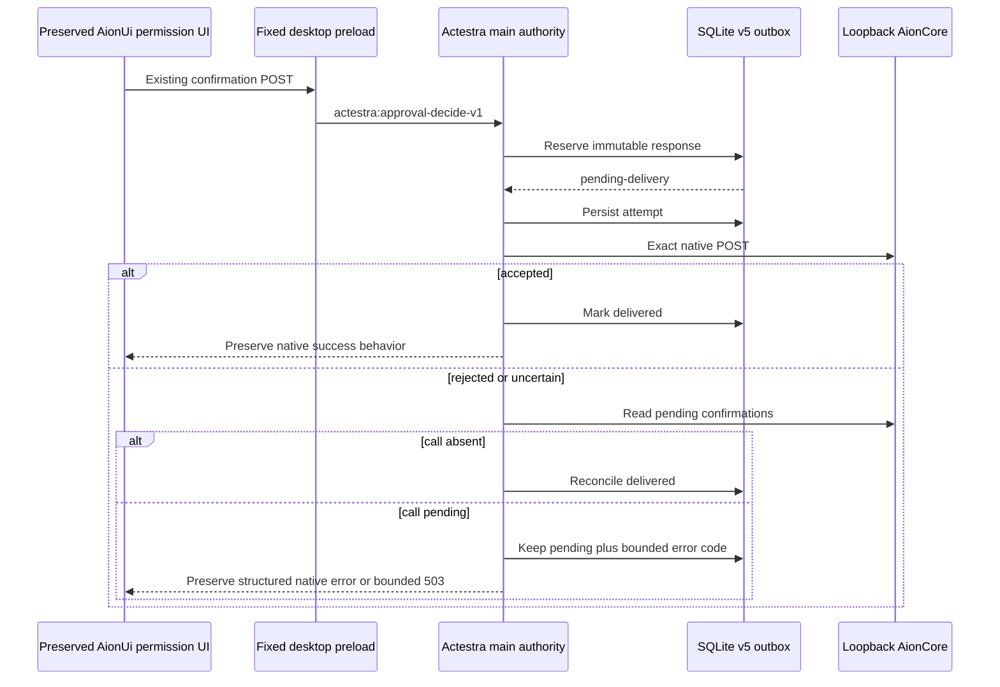

# AionUi F3.1 Approval Decision Authority

Status: Implemented, pushed, and exact-implementation CI-backed on
`feat/aionui-first-foundation`; Draft review, merge, candidate, release,
distribution, and acceptance remain separate gates.

## Outcome

F3.1 moves one write beneath the preserved AionUi interface: desktop
confirmation responses are durably reserved by Actestra main before the local
native runtime receives them.

The visible product remains AionUi `v2.1.41`. No permission card, ACP option,
pet confirmation window, route, sidebar entry, Guide workflow, or general
feature surface is replaced.

This is not the whole approval or general-work migration. Actestra owns only
the immutable response and its delivery outbox; native AionCore still owns
pending-request creation, provider semantics, acceptance, and the protected
operation.

## Authority map

| Concern | F3.1 owner |
| --- | --- |
| Permission card and option presentation | Preserved AionUi UI |
| Pet confirmation presentation | Preserved AionUi main window |
| User response envelope validation | Actestra desktop main |
| Immutable response and delivery state | Actestra SQLite schema 5 |
| Pending confirmation creation and lookup | Native AionCore |
| Provider option and `always_allow` semantics | Native AionCore |
| Protected operation execution | Native AionCore |
| P3 policy, approval, audit, credential, and tool release | Not activated by F3.1 |
| Headless or remote WebUI confirmation writes | Retained native compatibility path; not F3.1 authority |

## Runtime path



The pet confirmation window enters the same main-owned service directly. It
uses its original native bridge only when main returns the explicit rollback
result.

## Implementation inventory

### Root authority contracts

- `apps/desktop/src/compatibility/aionui/approvalAuthority.ts`
  - exact contract version 1;
  - route, key, identifier, structure, depth, node, string, and byte bounds;
  - deterministic decision identity and request hash;
  - explicit `approved`, `denied`, `cancelled`, and opaque `selected`
    classification;
  - canonical persisted-record validation.
- `apps/desktop/src/main/compatibility/aionuiApprovalAuthorityService.ts`
  - per-decision serialization;
  - persist-before-deliver coordination;
  - duplicate and immutable-conflict behavior;
  - pending-state reconciliation and restart recovery;
  - bounded, redacted native error mapping.
- `apps/desktop/src/main/persistence/sqliteMigrations.ts`
  - forward-only schema version 5.
- `apps/desktop/src/main/persistence/sqliteCorePersistence.ts`
  - immutable reservation, outbox transitions, pending listing, summary, and
    canonical-to-index corruption checks.

### Downstream integration

Patch `downstream/aionui-v2.1.41/patches/0003-actestra-approval-authority.mjs`
adds:

- a renderer contract and exact confirmation-route client;
- one fixed preload operation;
- current-window/current-main-frame IPC validation;
- a loopback-only native transport with a 10-second timeout and 64 KiB
  response limit;
- renderer HTTP bridge interception below both retained confirmation call
  sites;
- pet confirmation routing through the same authority;
- startup recovery;
- focused client, persistence, service, and transport tests.

The frozen `foundation/aionui-v2.1.41` tree is not edited. The generated
`.actestra/aionui-v2.1.41` tree is disposable.

## Persisted state

Schema version 5 adds `aionui_approval_decisions` with:

- deterministic `decision_id`;
- native conversation, call, and message identity needed for exact delivery;
- native confirmation path and request hash;
- semantic decision or opaque `selected` state;
- exact bounded response body;
- `pending-delivery` or `delivered` state;
- attempt, creation, update, last-attempt, and delivered timestamps;
- a bounded last error code;
- canonical JSON plus indexed-column parity.

The table has one immutable identity per native conversation and call. An exact
repeat is idempotent. A changed response for that identity returns a conflict.

Unlike F2 shadow evidence, this row is authoritative for the response and
outbox state. It is not inserted into the existing P3 `approvals`,
`privileged_audit`, or core-event tables and cannot release a P3 tool.

## Restart and uncertainty rules

- A row is durable before its first native `POST`.
- Every delivery attempt is durable before network I/O.
- A row with a previous attempt must prove that the native call is still
  pending before redelivery.
- After a failed `POST`, absence from the pending list reconciles the row as
  delivered.
- Inability to read pending state returns a bounded failure and performs no
  blind retry.
- Startup attempts at most 100 pending rows.
- Delivered rows never redeliver.

## Error compatibility

| Condition | Result |
| --- | --- |
| Invalid contract, route, or body | `400 ACTESTRA_APPROVAL_INVALID_REQUEST` |
| Changed response for immutable call | `409 ACTESTRA_APPROVAL_DECISION_CONFLICT` |
| Structured native rejection | Original native HTTP status and stable code |
| Native detail object | Maximum 4 KiB, credential-like keys redacted |
| Persistence unavailable | Bounded `503`, no native bypass |
| Pending-state reconciliation unavailable | Bounded `503`, no blind retry |
| Transport unavailable or timed out | Bounded `503`, row remains pending |
| Native response larger than 64 KiB | Rejected as bounded `502` transport error |
| `ACTESTRA_APPROVAL_AUTHORITY=0` | Explicit `native-fallback` only |

## Migration and rollback

The version 4 to 5 migration preserves all P3 and F2 rows and creates the new
outbox. F2 approval observations cannot be imported because they deliberately
stored no raw identity or response body. A still-pending native confirmation
enters authority when its next response is submitted.

Runtime rollback:

```bash
ACTESTRA_APPROVAL_AUTHORITY=0 bun run downstream:aionui:dev
```

Source rollback regenerates without
`0003-actestra-approval-authority.mjs`. Both paths preserve the frozen source,
native profile, and forward-only schema history. Existing version 5 rows remain
inert and are not deleted.

## Validation matrix

| Gate | Current evidence |
| --- | --- |
| Frozen source | Pass; all 1,766 selected files, 27 routes, and 41 bridge domains |
| Overlay declaration | Pass; 93 declared changes, 4 R0 invariants, 15 reviewed source copies |
| Root contract/service/persistence and migration | Pass; 4 focused files and 20 tests |
| Root full check | Pass; formatting, lint, strict types, Electron SQLite, 30 files and 153 tests, process smoke, 40-source boundary, frozen and overlay checks, production build |
| Downstream renderer/client/service/transport | Pass; 6 focused F2/F3 files and 15 tests |
| Type boundaries | Pass; root and materialized downstream strict TypeScript |
| Native regression | Pass; 330 files passed, 1 skipped; 2,602 tests passed, 5 skipped |
| Native production build | Pass; 563 main, 7 preload, and 10,163 renderer modules |
| Documentation | Pass; 40 Markdown files and all relative links |
| Runtime parity and restart | Pass on an isolated profile; details below |
| Explicit rollback | Pass; main returns only `native-fallback` and creates no new row |
| CI | Pass; exact implementation run 30425061316 on `cf61ffb8453a888cdc03f73457ebeaf72708511a` |

The complete native suite emits its existing non-failing process-listener
warning. The production build emits existing upstream circular-chunk,
large-chunk, and mixed static/dynamic import warnings and completes
successfully.

## Real desktop evidence

An isolated Actestra profile exercised the materialized Electron application
against the real local AionCore:

1. the application opened as `Actestra` at `#/guid`;
2. the preserved sidebar, new conversation, assistants, schedules, Team,
   Settings, provider selector, workspace composer, suggestions, feedback,
   repository, and WebUI entries remained visible;
3. `window.__backendPort` held the actual loopback port and
   `window.actestraApprovalAuthority.decide` was available only through
   preload;
4. a synthetic nonexistent confirmation response crossed preload, trusted
   IPC, main authority, SQLite, and native loopback without creating a real
   tool request;
5. native AionCore returned structured
   `404 NOT_FOUND`, and the renderer received the same status, code, and
   message;
6. schema version 5 already contained one immutable `approved`,
   `pending-delivery` row with attempt count 1 and `NOT_FOUND`, proving
   persist-before-deliver ordering;
7. after a graceful restart, startup logged
   `Recovery attempted=1 delivered=0 pending=1`;
8. the row remained at attempt count 1, proving failed pending lookup did not
   cause blind redelivery;
9. a second launch with `ACTESTRA_APPROVAL_AUTHORITY=0` returned exactly
   `{ "status": "native-fallback" }`;
10. the rollback probe left the database at one row and one total attempt.

The synthetic path cannot be mistaken for successful native approval or
protected-operation evidence: it intentionally exercised the durable failure,
restart, and rollback behavior only.

## Remote evidence

Implementation commit
`cf61ffb8453a888cdc03f73457ebeaf72708511a` is pushed to
`feat/aionui-first-foundation`.
[macOS arm64 CI run 30425061316](https://github.com/bignormal/actestra-desktop/actions/runs/30425061316)
passes on that exact commit, including root source/test/boundary checks,
documentation links, downstream materialization and install, strict type
checks, identity and isolation checks, native production build, unsigned
bundle, packaged identity and product boundary, and clean-profile smoke.

The full native suite, visual UI parity, real local AionCore failure path, and
restart reconciliation remain local evidence. A pushed implementation and
passing CI run are not merge, candidate, release, distribution, or user
acceptance.

## Non-claims

F3.1 does not prove:

- Actestra ownership of pending approval requests or provider permission
  policy;
- P3 policy evaluation, audit integration, credential release, or protected
  tool execution;
- conversation, task, workspace, artifact, provider, or runtime write
  authority;
- remote WebUI approval authority;
- supervised utility-process persistence;
- signed candidate, merge, release, distribution, or user acceptance.

The next F3 slice must either connect this durable decision to the accepted P3
policy/audit/tool-release path or select another single domain with equally
explicit migration, rollback, restart, error, and UI-parity proof.

## Governing decisions

- [ADR-0010](../architecture/decisions/0010-aionui-first-product-foundation.md)
- [ADR-0011](../architecture/decisions/0011-aionui-shadow-projection.md)
- [ADR-0012](../architecture/decisions/0012-aionui-approval-decision-authority.md)
- [AionUi–Actestra Fusion](../architecture/AIONUI_ACTESTRA_FUSION.md)
- [AionUi Retention Matrix](../upstream/AIONUI_RETENTION_MATRIX.md)
