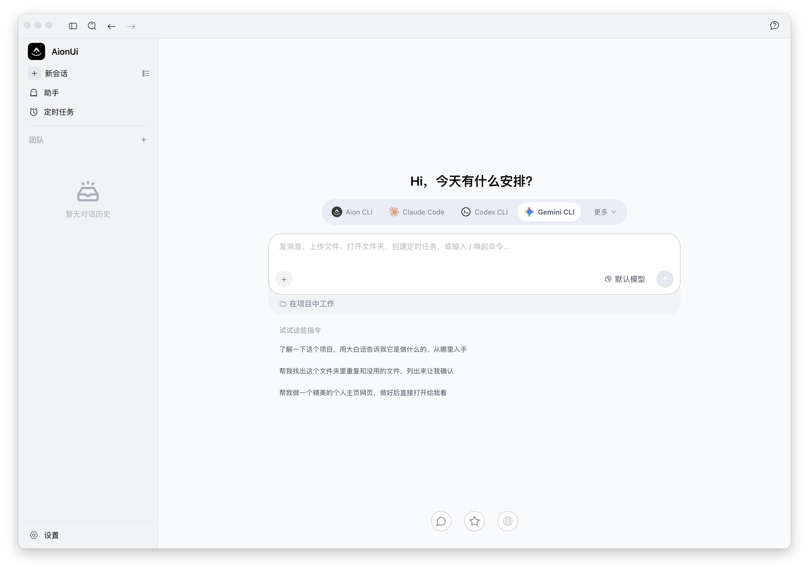

# AionUi Native Foundation Evidence

Date: 2026-07-29

Host: macOS arm64

Branch: `feat/aionui-first-foundation`

Base: `a32b7cb4516f5592e8e1fe6f1f5afad7c50de991`

Implementation: `13270ca0abd7353710541afca9ddf46c47670be3`

Draft PR: [6](https://github.com/bignormal/actestra-desktop/pull/6)

## Result

The product direction now starts from the real AionUi application rather than
an Actestra-drawn approximation.

The repository contains the exact runnable AionUi `v2.1.41` desktop source
selection from commit `2d8925fc67a97a20996fadcd2a0862b778b572ba`:
1,766 files with no local modification inside the snapshot. The root preservation check verifies the
manifest hash, every file hash, all 27 routes, and all 41 exported bridge
domains.

## Local evidence

| Check | Result |
| --- | --- |
| Exact source manifest | Pass; SHA-256 `252b7b22b75e3a89ad4d9379398a04521772f853b855227c236928fa151f844f` |
| Exact upstream parity | Pass against clean checkout at `2d8925f`; all 1,766 selected files match, and no tracked file under `packages`, `public`, `patches`, `tests`, or `examples` is omitted |
| Compatibility contract | Pass; all 27 routes are R0, all 41 bridge domains are classified exactly once as R1 or R2, no remove disposition exists, and F0 claims no Actestra-authoritative domain |
| Frozen dependency install | Pass; `bun install --frozen-lockfile`, 3,177 packages |
| Native production build | Pass; main, preload, and full renderer built |
| Native unit/integration tests | Pass after restoring the exact omitted workflow fixture: 321 files passed, 1 skipped; 2,576 tests passed, 5 skipped; 0 failures |
| Native launch | Pass in an isolated profile with update effects disabled |
| Bundled general runtime | Exact evaluated AionCore `v0.1.52` started locally; distribution remains blocked by license clarification |
| Native UI evidence | Pass; actual Electron window captured from the running source |



The captured native Guide shows the original sidebar entries, model/agent
selector, assistant and workspace controls, prompt composer, and suggestion
surface. It is evidence of native UI reproduction, not Actestra identity or
end-to-end fusion.

## Reproduction

```sh
bun run foundation:aionui:check
bun run foundation:aionui:install
bun run foundation:aionui:test
bun run foundation:aionui:package
bun run foundation:aionui:dev
```

For the local launch proof only, the ignored
`foundation/aionui-v2.1.41/resources/bundled-aioncore` link targeted the exact
previously verified AionCore `v0.1.52` bundle. A clean CI or release workflow
must obtain and verify that runtime through an accepted, reproducible mechanism
instead of relying on this local link.

The isolated launch also exposed two compatibility items:

- the upstream Sentry startup path reports a harmless missing-DSN error;
- the upstream managed Node setup may download a runtime on first launch.

F1 must isolate or replace both external effects while preserving the
corresponding AionUi error, diagnostics, and configuration experience.

## Non-claims

The F0 implementation commit is pushed, and exact-head CI run
[30392140461](https://github.com/bignormal/actestra-desktop/actions/runs/30392140461)
passes the root source/test/boundary/documentation/package/smoke workflow. The
full native AionUi tests, native build, and visual launch in this document are
local evidence and are not represented as CI.

PR 6 remains Draft. CodeRabbit explicitly skipped review because of that Draft
state, so its successful status is not review evidence. This is not merge,
candidate, signed package, release, distribution, or user-acceptance evidence.
