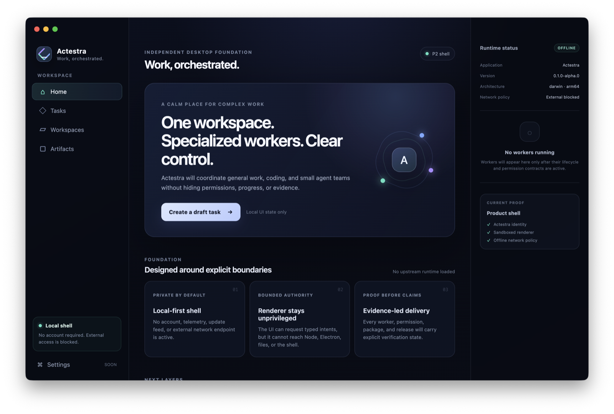

# P2 Independent Product Shell

Status: Pushed review remediation with local and pull-request CI evidence

Evidence date: 2026-07-28

Branch: `feat/independent-product-shell`

Exact base: `main` at `174ef46ff971a2f67aec16fbfd6dc56fc0910306`

Implementation commit: `1892b48402b1bfa9425a34172ff79259b7190b81`

Review-remediation commit: `892a44240405c1d2d4720d4ff7e09a6a19bbe4e9`

Review surface:
[draft pull request 2](https://github.com/bignormal/actestra-desktop/pull/2)

The local gate and
[macOS arm64 pull-request CI run 30329203456](https://github.com/bignormal/actestra-desktop/actions/runs/30329203456)
pass on the exact review-remediation commit. The final evidence-only follow-up
must retain a passing PR head check and complete GitHub review. This document
does not claim merge, candidate, release, deployment, distribution, or user
acceptance.

## Outcome

P2 establishes an original Actestra desktop shell without importing AionUi or
another product's application source. It is intentionally offline and
account-free. Task persistence, workers, tools, approvals, and orchestration
remain absent until Actestra-owned P3 contracts exist.

## Independent review remediation

Three completed CodeRabbit CLI passes raised 14 issues. Thirteen valid issues
were fixed:

- CI actions now use full immutable commits with their versions recorded;
- developer runs use canonical, unique, mode-`0700` temporary directories and
  never terminate unrelated Actestra sessions;
- packaged smoke tests track spawn errors, exit codes, signals, graceful
  termination, and SIGKILL fallback;
- the renderer boundary scan rejects Electron and Node dynamic imports;
- macOS activation window failures are logged instead of becoming unhandled
  rejections;
- packaged DevTools are disabled while development DevTools remain available;
- production CSP removes development WebSocket and inline-style allowances and
  denies all renderer connections;
- package verification extracts the shipped renderer HTML and validates the
  actual CSP meta value.

The remaining minor suggestion expected `notifyRendererReady()` to return a
Promise. Its typed contract and `ipcRenderer.send` implementation both
intentionally return `void`, so no rejection exists to catch. A fourth CLI
confirmation attempt returned a rate-limit error and is not represented as a
zero-issue review; final GitHub review remains a merge gate.

## Product identity

| Surface | P2 value |
| --- | --- |
| Product and executable | `Actestra` |
| npm package | `actestra-desktop` |
| macOS bundle identifier | `com.bignormal.actestra` |
| Deep-link scheme | `actestra:` |
| Default user-data directory | `Actestra` below Electron's platform application-data root |
| Data layout | `data-layout.json`, version 1, foreign and future versions fail closed |
| Icon | Original repository SVG with a reproducible `.icns` generator |
| Account requirement | None |
| Telemetry and updater | None |

The unsigned development package includes Electron's MIT license and Chromium
third-party notices as top-level resources. React, React DOM, and Scheduler
license files remain inside `app.asar`. Exact versions and license scope are in
[Third-Party Notices](../../THIRD_PARTY_NOTICES.md).

## Authority boundary

The packaged application contains three built targets:

1. the main process owns product paths, the window, session policy, navigation,
   and typed IPC registration;
2. the sandbox-compatible CommonJS preload exposes only `getAppInfo()` and
   `notifyRendererReady()`;
3. the React renderer displays local state and has no Electron, Node.js,
   filesystem, shell, process, credential, installation, or publishing API.

`contextIsolation`, the Chromium sandbox, and web security are enabled.
`nodeIntegration` is disabled. Permission requests, new windows, and
cross-navigation are denied. Packaged HTTP, HTTPS, WS, and WSS requests are
cancelled; development permits only loopback hosts. The only declared macOS
entitlement is the Electron JIT entitlement.

No approval channel exists in P2, so there is no automatic approval path to
disable or accidentally expose. Privileged services and workers will be
separate processes introduced only after P3 defines their lifecycle, policy,
approval, event, and audit contracts.

## Provenance

- The shell source, layout, CSS, icon, tests, scripts, and packaging
  configuration are original Actestra work.
- No AionUi, AionCore, Goose, Eigent, Aera, or AgentEra application source,
  prompt, skill, model, or asset is present.
- AionUi remains a pinned evaluation reference. Future reuse must be a narrow,
  attributed selective port recorded in the
  [Upstream Import Log](../upstream/IMPORT_LOG.md).
- Runtime and development packages come from the locked Bun dependency graph.

ADR-0003 records why Actestra uses a clean shell and selective ports rather than
copying, submoduling, or overlaying the complete AionUi repository.

## Local verification

The following checks were run on macOS 26.5.2 arm64 with Node.js 24.13.0 and Bun
1.3.9:

| Command | Result |
| --- | --- |
| `bun install --frozen-lockfile` | Pass; lockfile required no changes |
| `bun run check` | Pass; formatting, zero lint warnings, strict types, five test files with 22 tests, three failure-path smoke-harness scenarios, dynamic-import product boundary, and all three build targets |
| `bun run docs:check` | Pass; all repository-relative Markdown links resolve |
| `bun run dist:dir` | Pass; local unsigned macOS arm64 `Actestra.app` |
| `bun run dist:mac` | Pass; local unsigned macOS arm64 DMG and ZIP; inferred publishing explicitly disabled |
| `bun run verify:package` | Pass; bundle name, identifier, executable, arm64 architecture, ASAR boundary, exact packaged renderer CSP, no updater resource, and required Electron notices |
| `bun run smoke:package` | Pass from a new temporary profile; data layout plus application, window, and renderer ready markers observed |
| `./script/build_and_run.sh --run` | Pass; rebuilt, verified, staged below the macOS temporary directory, and opened the real packaged shell |

Final local artifact checks:

| Artifact | SHA-256 |
| --- | --- |
| `Actestra-0.1.0-alpha.0-mac-arm64.dmg` | `df3fe00ca92942e18ef1b49e0dfaadc32f9d425eb6c22371739b98424edd3882` |
| `Actestra-0.1.0-alpha.0-mac-arm64.zip` | `a4a2375769b9ec8206932a60ca8f1076388f5e307719685bcf19aab77a92fc33` |

`hdiutil verify` accepted the DMG. `codesign --verify --deep --strict` and
Gatekeeper assessment both returned exit 1, which is expected for this
deliberately unsigned local build and prevents it from being described as a
candidate.

The product-boundary check scans application source for upstream and Aera
identity, known upstream endpoints, and unapproved telemetry. It also rejects
Electron, Node.js, CommonJS, and `process` access from renderer source and
allows only the expected macOS entitlement.

The package verifier inspects `Info.plist`, the executable architecture,
packaged resources, ASAR identity strings, and the exact shipped renderer CSP.
The smoke verifier does not accept a process-only launch: it requires the main
process, visible-window, and React-renderer markers, then checks the new
profile's Actestra layout manifest. Its failure harness also proves early exit,
spawn error, and forced-termination paths. This stronger condition caught and
led to the repair of an ESM preload that created a window but left the renderer
black.

## macOS protected-folder check

Because the repository itself is below `Desktop`, an early direct app launch
left a macOS Desktop-folder prompt pending. The app did not receive that
permission. The run entry now canonicalizes the system temporary root, creates
a unique mode-`0700` staging directory, and copies the verified app there. It
launches with both its working directory and development profile there without
killing another Actestra session.

After resetting the new Actestra bundle's test-only TCC state, the staged
launch did not prompt. A live open-file inspection showed no Desktop paths.
This staging behavior is for local development only; a distributed app will
run from its installed location.

## Exit-gate assessment

The P2 technical exit gate passes locally:

- a clean profile launches and renders as Actestra;
- no upstream or Aera application brand, account, endpoint, data path, updater,
  telemetry integration, or source import is present;
- original identity, versioned data ownership, renderer authority, package
  notices, and offline policy are verified;
- packaging and the strengthened smoke test pass.

P2 remains unaccepted until the final evidence head passes CI, the GitHub review
has no unresolved blocker, and the change is merged to `main`.

## Non-claims and remaining gates

- The `.app` is deliberately unsigned and is not a candidate.
- The screenshot is local visual evidence, not user acceptance.
- No signing, notarization, SBOM, provenance, update, distribution, or
  clean-machine acceptance claim is made.
- No task database, migration beyond layout version 1, worker, tool gateway,
  credential broker, approval service, audit store, or orchestration exists.
- The license for original Actestra source is still an open product decision.
