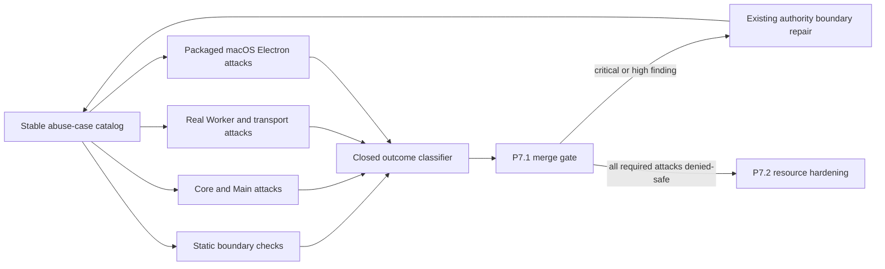

# P7 Security and Reliability Hardening Design

**Status:** Approved design; written specification awaiting review

**Date:** 2026-08-13

**Baseline:** `origin/main@17acae034d723e45a46dcef264844ed5a27c3da2`

**Phase:** P7 — Security and Reliability Hardening

## Purpose

P7 hardens the accepted P4–P6 product without replacing its mature framework.
AionUI v2.1.41 remains the sole product surface, Actestra Main/Core remains the
authority for state and privileged effects, Tool Gateway remains the policy and
approval boundary, and Goose remains an isolated coding worker. The frozen
`foundation/` snapshot is not edited.

P7 is divided into four independently reviewable, testable, and reversible
batches:

1. **P7.1 — Threat model and abuse-case baseline:** document the repository-wide
   trust model, turn security invariants into executable attacks, and repair any
   critical or high-risk boundary violation those attacks expose.
2. **P7.2 — Worker resource and process reliability:** add governed CPU, memory,
   output, time, process-tree, and storage controls behind platform-neutral
   interfaces, with real macOS enforcement.
3. **P7.3 — Database backup and recovery:** add verified backup, restore,
   migration-failure rollback, corruption handling, and crash-recovery proof.
4. **P7.4 — Diagnostic export and audit retention:** add explicit-consent,
   redacted diagnostic export, bounded audit retention and integrity checks,
   then perform the final P7 security review and acceptance.

Each batch has its own source, focused tests, complete project gate, packaged
evidence, documentation, commit, pull request, exact-head CI, merge, and
merged-main CI. Completing P7.1 does not complete P7.

## Platform strategy

P7 performs real enforcement and packaged acceptance on macOS, because that is
the currently accepted Electron, sandbox, and Goose execution platform.
Platform-facing contracts must describe capabilities and outcomes rather than
hard-code macOS command names into Core or product contracts. Windows and Linux
implementations and physical-machine acceptance remain P8 work.

An unavailable platform enforcement test reports `unsupported-platform`. It is
never counted as a pass. The P7 ledger records the exact macOS evidence and the
corresponding Windows/Linux P8 obligation.

The executable P7.1 macOS gate contains every case marked required on macOS;
none of those cases may resolve to `unsupported-platform`. Windows and Linux
obligations remain catalog metadata and separate P8 ledger entries rather than
being silently skipped or included in the successful P7.1 case count. If an
individual cross-platform probe is invoked on an unsupported platform, it
returns `unsupported-platform` and exits nonzero.

## P7.1 scope

P7.1 establishes the security baseline that later P7 batches extend. It adds:

- a repository-scoped threat model bound to an exact Git revision;
- an accepted ADR for the threat-model and abuse-case authority;
- a stable abuse-case catalog with machine-checkable identifiers and expected
  outcomes;
- static, in-process, real-worker, and packaged-Electron attack tests;
- a deterministic result vocabulary and risk classification;
- regression fixes for any critical or high-risk defect found by those tests;
- a current project-status record that separates verified evidence from open
  P7.2–P7.4 and P8 work.

P7.1 does not add a second policy engine, approval system, sandbox framework,
credential store, persistence authority, Worker protocol, or UI. It attacks
the existing boundaries and changes production behavior only when an attack
demonstrates a real defect.

### Revision binding

The repository threat model identifies the exact repository and immutable
product-source revision whose runtime boundaries it reviewed. Because a
committed document cannot include the hash of the commit that contains itself,
the versioned threat-model update is the final documentation-only commit after
the reviewed production and test bytes. Its `Version` footer names that
immediate reviewed product-source parent. The containing commit may change only
the threat model, ADR, project-status evidence, and human-readable evidence
ledger. The machine-checked catalog and every executable test are part of the
named reviewed parent. Any product, runtime, build, package, policy, manifest,
machine-checked catalog, or security-test byte beyond the named revision
invalidates the binding and requires a new review and footer.

Exact-head CI records both the reviewed product-source revision and the final
documentation commit. This rule prevents a mutable branch name, future commit,
or self-consistent fixture from being presented as the reviewed security
revision.

## Protected assets

The repository threat model must cover at least these assets:

- provider credentials and credential references;
- user workspace content and the canonical authorized workspace identity;
- the original Git checkout, isolated coding worktrees, patches, and Artifact
  content references;
- protected-operation policy, approval, delivery, and audit evidence;
- Actestra task, session, Worker, Attempt, Team, run, and persistence identity;
- SQLite product state, migrations, recovery records, and append-only audit
  sequence;
- admitted Worker, planner, MCP, and tool manifests and their trusted digests;
- Main-owned IPC and projection authority;
- Worker process groups, sandbox profiles, closed environments, loopback
  authentication, and cleanup state;
- product logs, failure diagnostics, packaged resources, and build provenance.

## Actors and trust boundaries

### Trusted authorities

- Accepted Actestra Core contracts and state machines.
- Electron Main services after exact composition and startup admission.
- The persistence utility after protocol validation and database admission.
- Tool Gateway after manifest, policy, approval, credential-reference, and
  audit checks.
- Exact admitted runner and planner artifacts whose external trust roots match.
- The user only for the explicit decision being made; a click does not grant
  broader authority than the displayed protected operation.

### Untrusted or partially trusted inputs

- all Renderer and preload requests, including requests originating from a
  compromised renderer;
- provider metadata and model completions;
- Goose ACP messages, MCP requests, tool arguments, progress, and diagnostics;
- planner candidates and Worker-private identifiers;
- user-selected workspaces and all files, symlinks, Git configuration, hooks,
  filters, and concurrent changes inside them;
- local loopback HTTP clients other than the authenticated admitted peer;
- environment variables, inherited descriptors, subprocess output, signals,
  and abnormal process exit;
- persisted bytes read after restart, including replayed, stale, conflicting,
  truncated, or structurally valid but unauthorized records;
- packaged upstream resources unless admitted by Actestra's exact overlay and
  package verification contracts.

### Developer- and operator-controlled inputs

- exact upstream pins, downstream overlays, CI actions, build tools, manifests,
  and release configuration;
- locally selected development output directories and isolated test profiles;
- security-test fixtures and the expected trust roots supplied to them.

Developer control is not runtime product authority. A fixture, local cache, or
self-consistent manifest cannot authorize its own production use.

## Security invariants

The threat model and tests use stable invariant identifiers:

| ID | Invariant |
| --- | --- |
| `P7-I-RENDERER-001` | Renderer receives only bounded projections and typed intents; it has no direct credential, filesystem, shell, process, Git, patch-content, persistence, or unrestricted network authority. |
| `P7-I-IPC-001` | Only the trusted current main frame may invoke an exact registered IPC operation; unknown fields, prototypes, stale frames, and undeclared channels fail closed. |
| `P7-I-CREDENTIAL-001` | Raw credentials remain Main-owned, are redacted before projection or caching, are never written back as sentinels, and are supplied to effects only through the admitted Main path. |
| `P7-I-WORKSPACE-001` | Every file or Git effect is bound to the active grant and revalidated canonical root; traversal, symlink, Git-indirection, binding drift, and scope substitution fail closed. |
| `P7-I-DELIVERY-001` | Goose changes an isolated worktree only. Applying a patch to the original workspace requires a distinct persisted Main-owned approval and post-approval revalidation. |
| `P7-I-TOOL-001` | An undeclared tool, missing manifest, unmatched or conflicting policy, malformed input, invalid credential reference, or stale approval never reaches an executor. |
| `P7-I-APPROVAL-001` | Approval is exact-operation, exact-attempt, one-shot evidence; protected approval, workflow feedback, publish approval, and workspace-apply approval cannot satisfy one another. |
| `P7-I-MCP-001` | MCP and model loopback endpoints admit only the exact authenticated peer, bounded protocol shape, allowed tool set, and declared model behavior. |
| `P7-I-WORKER-001` | A Worker receives a closed environment, admitted executable and capabilities, no raw credential, and no direct authority outside its attempt-private scope. |
| `P7-I-NETWORK-001` | Packaged Renderer and isolated Workers cannot create undeclared external network effects; admitted provider traffic remains a Main-owned, bounded exception. |
| `P7-I-PROCESS-001` | Success, rejection, timeout, cancellation, crash, and parent death settle durable state before release and leave no privileged child, process group, lease, lock, private root, or worktree orphan. |
| `P7-I-PERSISTENCE-001` | Replayed, stale, conflicting, tampered, malformed, or unauthorized durable records fail closed without rewriting accepted authority or creating a second effect. |
| `P7-I-REDACTION-001` | Events, audit, incidents, logs, Renderer projections, and test evidence retain only their admitted classification and never expose credentials, prompt or model text, tool arguments, content references, or user paths. |
| `P7-I-ARTIFACT-001` | Worker, planner, tool, and packaged artifacts require an external trust root, exact digest and shape, and fail closed on substitution, widening, symlinks, unexpected files, or unsupported platform identity. |

The implementation may add an invariant only by updating the threat model,
catalog, tests, and source-of-truth documents in the same change. Removing or
weakening an invariant requires an accepted superseding ADR.

## Abuse-case catalog

Every executable attack has a stable identifier of the form
`P7-A-<DOMAIN>-NNN`, where `<DOMAIN>` is one of:

- `RENDERER`
- `IPC`
- `CREDENTIAL`
- `WORKSPACE`
- `DELIVERY`
- `TOOL`
- `APPROVAL`
- `MCP`
- `WORKER`
- `NETWORK`
- `PROCESS`
- `PERSISTENCE`
- `REDACTION`
- `ARTIFACT`

Each catalog entry contains exactly:

- attack identifier and protected invariant;
- risk level;
- minimum verification layer;
- attacker-controlled input and required precondition;
- expected rejection boundary and stable product incident code, when the
  product exposes one;
- forbidden side effects;
- required evidence and redaction rule;
- supported platforms and the P8 obligation for unverified platforms.

The catalog contains no credentials, prompt content, tool arguments, absolute
user paths, or mutable test-machine identifiers. Tests refer to catalog IDs so
a removed, duplicated, or silently weakened attack fails the catalog contract.

## Verification layers

### Layer 1 — Static product boundary

Static checks reject new Renderer, preload, downstream overlay, or packaged
imports that bypass Main/Core authority. Existing product-boundary,
foundation, source-copy, retention, package-identity, and forbidden-import
checks remain authoritative and are extended only for a demonstrated gap.

### Layer 2 — Core and Main attack tests

Deterministic tests submit malformed, extra-key, prototype-bearing, replayed,
stale, conflicting, cross-owner, cross-attempt, wrong-digest, and approval-
substitution inputs directly to the real validators and services. Each test
asserts both the rejection and absence of executor, filesystem, persistence,
credential, and audit side effects beyond the expected metadata-only record.

### Layer 3 — Real local process and transport tests

Real supervised fixtures exercise process boundaries, authenticated loopback
HTTP, SSE, ACP, MCP, Git, sandbox profiles, environment filtering, output
bounds, signals, cancellation, parent death, and cleanup. Fixtures are local,
deterministic, and malicious by design. They are never described as real Goose,
real providers, or production engines unless the admitted artifact is actually
used.

### Layer 4 — Packaged macOS Electron acceptance

An ad-hoc-signed development app runs from one fresh isolated profile. A local
malicious fixture attempts the packaged IPC, credential, network, Worker, MCP,
approval, workspace, and cleanup attacks that require the final bundle. The
run must prove exact denial, expected durable state, unchanged protected files,
and an empty Actestra, AionCore, General Worker, Goose, planner, fixture, and
descendant process scan after quit.

Layer 4 does not require a real external Provider. Provider functionality and
security-boundary enforcement are separate questions; local fixtures are more
deterministic and do not require user credentials.

## Minimum P7.1 attack matrix

P7.1 must include at least the following attacks. Existing tests may satisfy an
entry only when the catalog binds the exact test and its assertions prove the
full invariant and forbidden-side-effect set.

| Domain | Required attacks |
| --- | --- |
| Renderer and IPC | Direct privileged import, undeclared channel, stale or non-main frame, unknown keys, prototype-bearing payload, oversized payload, and direct network request. |
| Credentials | Provider list/cache projection, sentinel write-back, cross-provider substitution, missing stored credential, Renderer/log/persistence leakage, and raw environment inheritance. |
| Workspace and Git | `..` traversal, symlink escape, replaced `.git` pointer, different canonical root, executable Git filter/hook/include indirection, dirty tree, HEAD drift, concurrent apply, and source write before approval. |
| Tools and approvals | Unknown tool, missing manifest, no policy rule, conflicting rules, mismatched operation, denied approval, reused approval, approval from another attempt, publish/apply approval substitution, and ambiguous post-effect retry. |
| MCP and loopback | Wrong token, Host, Origin, User-Agent, method, content type, model, tool name, tool count, malformed JSON/SSE, oversized frame, duplicate call identity, and request after close. |
| Worker and network | Unadmitted executable or digest, widened capabilities, inherited secret variables, external network attempt, workspace-external read, unexpected child, timeout, crash, cancellation, and parent death. |
| Persistence and redaction | Stale CAS, conflicting duplicate, cross-owner record, digest tamper, timestamp or sequence regression, unknown fields, truncated database/protocol frame, sensitive diagnostic text, user path, prompt/tool content, and false completed projection after rejection. |
| Artifact and package | Self-authorizing manifest, wrong architecture, symlink, unexpected file, changed binary, widened Goose feature set, unsafe dependency regression, missing license/SBOM/audit evidence, and packaged source-copy drift. |

## Result vocabulary

Every attack resolves to one of these closed outcomes:

- `denied-safe`: the attack is rejected at the declared boundary, expected
  metadata evidence is present, and no forbidden side effect occurs. This is a
  pass.
- `unsupported-platform`: the platform cannot enforce or verify the scenario.
  This is recorded as unverified and transferred to P8; it is not a pass.
- `security-boundary-violated`: the attack gains authority, leaks protected
  data, bypasses approval, or changes protected state. This blocks P7.1.
- `cleanup-incomplete`: the primary attack is rejected but leaves a process,
  authorization, lease, lock, private root, worktree, or other privileged
  residue. This blocks P7.1.
- `evidence-incomplete`: rejection may have occurred, but the required durable,
  redacted, or no-side-effect proof is absent. This does not count as a pass.
- `test-harness-invalid`: the fixture, environment, or attack precondition is
  not faithful. This does not count as product failure or pass.

An individual case runner exits nonzero for every outcome except
`denied-safe`. The P7.1 macOS aggregate succeeds only when every required macOS
case is `denied-safe`; it reports Windows/Linux P8 obligations separately and
does not count them as executed or passing cases.

## Risk classification and disposition

### Critical

Examples include raw credential disclosure, Renderer acquisition of shell or
filesystem authority, unapproved modification of the original workspace,
arbitrary command execution outside the admitted Tool Gateway, sandbox escape,
or substitution of a privileged executable through a self-authorizing
manifest.

Critical findings must be repaired and regression-locked in P7.1. The batch
cannot merge with an unresolved critical finding.

### High

Examples include tool or approval bypass, access outside an authorized
workspace, undeclared Worker network, replay of a protected effect, tampering
with authoritative persistence, or a privileged orphan after rejection or
shutdown.

High findings must be repaired and regression-locked in P7.1. The batch cannot
merge with an unresolved high finding.

### Medium

Examples include a sanitized incident that still leaks a user path or model
text, inaccurate terminal classification that does not grant authority, or
non-privileged temporary residue after otherwise safe denial.

A medium finding may be deferred only with an exact owner, affected invariant,
reason it cannot change authority, bounded workaround, target P7 batch, and
regression test that prevents worsening.

### Low

Examples include unclear denial guidance, overly broad but non-sensitive
metadata, or missing coverage for an already independently enforced boundary.

A low finding may be deferred with an owner and target batch. It cannot be
silently omitted from the P7 ledger.

## Error and evidence handling

- Product-facing failures use stable closed incident codes already owned by the
  relevant boundary. A new code is added only when two materially different
  remediation paths are currently collapsed.
- Attack IDs and outcome classifications are test evidence, not privileged
  product authority and not Renderer-readable diagnostics by default.
- Evidence records only identifiers, classifications, booleans, counts,
  bounded lengths, exact immutable digests when appropriate, and sanitized
  process exit shapes.
- Evidence never records API keys, authorization headers, provider URLs with
  embedded credentials, prompt or completion text, tool arguments, content
  references, raw patches, absolute user paths, environment values, or private
  Worker state.
- If the evidence sink fails after an effect may have occurred, the outcome is
  not `denied-safe`; the existing uncertain/fail-closed recovery path applies.
- A harness failure is separated from a product rejection so infrastructure
  instability cannot be reported as a security pass or product vulnerability.

## Architecture and source ownership

P7.1 adds test and documentation components around existing authorities:

The expected ownership is:

- `docs/security/`: repository threat model and human-readable abuse-case
  inventory;
- `docs/architecture/decisions/`: one ADR that makes the threat model,
  invariant IDs, outcome vocabulary, and staged P7 boundary authoritative;
- `tests/security/`: catalog contracts, static attacks, cross-boundary attack
  composition, and fixtures shared only by security tests;
- existing `tests/core`, `tests/main`, `tests/utility`, and `tests/scripts`:
  narrow attacks that belong to an existing production boundary;
- existing `apps/desktop/src/...`: only the minimum repair required by a
  demonstrated critical or high defect;
- downstream patches and overlay: only when a packaged AionUI boundary defect
  requires a reviewed R1/R2 correction; `foundation/` remains frozen.

Security-test fixtures never become production startup dependencies and never
enter the packaged app except through an explicit isolated acceptance harness.

## Compatibility and retention

- AionUI's existing routes, settings, Team, ACP, permission, Artifact,
  diagnostics, and recovery entries remain available according to the
  retention matrix.
- Existing Main/Core, Tool Gateway, approval, persistence, worktree, Goose,
  planner, and General Worker interfaces are tested before any extension is
  proposed.
- Renderer authority is never increased to make an attack test or diagnostic
  view easier.
- P7.1 adds no default telemetry, feedback upload, remote security service,
  privileged debug mode, hidden YOLO mode, or user-visible raw security log.
- Any downstream user-visible change must be classified R0/R1/R2 and include
  native compatibility and rollback evidence.

## Validation sequence

Implementation follows strict RED → GREEN evidence for each attack:

1. bind the catalog entry to the intended existing test or add the faithful
   failing attack;
2. run the narrow attack and confirm its real failure mode;
3. if the boundary is already safe, strengthen assertions until the full
   no-side-effect invariant is proven without changing production code;
4. if a critical or high violation exists, make the minimum repair in the
   owning Main/Core/platform boundary;
5. rerun the exact attack and its adjacent regression suite;
6. run the complete abuse-case gate;
7. run `bun run check`, documentation checks, frozen-foundation and downstream
   checks, package build, and packaged macOS attack acceptance;
8. verify no credentials in source, diff, logs, or artifacts and no residual
   Actestra, AionCore, General Worker, Goose, planner, fixture, or descendant
   process;
9. update source-of-truth documents with exact results and remaining P7.2–P7.4
   and P8 obligations.

Unchanged P6 real-provider functionality is not rerun merely to prove P7.1.
The packaged security harness uses deterministic local hostile peers and an
isolated profile.

## P7.1 exit gate

P7.1 is complete only when all of the following hold:

1. The repository threat model is complete, repository-scoped, bound to the
   exact accepted revision, and consistent with accepted ADRs and the system
   overview.
2. Every invariant in this design maps to at least one stable executable abuse
   case, and every minimum attack-matrix entry maps to a concrete test.
3. Renderer/IPC, credentials, workspace/Git, delivery, MCP/tools, approvals,
   Worker network/process, persistence/redaction, and artifact/package
   boundaries have required-layer evidence.
4. Every required macOS case reports `denied-safe`; unsupported Windows/Linux
   cases are explicitly recorded for P8 and are not counted as passes.
5. No unresolved critical or high finding remains.
6. Denial and shutdown leave protected files unchanged and no repeated effect,
   authorization, lease, lock, private root, worktree, process, or descendant
   residue.
7. Durable and exported test evidence is bounded and contains no credential,
   content, prompt, tool argument, content reference, private path, or Worker-
   private state.
8. Focused tests, the complete abuse-case gate, `bun run check`, package build,
   packaged smoke, packaged macOS attack acceptance, product boundary,
   downstream overlay, frozen foundation, documentation links, Markdown lint,
   and `git diff --check` pass on the same final bytes.
9. Exact-head CI, review disposition, merge, and one merged-main CI run are
   recorded separately from local and packaged evidence.
10. Project status explicitly states that P7.2 resource enforcement, P7.3
    database recovery, P7.4 diagnostic/audit hardening, P8 Windows/Linux
    acceptance, formal signing, release, deployment, and final user acceptance
    remain open.

## Non-goals

P7.1 does not:

- release, distribute, notarize, or create a formal candidate;
- implement Windows or Linux sandboxing or claim cross-platform acceptance;
- introduce CrewAI or another Worker, UI, provider, policy engine, database, or
  credential store;
- redesign AionUI or import Goose/Eigent application UI;
- implement the P7.2 resource-control backend;
- implement P7.3 backup/restore or migration rollback operations;
- implement P7.4 user-facing diagnostic export or audit-retention deletion;
- weaken an existing boundary to make a fixture pass;
- treat a skipped, unsupported, flaky, or invalid attack as security success.

## Rollback

The initial P7.1 documentation and test catalog can be reverted without a data
migration. A production repair discovered by an abuse case must state its own
rollback and may not remove the test that demonstrates the unsafe old behavior.
No P7.1 change rewrites persisted schema bytes unless a separately accepted ADR
and migration design is required by a demonstrated finding.

## Review triggers

Revisit this design if:

- a new UI, provider, Worker, planner, tool, MCP server, credential store,
  persistence service, or platform runtime is proposed;
- a protected asset or trust boundary changes;
- macOS sandbox enforcement changes or becomes unavailable;
- P7.2–P7.4 require weakening an invariant rather than extending it;
- a critical/high finding cannot be repaired within P7.1;
- P8 discovers a Windows/Linux platform model that cannot implement the same
  platform-neutral contract;
- formal release signing, notarization, update, rollback, or distribution
  changes the artifact trust root.
