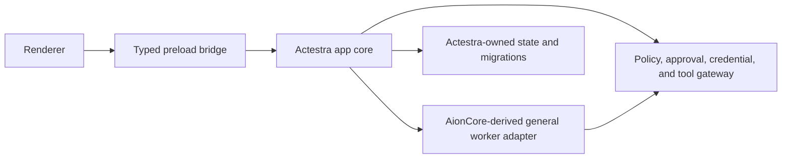

# AionUi v2.1.41 Module Map

This map records the P1 disposition of AionUi `v2.1.41`. It is an adoption plan,
not evidence that any upstream source has been imported.

## Disposition meanings

| Disposition | Meaning |
| --- | --- |
| Keep | Use as the initial foundation, subject to Actestra tests and ownership |
| Wrap | Retain behind an Actestra-owned interface or process boundary |
| Replace | Remove upstream product identity, authority, or infrastructure |
| Remove | Exclude from the Actestra product unless a later decision restores it |
| Defer | Do not include in the first vertical slice; reassess in a later phase |

## Target boundary

The renderer must not call AionCore, shell, filesystem, credential, update, or
telemetry services directly.

## Module dispositions

| Upstream area | Representative paths | Disposition | Required Actestra action |
| --- | --- | --- | --- |
| Electron main, preload, renderer separation | `packages/desktop/src/index.ts`, `preload/`, `renderer/` | Keep | Preserve process separation and add tests that privileged actions cannot bypass the main process |
| Typed IPC and common contracts | `packages/desktop/src/common/adapter`, `process/bridge` | Keep | Narrow into Actestra contracts; remove upstream product and backend assumptions |
| Renderer shell and general-work UX | `packages/desktop/src/renderer` | Keep | Rebrand and migrate incrementally after identity and authority boundaries are established |
| AionCore process lifecycle | `packages/desktop/src/process/backend`, `packages/web-host/src/backend-launcher.ts` | Wrap | Launch as an isolated worker behind `AgentAdapter`; add version, heartbeat, cancellation, timeout, and crash semantics |
| AionCore HTTP/WebSocket API | desktop bridge and `packages/web-host` | Wrap | Translate to Actestra events and state; do not expose it as the product contract |
| Database and migrations | `process/services/database`, AionCore database | Replace | Establish Actestra-owned schema, migration authority, backup, and recovery before importing user state |
| Agent/provider registry | renderer agent hooks and AionCore registry | Wrap | Treat upstream agents as capabilities; route credentials and availability through Actestra |
| MCP and tool execution | MCP bridges, builtin MCP bundles | Wrap | Route every tool through Actestra policy, approval, audit, and workspace grants |
| Shell and filesystem access | AionCore shell, file, process modules | Wrap | Move to isolated workers and least-privilege workspace scopes |
| Product name, bundle ID, protocol, icons, copyright | `electron-builder.yml`, `resources/`, package metadata | Replace | Use Actestra-owned identity before any application package is shared |
| Application directories and symlinks | `initStorage.ts`, `utils.ts`, web scripts | Replace | Introduce Actestra paths, versioned migration, test cleanup, and no upstream-name collision |
| Auto-update and publishing | `autoUpdaterService.ts`, `updateFeed.ts`, builder `publish` | Replace | Disable upstream feeds and implement signed Actestra metadata with rollback evidence |
| Sentry, analytics ID, and log reporting | `packages/desktop/src/sentry.ts` | Replace | Default off; add explicit consent, redaction, retention, and Actestra-owned endpoint policy if telemetry is retained |
| Runtime and CLI downloader | `packages/shared-scripts/src/prepare-aioncore.js` | Replace | Pin every artifact, verify checksum/signature before extraction, and generate SBOM/provenance |
| macOS entitlements and signing hooks | `entitlements.plist`, `scripts/afterSign.js` | Replace | Minimize entitlements; fail closed on signing errors; add notarization and Gatekeeper verification |
| AionHub offline bundle | `scripts/prepareHubResources.js`, `resources/hub` | Defer | Replace moving tags with an allowlisted, immutable, signed extension catalog before enabling |
| Web host and web CLI | `packages/web-host`, `packages/web-cli` | Defer | Desktop MVP first; retain only shared code needed by an accepted boundary |
| Remote messaging channels | Telegram, Lark, DingTalk, Weixin, WeCom modules | Defer | Exclude from the first Actestra vertical slice; revisit with identity and secret-isolation design |
| Upstream team orchestration | team pages, hooks, and AionCore team modules | Defer | Use as product evidence only until P6 contracts and deterministic fixtures exist |
| Desktop pet windows | `process/pet`, renderer pet components | Remove | Exclude from the MVP product shell unless a later product decision restores it |
| Upstream installers and release scripts | `scripts/install-*`, release asset scripts | Remove | Build Actestra-owned packaging and release automation |
| Upstream accounts and official links | auth flows, about/help links, upstream services | Replace | Provide a local-first Actestra flow with no mandatory upstream account |
| Demonstration media and promotional assets | large tracked files under `resources/` | Remove | Do not import marketing media; retain only separately reviewed application assets |

## Adoption order

1. Create the Actestra product identity and owned data directories.
2. Disable upstream update, publishing, telemetry, and remote extension inputs.
3. Establish main/preload/renderer authority tests.
4. Put AionCore lifecycle behind the first `AgentAdapter`.
5. Introduce Actestra-owned task, event, approval, credential, and audit state.
6. Import only the minimum modules needed for the P4 general-work vertical slice.
7. Reassess deferred web, channel, Hub, and team modules at their roadmap phases.

Any change from this disposition requires a documented reason. A broad source
merge still requires a new accepted architecture decision.
