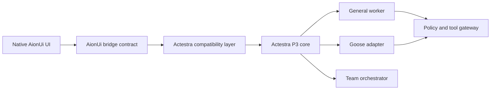

# AionUi v2.1.41 Module Map

This map records how the exact AionUi `v2.1.41` foundation is retained and
fused with Actestra under ADR-0010. It replaces the earlier
keep/wrap/replace/remove/defer plan.

The detailed user-function contract is in the
[AionUi Retention Matrix](AIONUI_RETENTION_MATRIX.md).

## Disposition meanings

| Disposition | Meaning |
| --- | --- |
| R0 — exact retain | Preserve native UI, interaction, source, and behavior as the golden baseline |
| R1 — compatible provider | Preserve UI and semantics; replace authority behind a stable compatibility seam |
| R2 — retained but isolated | Preserve source, entry, and workflow; block external effects until the Actestra provider is safe and ready |
| Build/test support | Preserve in the source foundation; do not treat it as end-user product authority |

## Target boundary

Renderer code keeps the AionUi contract but receives no implicit privileged
authority. The compatibility layer maps native shapes to main-owned Actestra
services.

## Module dispositions

| Upstream area | Representative paths | Disposition | Fusion action |
| --- | --- | --- | --- |
| Electron main, preload, renderer application | `packages/desktop/src`, `public` | R0/R1 | Preserve the complete application and functional UI; patch identity and main-owned authority without replacing layout or journeys |
| Router, layout, Guide, conversations, settings | `renderer/components/layout`, `renderer/pages` | R0 | Use as the golden product experience; require all 27 routes and visual/E2E non-regression |
| Typed platform and bridge contracts | `common/platform/bridge`, `common/adapter/ipcBridge.ts` | R0/R1 | Keep the 41 functional domains and event shapes; implement Actestra providers behind them |
| AionCore process lifecycle and API | `process/backend`, `packages/web-host` | R1 | Retain initially for parity; supervise as a general-worker compatibility runtime and migrate authority into P3 contracts |
| Conversation, task, and database state | bridge domains, AionCore database | R1 | Preserve renderer semantics; migrate one declared system of record at a time to Actestra persistence and projections |
| Agents and ACP clients | Agent Settings, ACP conversation platform | R0/R1 | Preserve registry, detection, repair, overrides, status, permissions, and UI; register Goose through `AgentAdapter` here |
| Models and providers | Mode Settings, provider services | R0/R1 | Preserve provider/model UI and validation; move credentials and network policy behind the Actestra broker |
| Assistants | Assistant Settings and services | R0/R1 | Preserve complete CRUD, import, defaults, prompts, Skills, and state; provide Actestra-owned records through compatible shapes |
| Skills and Skills Hub | Skills Settings, extension contributions | R0/R2 | Preserve all local workflows; isolate unsigned remote catalog effects until Actestra integrity policy exists |
| MCP and tool execution | Tools Settings, MCP bridges | R0/R1 | Preserve configuration and status UI; route effects through workspace grants, policy, approvals, leases, audit, and timeouts |
| Files, shell, workspace, snapshots | file/shell bridges, Workspace | R0/R1 | Preserve interactions; move privileged operations behind path validation and the Actestra tool gateway |
| Preview and document workflows | Preview panel and document bridges | R0/R1 | Preserve all viewers and generation UI; use Actestra artifact and safe-file services |
| Scheduled tasks | cron pages and bridge | R0/R1 | Preserve CRUD, history, run, and associations; use durable Actestra scheduling and approval semantics |
| Team orchestration | team pages, hooks, types, bridge | R0/R1 | Preserve all Team UI and native behaviors; map Eigent-style and Actestra orchestration into this contract |
| Appearance, language, and pet | themes, appearance/pet settings and processes | R0/R1 | Preserve interactions and settings; patch product identity and main-owned platform operations only |
| Extensions and Hub | extension loader, contributions, Hub resources | R0/R2 | Preserve full contribution architecture and UI; require signed manifests, capability grants, and an allowlisted catalog before remote activation |
| Web host, WebUI, remote agents, channels | `packages/web-host`, `packages/web-cli`, remote/channel modules | R0/R2 | Preserve code, settings, and workflows; isolate listeners, credentials, and sends until Actestra identity and network policy are ready |
| Login, feedback, diagnostics, telemetry | auth, feedback, Sentry/log services | R1/R2 | Keep UI states; make desktop guest/local-first and replace upstream accounts/endpoints with explicit-consent Actestra providers |
| Auto-update and publishing | updater services, builder publish config | R1/R2 | Preserve update UX; disable upstream feeds and use signed Actestra metadata and rollback |
| Product identity and application directories | builder metadata, resources, storage initialization | R1 | Patch to Actestra name, icon, protocol, bundle ID, executable, and versioned profiles without altering functional layout |
| Runtime downloader and bundled binaries | shared scripts, bundled AionCore | R1/R2 | Preserve setup/recovery experience; require exact pins, checksum/signature, SBOM, provenance, and resolved licenses |
| Entitlements, installers, release scripts | entitlements and scripts | R1/R2 | Preserve required platform behavior; replace signing, publisher, release channel, and credential authority with Actestra-owned automation |
| Tests, examples, showcase, promotional material | `tests`, `examples`, `/test/components`, resource media | Build/test support | Retain as compatibility and upstream-update evidence; do not expose test-only or promotional surfaces as normal product navigation |

## Fusion order

1. Freeze and reproduce the exact native source, tests, build, routes, bridge
   domains, and UI.
2. Apply Actestra identity and isolated profiles without removing functions.
3. Disable unowned external effects while retaining their UI and error states.
4. Add shape-compatible adapters and P3 shadow projections.
5. Move one authoritative data or privileged domain at a time to Actestra.
6. Register Goose through the preserved agent/ACP experience.
7. Map Eigent-style orchestration into the preserved Team experience.
8. Activate remote, extension, channel, and update providers only after their
   identity, integrity, permission, and rollback gates pass.
9. Run the full retention contract against cross-platform candidate artifacts.

An unavailable provider is not permission to delete its UI. Any intentional
retirement requires a new owner-approved decision with migration and
user-impact evidence.
